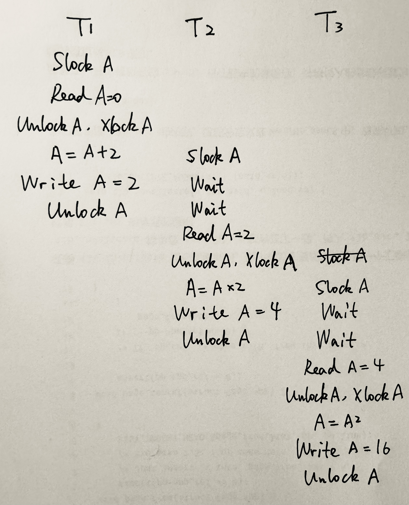
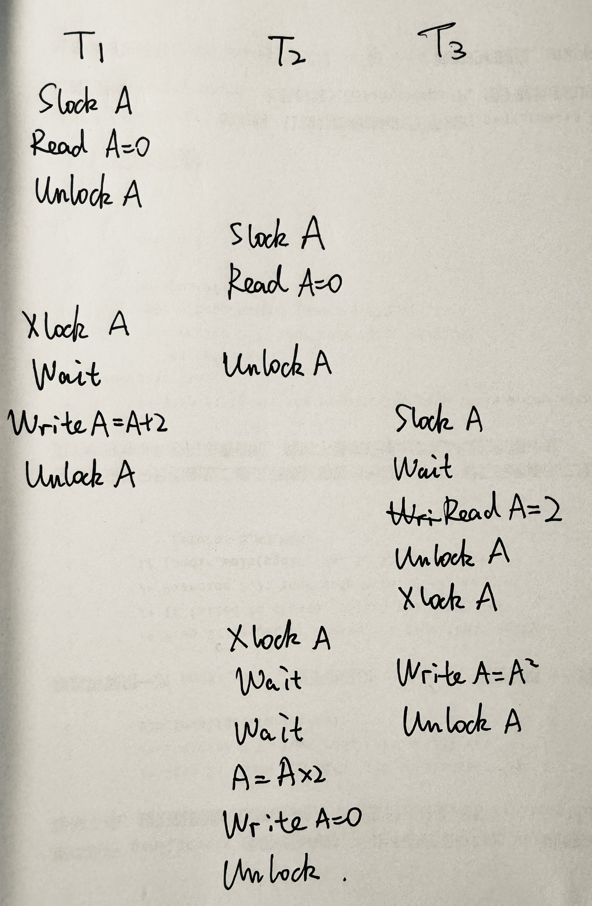
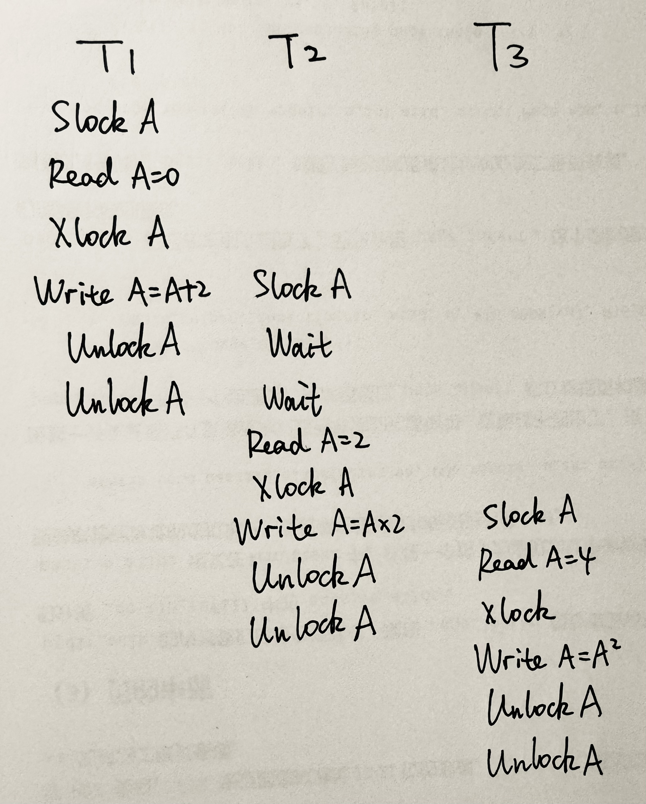
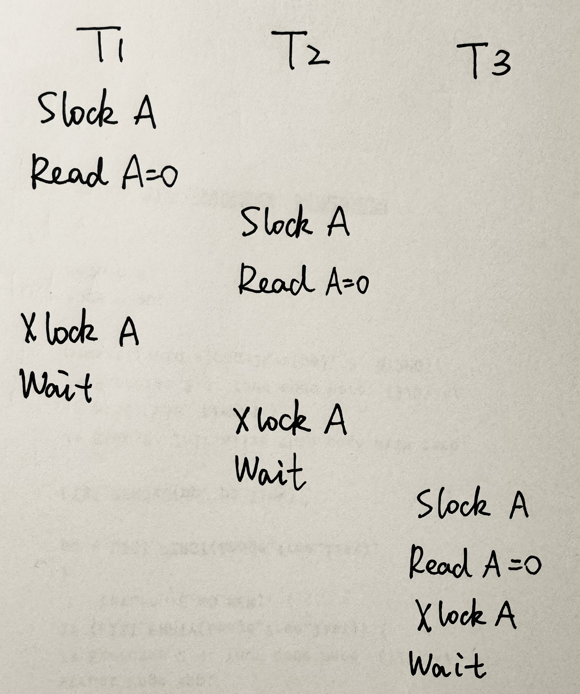
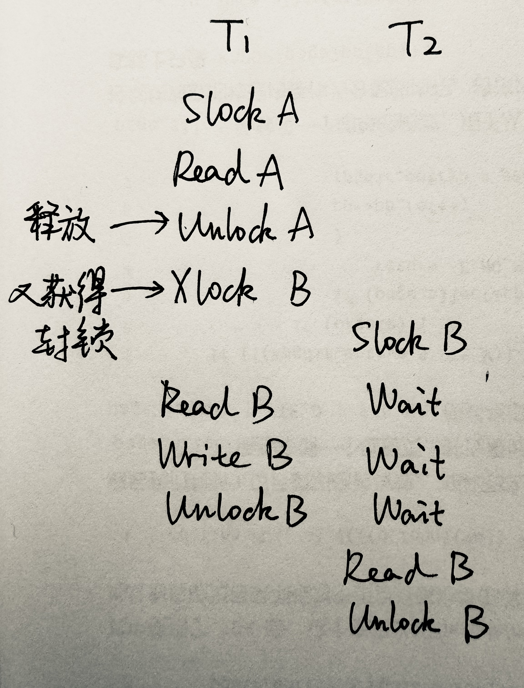
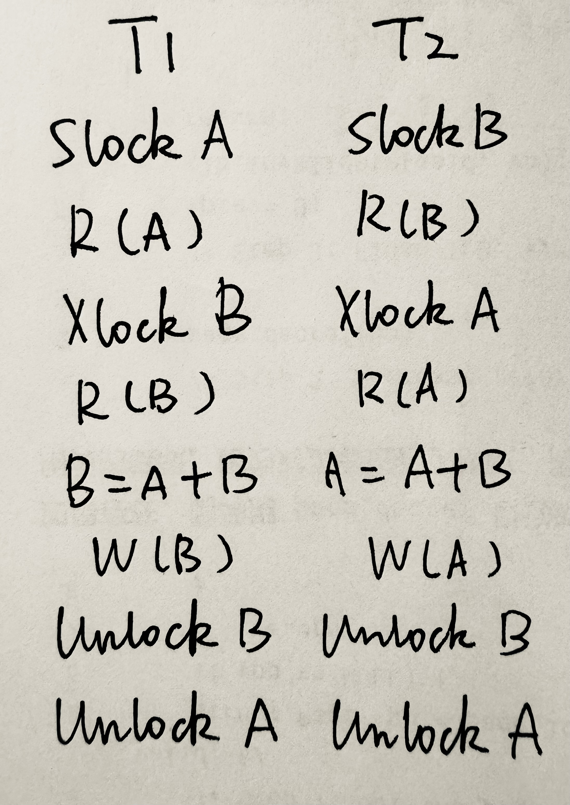
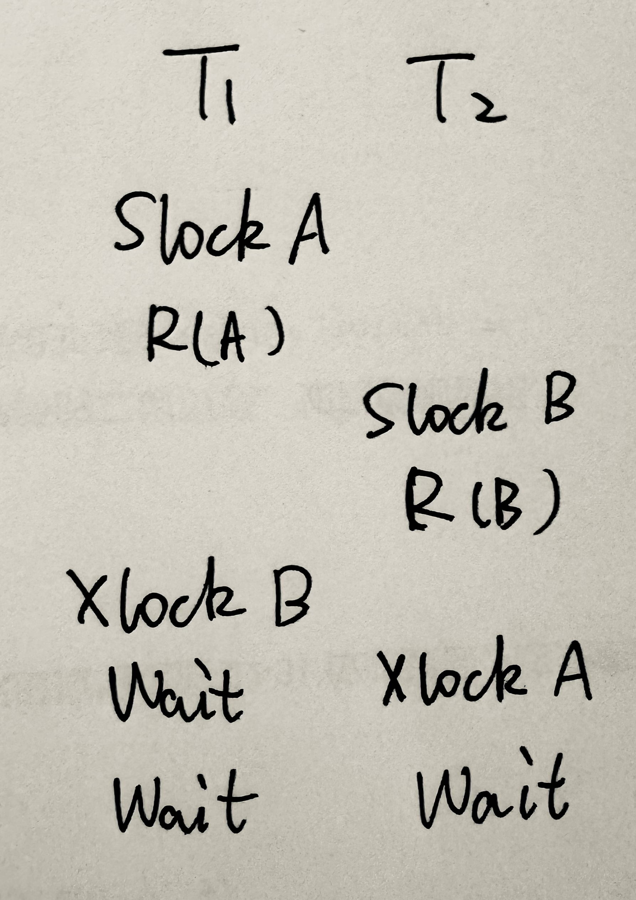

# 数据库第八次作业

> #### 22373386 高铭
>
> #### WEEK 10

## 书P305

### 1.

> 试述事务的概念及事务的4个特性。恢复技术能保证事务的哪些特性？

事务：**用户定义的**一个数据库操作序列，是不可分割的工作单位（要么全做，要么全不做）

原子性（Atomicity）

- 事务中包含的所有操作**要么全做，要么全不做**
- 系统应保证只执行了一部分的事务不会对数据库状态产生影响

隔离性（Isolation）

- 并发执行的**各个事务之间不能互相干扰**
- 一个事务**内部**的操作及使用的数据对**其他**并发事务是**隔离**的
- 每个事务在执行的时候应感觉不到其他事务的存在

一致性（Consistency）

- 是原子性和隔离性的结果
- 数据库在事务执行前是一致的，执行过程中可能暂时出现不一致，而当**事务执行完后，数据库仍会处于一致性状态**

持久性（Durability）

- 一个事务一旦提交（commit）之后，它对数据库的**影响必须是永久的**。系统发生失效不能改变事务的持久性。

恢复技术能保证事务的**原子性和持久性**。

### 2.

> 为什么事务非正常结束时会影响数据库数据的正确性？请举例说明之。

- 事务执行的结果必须是使数据库从一个一致性状态变到另一个一致性状态。如果数据库系统运行中发生故障，有些事务尚未完成就被迫中断，这些未完成事务对数据库所做的修改有一部分已写入物理数据库，这时数据库就可能处于不正确的状态，或者说是不一致的状态。
- 例如银行账户管理系统，要实现A给B转账100元，则可以定义一个事务T，T包括两个操作：A=A-100，B=B+100。如果T非正常终止时只做了第一个操作，则数据库就处于不一致性状态，A的余额无缘无故少了100块。

## 书P326

### 1.

> 在数据库中为什么要并发控制？并发控制技术能保证事务的哪些特性？

- 因为数据库是共享资源，通常有多个事务同时运行。多个事务并发存取数据库时就可能会同时读取/修改统一数据。如果不加以适当控制，可能会破坏事务的隔离性，产生数据的不一致性。
- 并发控制技术能保证事务的**一致性和隔离性**。

### 2.

> 并发操作可能会产生哪几类数据不一致？用什么方法能避免各种不一致的情况？

1. 丢失修改（lost update）——写写冲突
   - 事务1与事务2从数据库中读入同一数据并修改，事务2的提交结果破坏了事务1提交的结果，导致**事务1的修改被丢失**。也称脏写（dirty write）

2. 不可重复读（non-repeatable read）——读写冲突

   - 指事务1读取数据后，事务2执行更新操作，使事务1**无法再现前一次读取结果**。

   - 三种情况：事务1读取某一数据后，

     1. 事务2对其做了修改，当事务1再次读该数据时，得到与前一次不同的值。
     2. 事务2删除了其中部分记录，当事务1再次读取数据时，发现某些记录神秘地消失了。
     3. 事务2插入了一些记录，当事务1再次按相同条件读取数据时，发现多了一些记录。

3. 读“脏”数据（dirty read）——写读冲突
   - 事务1修改某一数据，并将其写回磁盘。事务2读取同一数据后，**事务1由于某种原因被撤消**，这时事务1已修改过的数据恢复原值，事务2读到的数据就与数据库中的数据不一致，是不正确的数据，又称为“脏”数据。

- 用并发控制可以避免各种不一致的情况。常见技术包括封锁方法、时间戳方法、乐观控制方法、多版本并发控制方法等。

### 3.

> 什么是封锁？基本的封锁类型有几种？试述它们的含义。

封锁就是事务T在对某个数据对象（例如表、记录等）操作之前，先向系统发出请求，对其加锁

加锁后事务T就对该数据对象有了一定的控制，在事务T释放它的锁之前，**其它的事务不能更新此数据对象**。

DBMS通常提供了多种类型的封锁。一个事务对某个数据对象加锁后究竟拥有什么样的控制是由封锁的类型决定的

基本封锁类型：

- **排它锁**（exclusive lock，简记为**X锁**），写锁
  - 若事务T对数据对象A加上X锁，则只允许T读取和修改A，其它任何事务**都不能再对A加任何类型的锁**，直到T释放A上的锁
- **共享锁**（Share lock，简记为**S锁**），读锁
  - 若事务T对数据对象A加上S锁，则其它事务**只能再对A加S锁，而不能加X锁**，直到T释放A上的S锁。
  - 这就保证了其他事务在T释放R上的S锁之前，**只能读取R**，而不能再对R作任何修改

### 4.

> 如何用封锁机制保证数据的一致性？

DBMS在对数据进行读写操作之前先对数据执行封锁操作，按照一定的封锁协议对并发操作进行控制，使得多个并发操作有序地执行，就可以避免丢失修改、不可重复读、读脏数据等数据不一致性。

一个事务对某数据加锁后，另一个事务只能等待该事务释放锁以后才能获得对该数据的锁。

### 6.

> 什么是死锁？请给出预防死锁的若干方法。

两事务对两数据各自等待，T1等待T2，而T2又在等待T1，T1和T2两个事务永远不能结束，形成死锁。情形如下表所示。

|   T1    |   T2    |
| :-----: | :-----: |
| LOCK R1 |         |
|         | LOCK R2 |
| LOCK R2 |         |
|  WAIT   |         |
|  WAIT   | LOCK R1 |
|  WAIT   |  WAIT   |

预防方法有两种：

1. 一次封锁法：要求每个事务必须一次将所有要使用的数据全部加锁，否则就不能继续执行。
2. 顺序封锁法：预先对数据对象规定一个封锁顺序，所有事务都按这个顺序实行封锁。

### 7.

> 请给出检测死锁发生的一种方法，当发生死锁后如何解除死锁？

数据库系统一般采用的方法是允许死锁发生，DBMS检测到死锁后加以解除。

诊断死锁一般使用超时法或事务等待图法。

- 超时法：如果一个事务的等待时间超过规定的时限，就认为发生了死锁。
- 等待图法检测死锁：T1等待T2，则T1指向T2画一条有向边。系统周期性检查，如果存在回路，则出现死锁，选择一个事务回滚，打破死锁。

解除死锁的方法：选择一个处理死锁代价最小的事务，将其撤销，释放次事务持有的所有锁，使其他事务得以继续运行下去。

### 8.

> 什么样的并发调度是正确的调度？

可串行化的调度是正确的调度。

几个事务的并行执行是正确的，当且仅当其**结果与按某一次序串行地执行它们时的结果相同**。这种并行调度策略称为**可串行化（Serializable）**的调度

### 9.

> 设$T_1$、$T_2$、$T_3$是如下的三个事务，设A的初值为0。
> $$
>    T_1: A:=A+2;\\
>    T_2: A:=A*2;\\
>    T_3: A:=A^2
> $$
>    （1）若这三个事务允许并发执行，则有多少种可能的正确结果？请一一列举出来。
>
>    （2）请给出一个可串行化的调度，并给出执行结果。
>
>    （3）请给出一个非串行化的调度，并给出执行结果。
>
>    （4）若这三个事务都遵守两段锁协议，请给出一个不产生死锁的可串行化调度。
>
>    （5）若这三个事务都遵守两段锁协议，请给出一个产生死锁的调度。

1. 三个事务串行执行的次序有：$T_1T_2T_3,\;T_1T_3T_2,\;T_2T_1T_3,\;T_2T_3T_1,\;T_3T_1T_2,\;T_3T_2T_1$​。

   结果分别为：16，8，4，2，4，2。共有4种可能的结果：2，4，8，16。

2. 下图为可串行化的调度，结果为16。

   

3. 下图为非串行化的调度，结果为0。

   

4. 如下图。

   

5. 如下图。

   

### 10.

> 今有三个事务的一个调度$r_3(B)r_1(A)w_3(B)r_2(B)r_2(A)w_2(B)r_1(B)w_1(A)$​，该调度是冲突可串行化的调度吗？为什么？

是冲突可串行化的调度。

首先，交换$r_1(A)$和$w_3(B)$，得到$r_3(B)w_3(B)r_1(A)r_2(B)r_2(A)w_2(B)r_1(B)w_1(A)$。

然后，交换$r_1(A)$和$r_2(B)r_2(A)w_2(B)$，得到$r_3(B)w_3(B)r_2(B)r_2(A)w_2(B)r_1(A)r_1(B)w_1(A)$。

该调度是串行执行的，并且两次交换都是基于不冲突操作的，因此调度是冲突可串行化的。

### 12.

> 举例说明对并发事务的一个调度是可串行化的，而这些并发事务不一定遵守两段锁协议。

两段锁协议：

- 在对任何数据进行读、写操作之前，事务**首先要获得对该数据的封锁**
- 在释放一个封锁之后，事务**不再获得任何其他封锁**

举例如下，这一调度是可串行化的，但违反了两段锁协议的第二条规则。

### 13.

> 考虑如下的调度，说明这些调度集合之间的包含关系。
>
> （1）正确的调度。
>
> （2）可串行化的调度。
>
> （3）遵循两阶段封锁（2PL）的调度。
>
> （4）串行调度。

$$
(1)=(2)\supset(3)\\
(1)=(2)\supset(4)
$$

### 14.

> 考虑$T_1$和$T_2$​两个事务。
> $$
> T_1: R(A);\; R(B);\; B = A + B;\; W(B) \\T_2: R(B);\; R(A);\; A = A + B;\; W(A)
> $$
> ​    （1）改写$T_1$和$T_2$，增加加锁操作和解锁操作，并要求遵循两阶段封锁协议。
>
> ​    （2）说明$T_1$和$T_2$的执行是否会引起死锁，给出$T_1$和$T_2$的一个调度并说明之。

（1）

（2）可能会产生死锁，如图所示，$T_1$对$A$上了锁，$T_2$对$B$上了锁。随后$T_1$对$B$上锁，由于$T_2$没有释放$B$的锁，所以需要等待$T_2$；后来$T_2$对$A$上锁，由于$T_1$没有释放$A$的锁，所以需要等待$T_1$，这就导致$T_1$和$T_2$​互相等待，造成死锁。

## 课堂练习

### 1.

> 有如下三个调度：
>
> - $S1 = r_3(B),w_3(C),r_1(A),w_1(D),w_2(A),r_2(C),w_4(A),c_2,c_4,r_3(D),c_3,c_1$
> - $S2 = r_3(C),w_1(A),r_2(B),w_3(B),c_3,w_1(C),c_1,r_2(A),c_2$
> - $S3 = w_3(E),w_4(A),w_1(D),r_1(B),w_1(C),c_1,r_2(D),r_4(D),w_3(B),w_4(C),c_4,c_3,c_2$
> - 哪些调度是冲突可串行的？哪些是可恢复的？

可串行性：

- $S1$**是冲突可串行**的，只需交换$r_3(B)w_3(C)$和$w_4(A)$，

  得到$S1 = w_4(A),r_1(A),w_1(D),w_2(A),r_2(C),r_3(B),w_3(C),c_2,c_4,r_3(D),c_3,c_1$​

  该调度是按照事务4-1-2-3串行执行的，并且交换不涉及指令冲突

- $S2$**是冲突可串行**的，只需先交换$r_2(B)$和$w_1(C)$，再交换$w_1(A)$和$w_3(B)$，

  得到$S2 = r_3(C),w_3(B),w_1(C),w_1(A),c_3,r_2(B),c_1,r_2(A),c_2$​

  该调度是按照事务3-1-2串行执行的，并且交换不涉及指令冲突

- $S3$**是冲突可串行**的，只需交换$w_4(A)$和$w_3(B)$​，

  得到$S3=w_3(E),w_3(B),w_1(D),r_1(B),w_1(C),c_1,r_2(D),r_4(D),w_4(A),w_4(C),c_4,c_3,c_2$​

  该调度是按照事务3-1-2串行执行的，并且交换不涉及指令冲突

可恢复性：

- $S1$**是不可恢复的调度**。该调度中，$T_2$读了$T_3$写入的$C$，$T_3$读了$T_1$写入的$D$，故理应$c_3$在$c_2$前，$c_1$在$c_3$前。

  而提交的顺序为2-4-3-1，不合要求。

- $S2$**是可恢复的调度**。该调度中，$T_2$读了$T_1$写入的$A$，故理应$c_1$在$c_2$前。

  而提交的顺序为3-1-2，合乎要求。

- $S3$**是可恢复的调度**。该调度中，$T_2$读了$T_1$写入的$D$，$T_3$读了$T_1$写入的$D$，故理应$c_1$在$c_2$前，$c_1$在$c_4$前。

  而提交的顺序为1-4-3-2，合乎要求。

### 2.

> （1）有如下调度：
>
> $r1(X) w1(X) r2(X) r1(Y) w1(Y) r2(Y) w2(Y)$
>
> 请问是正确的调度吗？若是，等价于什么样的串行调度？是否是一个2PL的调度？
>
> （2）这是个2PL的调度，加上锁操作后如下(L指lock，U指unlock）：
>
> $L1(X) L1(Y) r1(X) w1(X) U1(X) L2(X) r2(X) r1(Y) w1(Y) U1(Y) L2(Y) r2(Y) w2(Y)U2(Y)$
>
> 请问是严格两阶段协议的调度吗?

1. **是正确的调度**，只需交换$r_2(X)$和$w_1(Y)$，得到$r1(X) w1(X) w1(Y) r1(Y) r2(X) r2(Y) w2(Y)$，这是一个串行调度。

   可以是一个2PL的调度。

2. 严格的两段锁协议增加规则：事务获得的锁只有在事务结束时才释放。

   由于释放锁$U1(X)$后又进行了操作$r1(Y)$，事务没结束，故**不是严格的两阶段协议的调度**。

