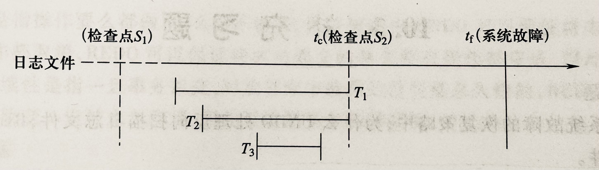

# 数据库第九次作业

> #### 22373386 高铭
>
> #### WEEK 11

## 书P305

### 3.

> 登记日志文件时为什么必须先写日志文件，后写数据库？

因为有可能在这两个操作之间发生故障，即这两个写操作只完成了一个。

如果先写了数据库修改，而在运行记录中没有登记这个修改，则以后就无法恢复这个修改了。而如果先写日志，但没有修改数据库，在恢复的时候只不过是多执行一次UNDO操作，并不会影响数据库的正确性。所以一定要先写日志文件，后写数据库的修改。

### 4.

> 考虑日志记录，
>
> （1）如果系统故障发生在14之后，说明哪些事务需要重做，哪些事务需要回滚。
>
> （2）如果系统故障发生在10之后，说明哪些事务需要重做，哪些事务需要回滚。
>
> （3）如果系统故障发生在9之后，说明哪些事务需要重做，哪些事务需要回滚。
>
> （4）如果系统故障发生在7之后，说明哪些事务需要重做，哪些事务需要回滚。

需要重做的事务：已提交（COMMIT）的事务；需要回滚（强行撤销所有对数据库的修改）的事务：没有达到预期的终点的事务

| 题号 | 需要重做的事务REDO | 需要回滚的事务UNDO |
| :--: | :----------------: | :----------------: |
|  1   |       T1、T3       |       T2、T4       |
|  2   |         T1         |       T2、T3       |
|  3   |         T1         |       T2、T3       |
|  4   |         T1         |         T2         |


### 5.

> 考虑日志记录，假设开始时A、B、C的值都是0：
>
> （1）如果系统故障发生在14之后，写出系统恢复后A、B、C的值
>
> （2）如果系统故障发生在12之后，写出系统恢复后A、B、C的值
>
> （3）如果系统故障发生在10之后，写出系统恢复后A、B、C的值
>
> （4）如果系统故障发生在9之后，写出系统恢复后A、B、C的值
>
> （5）如果系统故障发生在7之后，写出系统恢复后A、B、C的值
>
> （6）如果系统故障发生在5之后，写出系统恢复后A、B、C的值

只有重做的事务对数据的写入算数，回滚的事务不会写入数据。

| 题号 |  A   |  B   |  C   |
| :--: | :--: | :--: | :--: |
|  1   |  8   |  7   |  11  |
|  2   |  10  |  0   |  11  |
|  3   |  10  |  0   |  11  |
|  4   |  10  |  0   |  11  |
|  5   |  10  |  0   |  11  |
|  6   |  0   |  0   |  0   |


### 6.

> 针对不同的故障，试给出恢复的策略和方法。（即如何进行事务故障的恢复，如何进行系统故障的恢复，以及如何进行介质故障的恢复。）

**事务故障**

1. 反向扫描文件日志，查找该事务的更新操作。
2. 对该事务的更新操作执行逆操作。即将日志记录中“更新前的值”写入数据库。
3. 直至读到此事务的开始标记，该事务故障的恢复就完成了。

**系统故障**

1. 正向扫描日志文件，找出在故障发生前已经提交的事务队列（REDO队列）和未完成的事务队列（UNDO队列）。
2. 对未完成的事务队列中的各个事务进行UNDO处理。
3. 对已经提交的事务队列中的各个事务进行REDO处理。

**介质故障**

1. 装入最新的数据库后备副本（离故障发生时刻最近的转储副本），使数据库恢复到最近一次转储时的一致性状态。
2. 装入转储结束时刻的日志文件副本。
3. 启动系统恢复命令，由DBMS完成恢复功能，即重做已完成的事务。

### 7.

> 什么是检查点记录？检查点记录包括哪些内容？

检查点记录是一类新的日志记录。内容包括：

1. 建立检查点时刻**所有正在执行的事务清单**
2. 这些事务**最近一个日志记录的地址**

### 8.

> 具有检查点的恢复技术有什么优点？试举一个具体例子加以说明。

- 利用日志技术进行数据库恢复时，恢复子系统**必须搜索整个日志**，这将耗费大量的时间。此外，需要REDO处理的事务实际上**已将其更新操作结果写到数据库**中，恢复子系统又重新执行了这些操作，浪费了大量时间。检查点技术就是为了解决这些问题。

  

- 在采用检查点技术之前，恢复时需要从头扫描日志文件，而利用检查点技术只需要从$t_c$开始扫描日志，这就缩短了扫描日志的时间。

- 事务$T_3$的更新操作实际上已经写到数据库中了，进行恢复时没有必要再REDO处理，采用检查点技术做到了这一点。

### 9.

> 试述使用检查点方法进行恢复的步骤。

1. 在重新开始文件中，找到**最后一个检查点记录**在日志文件中的地址，由该地址在日志文件中找到最后一个检查点记录。

2. 由该检查点记录得到检查点建立时刻**所有正在执行的事务清单**ACTIVE-LIST。

   这里建立两个事务队列：

   - UNDO-LIST：需要执行 undo 操作（撤销）的事务集合；
   - REDO-LIST：需要执行 redo 操作（重做）的事务集合。

   把ACTIVE-LIST暂时放入UNDO-LIST队列，REDO-LIST队列暂为空。

3. 从检查点开始正向扫描日志文件，

   - 如有新开始的事务$T_i$，把$T_i$暂时放入UNDO-LIST队列；
   - 如有提交的事务$T_j$，把$T_j$​​​​从UNDO-LIST队列移到REDO-LIST队列，直到日志文件结束。

4. 对UNDO-LIST中的每个事务执行UNDO操作，对REDO-LIST 中的每个事务执行REDO操作。


## PPT练习

### 1.

> Consider the following log:
>
> ⟨START T⟩ ⟨T,A,10,11⟩ ⟨START U⟩ ⟨U,B,20,21⟩ ⟨T,C,30,31⟩ ⟨U,D,40,41⟩ ⟨COMMIT U⟩ 
>
> ⟨T,A,10,11⟩: T is the transaction, A is the modified object, 10 is the old value, 11 is the new value.
>
> After a crash:
>
> - What values might/must have been changed?
> - How does the recovery manager get the database back to a consistent state?
>
> Discuss for Undo-, Redo-, and Undo/Redo- logging

- Undo：Only T must be undone
  - A might have its value changed on disk

  - B must have its value changed on disk

  - C might have its value changed on disk

  - D must have its value changed on disk

- Redo：Only U must be redone
  - A cannot have its value changed on disk

  - B might have its value changed on disk

  - C cannot have its value changed on disk

  - D might have its value changed on disk

- Undo & redo: U must be undone, while U must be redone
  - A, B, C, D might have its value changed on disk

- Undo：
  - 由于事务U已被提交，因此在撤销阶段无需考虑它
  - C的值写成30
  - A的值写成10
  - 将T追加到日志中
- Redo：
  - 由于事务T已被提交，因此在重做阶段无需考虑它
  - B的值写成21
  - D的值写成41

### 2.

> Consider the content of the following **undo log**:
> ```
> (LSN: log sequence number 日志记录的序列号)
> LSN1 <START T1>
> LSN2 <T1 X 5>
> LSN3 <START T2>
> LSN4 <T1 Y 7>
> LSN5 <T2 X 9>
> LSN6 <START T3>
> LSN7 <T3 Z 11>
> LSN8 <COMMIT T1>
> LSN9 <START CKPT(T2,T3)>
> LSN10 <T2 X 13>
> LSN11 <T3 Y 15>
> *C*R*A*S*H*
> ```
>
> Questions:
>
> (a) Show how far back in the recovery manager needs to read the log. Write below the earliest LSN that the recovery manager reads.
>
> (b) Show below the actions of the recovery manager during recovery
>
> (c) What is the value of X at the end of the recovery

1. LSN3（start of the earliest transaction among incomplete transactions）因为T2是所有未提交事务当中最早开始的，理应从T2的START处开始进行Undo操作。

2. undo操作从后往前撤销操作（写入旧值）：

   ```
   Y := 15
   X := 13
   Z := 11
   X := 9
   ```

3. 9