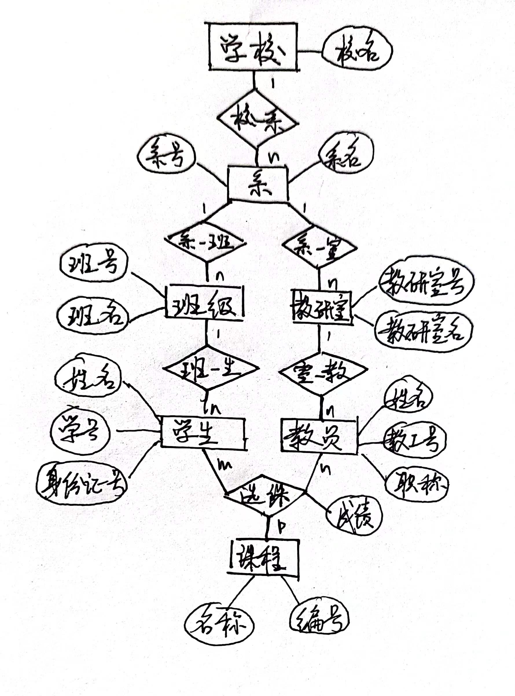

# 数据库第十一次作业

> #### 22373386 高铭
>
> #### WEEK 14

## 书P241

### 1. 试述数据库设计过程。

1. **需求分析阶段**
   - 准确了解与分析用户需求，是整个设计过程的基础，最困难、最耗时的一步
2. **概念结构设计阶段**
   - 是整个数据库设计的关键
   - 通过对用户需求进行综合、归纳与抽象，形成一个独立于具体DBMS的概念模型
3. **逻辑结构设计阶段**
   - 将概念结构转换为某个DBMS支持的数据模型，对其进行优化
4. **数据库物理设计阶段**
   - 为逻辑数据模型选一个最适合应用环境的物理结构（包括存储结构和存取方法）
5. **数据库实施阶段**
   - 根据逻辑设计和物理设计的结果；建立数据库；编制与调试应用程序；组织数据入库并试运行
6. **数据库运行和维护阶段**
   - 数据库应用系统经试运行后即可正式投入运行；运行过程中必须不断进行评价、调整与修改

### 3. 需求分析阶段的设计目标是什么？调查的内容是什么？

**设计目标**：通过详细调查现实世界要处理的对象（组织、部门、企业等），充分了解原系统（手工系统或计算机系统）工作概况，明确用户的各种需求，然后在此基础上确定新系统的功能。

**调查内容**：“数据”和“处理”，即获得用户对数据库的如下要求：

- 信息要求：用户需要从数据库中获得的信息内容和性质；从信息要求可以导出数据要求，即要数据库存储的数据
- 处理要求：用户要完成的处理功能、处理响应时间要求、处理方式（批处理/联机处理）
- 安全性与完整性要求

### 4. 数据字典的内容和作用是什么？

内容：**五类条目**——数据项、数据流、数据存储、处理过程、数据结构。

数据项是数据的最小组成单位，若干数据项组成一个数据结构。数据字典通过对**数据项**和**数据结构**的定义来描述**数据流**、**数据存储**的逻辑内容。

作用：数据字典是关于数据库中数据的描述，在需求分析阶段建立，是下一步进行概念设计的基础，并在数据库设计过程中不断修改、充实和完善。

### 5. 什么是数据库的概念结构？试述其特点和设计策略。

数据库的概念结构：将需求分析得到的**用户需求**抽象成的**信息结构**，即概念模型。

**特点**：

- 能真实、充分地反映现实世界，包括事物和事物之间的联系，能满足用户对数据的处理要求。是对现实世界的一个真实模型。
- 易于理解，从而可以用它和不熟悉计算机的用户交换意见，用户的积极参与是数据库的设计成功的关键。
- 易于更改，当应用环境和应用要求改变时，容易对概念模型修改和扩充。
- 易于向关系、网状、层次等各种数据模型转换。

**设计策略**：

1. **自顶向下**。即首先定义全局概念结构的框架，然后逐步细化。
2. **自底向上**。即首先定义各局部应用的概念结构，然后将它们集成起来，得到全局概念结构。
3. **逐步扩张**。首先定义最重要的核心概念结构，然后向外扩充，以滚雪球的方式逐步生成其他概念结构，直至总体概念结构。
4. **混合策略**。即将自顶向下和自底向上相结合，用自顶向下策略设计一个全局概念结构的框架，以它为骨架集成由自底向上策略中设计的各局部概念结构。

### 6. 定义并解释概念模型中以下术语：

实体：客观存在并可以相互区分的事物叫实体。

实体型：具有相同属性的实体具有相同的特征和性质，用**实体名及其属性名集合**来抽象和刻画同类实体称为实体型。

实体集：**同型实体的集合**称为实体集。

属性：实体所具有的**某一特性**，一个实体可由若干个属性来刻画。

码：**唯一标识实体**的属性集称为码。

实体-联系图（E-R图）：描述实体型、属性和联系的一种方法。

### 7. 请用 E-R 图画出此学校的概念模型。

> 学校中有若干系，每个系有若干班级和教研室，每个教研室有若干教员，其中有的教授和副教授每人各带若干研究生，每个班有若干学生，每个学生选修若干课程，每门课可由若干学生选修。

### 8. 请用 E-R 图画出此工厂产品、零件、材料、仓库的概念模型。

> 某工厂生产若干产品，每种产品由不同的零件组成，有的零件可用在不同的产品上。这些零件由不同的原材料制成，不同零件所用的材料可以相同。这些零件按所属的不同产品分别放在仓库中，原材料按照类别放在若干仓库中。

### 9. 什么是数据库的逻辑结构设计？试述其设计步骤。

**数据库的逻辑结构设计**：把概念结构设计阶段设计好的**基本E-R图**转换为与选用的DBMS产品所支持的**数据模型相符合的逻辑结构**。

**步骤**：

- 将概念结构转化为一般的关系、网状、层次模型
- 将转化来的关系、网状、层次模型向特定DBMS支持下的数据模型转换
- 对数据模型进行优化

### 10. 试把习题7和习题8中的E-R图转换为关系模型。

习题7：学校仅一个属性，合并到系实体；选课为m:n:p联系，转换为独立的关系模式；各1:n联系与n端关系模式合并。

> 系（<u>系号</u>，系名，学校名）
>
> 班级（<u>班号</u>，班名，系号）
>
> 教研室（<u>教研室号</u>，教研室名，系号）
>
> 学生（<u>学号</u>，姓名，学历，班号，导师号）
>
> 课程（<u>课程号</u>，课程名）
>
> 教员（<u>教工号</u>，姓名，职称，教研室号）
>
> 选课（<u>学号，课程编号，教师号</u>，成绩）

习题8：m:n属性为产品组成、零件组成、零件存放，转换为独立的关系模式

> 产品（<u>产品号</u>，产品名，仓库号）
>
> 零件（<u>零件号</u>，零件名）
>
> 原材料（<u>原料号</u>，原料名称，类别，仓库号，存放量）
>
> 仓库（<u>仓库号</u>，仓库名）
>
> 产品组成（<u>产品号，零件号</u>，用件量）
>
> 零件组成（<u>零件号，原料号</u>，用料量）
>
> 零件存放（<u>零件号，仓库号</u>，存储量）

### 11. 试用规范化理论中有关范式的概念分析习题7设计的关系模型中各个关系模式的候选码，它们属于第几范式？会产生什么更新异常？

候选键已在第10题用下划线标明。这些关系模式属于BCNF，不会产生更新异常。

### 12. 规范化理论对数据库设计有什么指导意义？

规范化理论为数据库设计人员判断关系模式优劣**提供了理论标准**，可用以指导关系数据模型的优化，用来预测模式可能出现的问题，为设计人员提供了自动产生各种模式的算法工具，使数据库设计工作有了严格的理论基础。