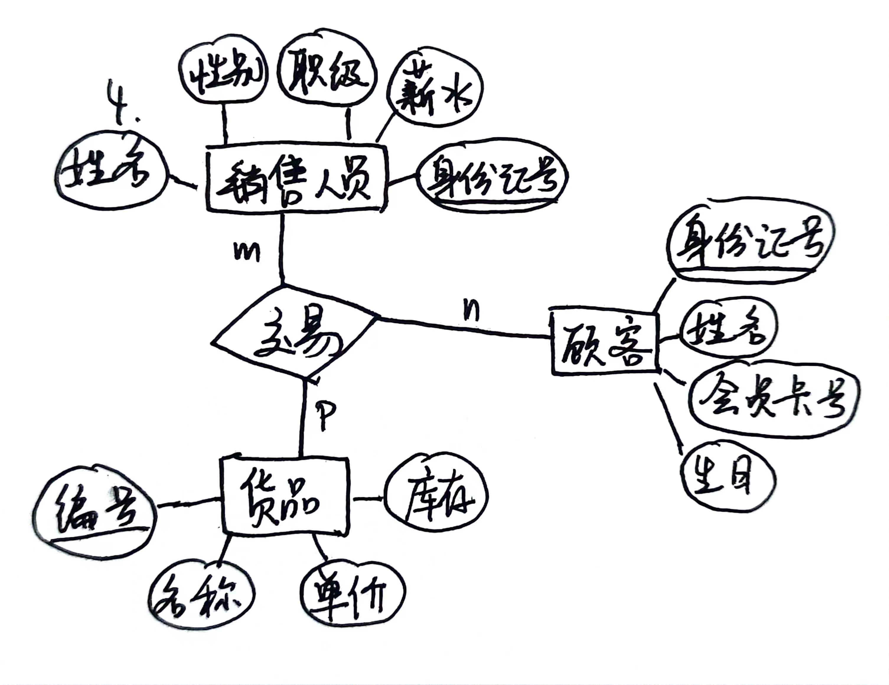
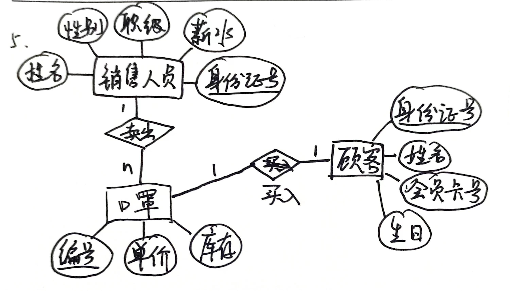

# 数据库第二次作业

#### 22373386 高铭
----

### P34 7、什么是概念模型？试述概念模型的作用
* 概念模型是独立于计算机系统的数据模型，不涉及信息在计算机中的表示，只用来描述某个特定组织所关心的信息结构，是对现实世界的第一层抽象。
* 概念模型按用户的观点对数据建模，强调其语义表达能力，是用户和数据库设计人员之间进行交流的语言和工具。

### 8、定义并解释概念模型中术语
* **实体**：客观存在并可以相互区分的客观事物或抽象事件。
* **实体型**：用实体名及其属性名集合来抽象和刻画同类实体称为实体型。
* **实体集**：同型实体的集合。
* **实体之间的联系**：实体之间的联系：包括实体（型）内部的联系和实体（型）之间的联系。实体内部的联系通常是指组成实体的各属性之间的联系；实体之间的联系通常是指不同实体集之间的联系。实体之间的联系有一对一、一对多和多对多等多种类型。

### P241 7、ER图（学校）

### 8、ER图（工厂）

### ER模型补充例题
#### 1) 

#### 2) 

#### 3) 

#### 4) 

#### 5) 
