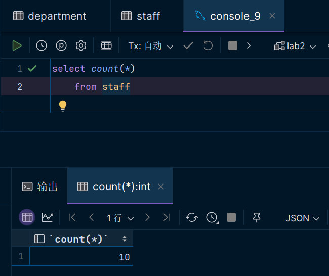
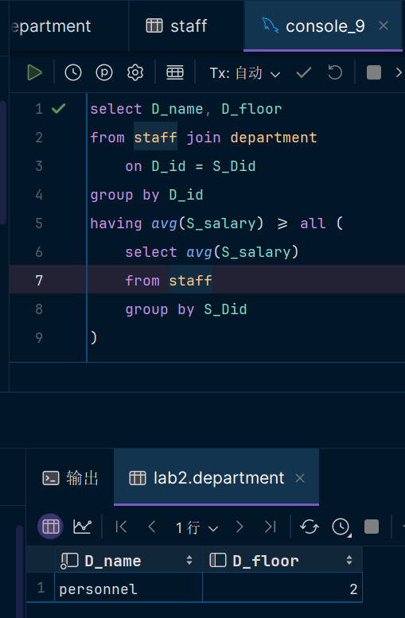

# **数据库第二次上机**

> #### 22373386 高铭

## TASK 1 约束

### Q1 

```sql
create table Department(
    D_id char(30) NOT NULL PRIMARY KEY,
    D_name varchar(255) NOT NULL,
    D_floor smallint
);

create table Staff(
    S_id char(30) NOT NULL PRIMARY KEY,
    S_name varchar(255) NOT NULL,
    S_salary int,
    S_absence int default 0,
    S_birth date,
    S_marriage bool,
    S_Did char(30) NOT NULL,
    constraint fk_Did foreign key (S_Did)
        references Department(D_id),
    check (S_salary >= 2000 and S_name LIKE '^[A-Z][a-z]*([- ]?[A-Z][a-z]*)*$')
);
```

### Q2

#### Department:


#### Stuff:


#### 报错1：


触发报错，因为插入数据S_salary为1980不合规，而要求该值不小于2000。

#### 报错2：


触发报错，因为插入数据S_Did为0009不合规。S_Did是外键，要求和Stuff的主键D_id保持对应。但是0009并不在表Stuff中的D_id的域中，故触发报错。

#### 删去还有员工的部门


报错，因为想要删去的0001部门还与stuff中的数据存在外键约束，无法删除。

## TASK 2

### Q3 查询员工表的员工薪资、缺勤天数两列信息


### Q4 统计员工人数 



### Q5 查询全体员工的平均薪资


### Q6 某个部门的最高工资、最低工资。我们指定“某个”部门为0002


### Q7 统计缺勤天数超过3天的所有员工名


### Q8 查询平均工资最高的部门的名称和所在的楼层



### Q9 查询所有员工名，英文名称均大写表示


### Q10 将**Date**格式的出生日期列以”year/month/day”和“yearmonthday”格式展示


### Q11 选择某个员工，将其的姓和名分别单独查询出来


### Q12 选择两个员工，查询出他俩生日差几天


### Q13 查询生日比2000年1月1日晚的员工

