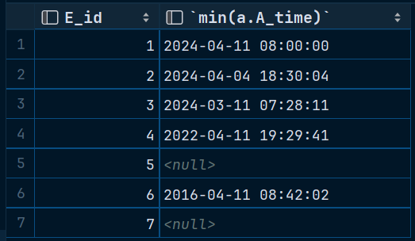

# **数据库第三次上机**

> #### 22373386 高铭

## TASK 2

### 关系模式1


```sql
# 建立表格
create schema lab3_1 collate utf8mb4_0900_ai_ci;
# utf8mb4_0900_ai_ci - MySQL针对utf8mb4编码的排序规则：不区分音调、不区分大小写
create table Department(
    D_id int NOT NULL PRIMARY KEY,
    D_name varchar(255) NOT NULL,
    D_manager_id int NOT NULL,
);
create table Employee(
    E_id int NOT NULL PRIMARY KEY,
    E_name varchar(255) NOT NULL,
    E_sex char(10) NOT NULL,
    E_birth date,
    E_rank int,
    E_salary int,
    D_id int NOT NULL,
    constraint fk_Employee_D_id foreign key (D_id)
        references Department(D_id)
);

alter table Department add
    constraint fk_Department_E_id foreign key (D_manager_id)
             references Employee(E_id);

create table Attendance(
    E_id int NOT NULL PRIMARY KEY,
    A_time time NOT NULL PRIMARY KEY,
    constraint fk_Attendance_E_id foreign key (E_id)
         references Employee(E_id)
);
create table Supervisor(
    S_id int not null primary key,
    S_name varchar(255) not null
);
create table Project(
    P_id int not null primary key,
    P_schedule int not null ,
    P_budget int
);
create table P_Implement(
    P_id int not null primary key,
    D_id int NOT NULL PRIMARY KEY,
    constraint fk_ProjectImplement_D_id foreign key (D_id)
        references Department(D_id),
    constraint fk_ProjectImplement_P_id foreign key (P_id)
        references Project(P_id)
);
create table P_Supervision(
    P_id int not null primary key,
    S_id int not null primary key,
    constraint fk_P_id foreign key (P_id)
        references Project(P_id),
    constraint fk_S_id foreign key (S_id)
        references Supervisor(S_id)
);
```


#### 各表数据展示

##### employee


##### attendance


##### department


##### supervisor


##### project


##### p_implement


##### p_supervision


#### 1-1. 查找监理过工程ID为1的监理姓名。

```sql
select supervisor.S_name
from supervisor,P_Supervision
where supervisor.S_id = P_Supervision.S_id and P_Supervision.P_id = 1
```


#### 1-2. 查询监理过部门ID为1的部门干过的工程的监理姓名。

```sql
select s.S_name
from supervisor as s, p_supervision as ps, p_implement as pi
where s.S_id = ps.S_id and ps.P_id = pi.P_id and pi.D_id = 1
group by s.S_name
```


#### 1-3. 查询所有职员ID及他们的经理ID（注意有的职员可能没有部门）。

```sql
select e.E_id, d.D_manager_id
from employee as e
left join department d on e.D_id = d.D_id
```


#### 1-4. 查询所有Zhang姓员工参与的工程的总预算。

```sql
select sum(p0.P_budget) budget_sum
from project p0
where p0.P_budget in (
    select p.P_budget
    from project p, employee e, p_implement pi
    where e.E_name like 'Zhang%' and p.P_id = pi.P_id and e.D_id = pi.D_id
    group by p.P_id
)
```


#### 1-5. 查询工程预算比所有工程工期大于10天的工程都要多的工程ID。

```sql
select p1.P_id
from project p1
where p1.P_budget > ALL (
    select p2.P_budget
    from project p2
    where p2.P_schedule > 10
)
```


#### 1-6. 查询所有职员最早的考勤记录。（给出查询结果：职员ID，最早考勤时间）

```sql
select e.E_id, min(a.A_time)
from employee e
left join attendance a on e.E_id = a.E_id
group by e.E_id
```




#### 1-7. 查询参加过的工程的总预算额在10000以上的部门ID，及其预算额。

```sql
select d.D_id, sum(P_budget)
from department d, project p, p_implement pi
where d.D_id = pi.D_id and p.P_id = pi.P_id
group by d.D_id
having sum(P_budget) > 10000
```


#### 1-8. 请查询至少监理了三个工程的监理姓名。

```sql
select S_name
from supervisor s, p_supervision ps
where s.S_id = ps.S_id
group by s.S_id, s.S_name
having count(p_id) >= 3
```


---

### 关系模式2


```sql
# 建立表格
create schema lab3_2
create table Student(
    S_id int not null primary key,
    S_name varchar(255) not null,
    S_age int,
    S_sex char(30),
    S_class int
);
create table Course(
    C_id int not null primary key,
    C_name varchar(255) not null,
    C_credit int
);
create table SelectCourse(
    S_id int not null,
    C_id int not null,
    T_id int,
    score int
);
alter table SelectCourse add primary key (S_id,C_id);

create table Teacher(
    T_id int not null primary key,
    T_name varchar(255) not null
);

alter table SelectCourse add foreign key (S_id)
    references Student(S_id);
alter table SelectCourse add foreign key (C_id)
    references Course(C_id);
alter table SelectCourse add foreign key (T_id)
    references Teacher(T_id);
```


#### 各表数据展示

##### student


##### course


##### selectcourse


##### teacher


#### 2-1. 查找选修了物理课的学生姓名

```sql
select s.S_name
from student s, course c, selectcourse sc
where s.S_id = sc.S_id and c.C_id = sc.C_id and c.C_name = 'Physics'
```


#### 2-2. 找出所有姓诸的学生姓名（排除姓‘诸葛’的学生）

```sql
select S_name
from student s
where S_name like '诸%' and S_name not like '诸葛%'
```


#### 2-3. 查找教的学生的成绩都大于60分的教师（给出教师号即可）

```sql
select t.T_id
from teacher t, selectcourse sc
where t.T_id = sc.T_id
group by t.T_id
having min(sc.score) >= 60
```


#### 2-4. 查询每个学生选修的课程数量，（给出查询结果：学号，选修课程数量）

```sql
select s.S_id, count(C_id)
from student s
left join selectcourse sc on s.S_id = sc.S_id
group by s.S_id
```


#### 2-5. 查找李力的所有不及格的课程名称和成绩，按成绩降序排列

```sql
select c.C_name, sc.score
from course c, student s, selectcourse sc
where s.S_id = sc.S_id and c.C_id = sc.C_id and S_name = '李力' and score < 60
order by score DESC 
```


#### 2-6. 列出每门课的学分，选修的学生人数，及学生成绩的平均分

```sql
select c.C_id, C_credit, count(S_id) stu_num, avg(score) avg_score
from course c
left join selectcourse sc on c.C_id = sc.C_id
group by c.C_id, C_credit
```


#### 2-7. 选出所修课程总学分在10分以下的学生（注：不及格的课程没有学分）

```sql
select s.S_id, sum(c.C_credit) sum_credit, min(sc.score) min_score
from student s, selectcourse sc, course c
where s.S_id = sc.S_id and c.C_id = sc.C_id
group by s.S_id
having sum_credit < 10 and min_score > 60
```

