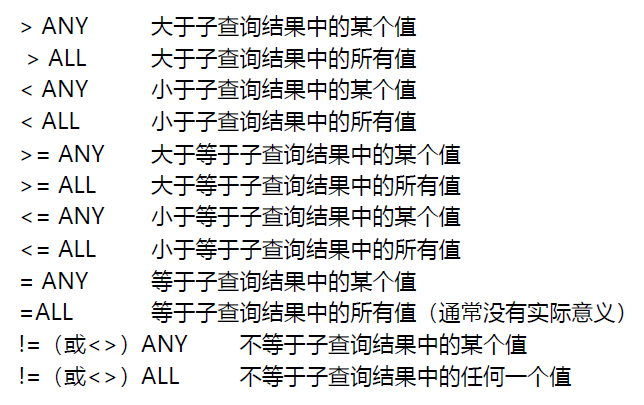

# 问题总结 - issue

> #### 22373386 高铭


截至目前，数据库课程已经有了三次上机。这三次上机，对我来说难度并不是很大，助教老师们在PPT中给出的教程和提示也十分详细，遇到SQL语言相关的问题通过参考PPT和上网查询基本都能迎刃而解。

不过，在第二次上机的 TASK 2 中，由于当时的我对于**连接语句**和**`ALL/ANY`**子查询和**`group by`**用法的不熟悉，在Q8上花了很长时间。下面将问题和解决方案贴在下面。

涉及了如下知识点：

- 子查询
- ANY/ALL谓词
- 连接查询
- 集函数
- 对查询结果进行分组

## 问题

- **Q8 - 查询平均工资最高的部门（department）的名称和所在的楼层**

关系模式：

**员工**（**员工编号、员工姓名、员工薪资、缺勤天数、出生日期、婚姻状况、员工对应部门的编号**）

**部门**（**部门编号、部门名称、部门所在楼层**）

问题：

1. 工资属性存储在员工表（staff）中，如何连接员工和部门表？
2. 单个部门的平均工资用集函数`AVG()`即可，但怎么得到部门间平均工资的最大值？

## 解决方案1

针对问题1，可以使用连接语句`join ... on ...`，本题中要连接stuff和department表，需要**员工对应部门的编号等于部门编号**，于是`from`和`join`语句可以写成如下形式：

```sql
from staff s1
join department d on d.D_id = s1.S_Did
```

其中，为了语句简洁，我将`staff`和`department`分别用`s`和`d`代替。

对于问题2，想要得到每个部门的平均工资，自然要按照部门编号分组

```
group by d.D_id
```

接着，想要得到部门平均工资的最大值，就需要用到带有`ALL`谓词的子查询。课堂PPT详细罗列了`ALL`和`ANY`谓词的用法，如下图和下表。



|         |  =   | <>或!= |  <   |        <=         |  >   |        >=         |
| :-----: | :--: | :----: | :--: | :---------------: | :--: | :---------------: |
| **ANY** |  IN  |   --   | <MAX |       <=MAX       | >MIN |       >=MIN       |
| **ALL** |  --  | NOT IN | <MIN | <=MIN(查询最小值) | >MAX | >=MAX(查询最大值) |

查询最大值，自然要用到`>=ALL`子句。子句中的select怎么写呢？工资在staff表中，因此子查询只需要再次按照员工对应部门的编号分组，查询平均工资即可。子句的写法如下所示：

```sql
having AVG(s1.S_salary) >= ALL (	# 用到`>=ALL`子句
	select AVG(s2.S_salary)
	from staff s2
	group by s2.S_Did				# 按照员工对应部门的编号分组
)
```

这样就完成了相关部门的查找，只需要按题目要求输出部门名称和所在楼层即可。完整代码如下：

```sql
select d.D_name, d.D_floor
from staff s1
join department d on d.D_id = s1.S_Did
group by d.D_id
having AVG(s1.S_salary) >= ALL (	# 用到`>=ALL`子句
	select AVG(s2.S_salary)
	from staff s2
	group by s2.S_Did				# 按照员工对应部门的编号分组
)
```

