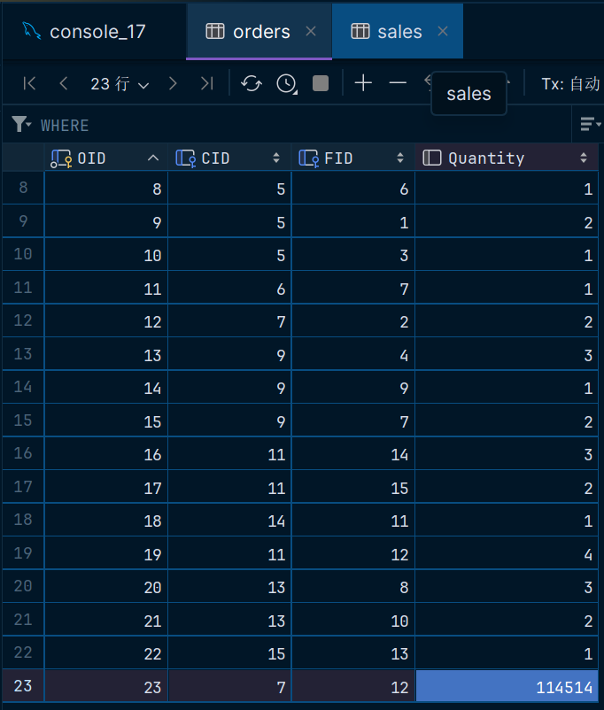

# **数据库第四次上机**

> #### 22373386 高铭

## TASK 1

<center class="half">


</center>

### Q1：查询与CID=1的顾客同一个城市的所有顾客ID

```sql
select CID
from customer c1
where c1.City = (
      select City
      from customer c2
      where c2.CID =1
      );
```


### Q2：查询购买过所有省份（Food表中出现过的City）的食物的顾客ID

```sql
select CID, count(City)
from food
join orders on food.FID = orders.FID
group by CID
having count(city) = (
    select count(distinct City)
    from food
    )
# 就给定的表中数据而言，没有符合要求的元组
```


### Q3：查询至少购买过ID为4的顾客买过的全部食物的顾客ID

```sql
select o1.CID
from orders o1
where o1.FID in(
    select FID
    from orders o2
    where o2.CID = 4
) and o1.CID <> 4
```


## TASK 2

### Q1：创建一个新表Sales，查询每种食物的总销量，将结果插入表中

```sql
create table Sales(
    FID int primary key,
    Name varchar(20),
    Quantity int
);

insert into Sales
    select food.FID, Name, sum(Quantity)
    from orders, food
    where orders.FID = food.FID
    group by food.FID, Name
```


### Q2：向Order表添加一条交易记录，内容自定义，并更新对应食物的总销量字段（两条SQL语句）

```sql
insert into orders
values (23, 7, 12, 114514);

update sales
set Quantity = Quantity + 114514
where FID = 12
```

<center class="half">


</center>


### Q3：为新表添加一个评分字段（数字型），要求分数范围限定为0-10，并设置默认值6

```sql
alter table sales
add Score float default 6 check (Score >= 0 and Score <= 10)
```


## Task 3

### Q1：建立购买过重庆或四川食物的顾客视图Shu-view（包含Customer中CID，City）

```sql
create view Shu_view as
    select c.cid, c.City
    from customer c, food f, orders o
    where c.CID = o.CID and f.FID = o.FID
        and (f.City = '重庆' or f.City = '四川')
    group by o.CID
```


### Q2：查询购买过重庆或四川食物的顾客中订单总消费最高的顾客CID（使用视图Shu-view，思考使用视图的好处）

```sql
# 方法1：避免子查询，使用排序->LIMIT查找最大值
select shu_view.cid, SUM(Price * Quantity)
from shu_view, orders, food
where shu_view.cid = orders.CID and food.FID and orders.FID
group by orders.CID
ORDER BY SUM(Price * Quantity) DESC
LIMIT 1;

# 方法2：用子查询，不用LIMIT语句，与方法一等价
select shu_view.cid
from shu_view, orders, food
where shu_view.cid = orders.CID and food.FID and orders.FID
group by orders.CID
having sum(Price * Quantity) >= all(
        select SUM(Price * Quantity)
        from shu_view, orders, food
        where shu_view.cid = orders.CID and food.FID and orders.FID
        group by orders.CID
        )
```


- 使用视图，好处在于可以**将复杂的查询逻辑封装起来，使得查询变得简单和可重用**，简化用户操作。
- 在这种情况下，我们可以利用已经创建的 `Shu_view` 视图来执行更简洁的查询，避免了多重子查询，提高可读性。


### Q3：向视图Shu-view加入表项（16，湖南），能成功吗，为什么？

- 不能成功，会产生报错：` The target table shu_view of the INSERT is not insertable-into`。

- 因为只有可更新视图才能向视图中加入表项，可更新视图是指：在视图中的行和基表中的行之间必须具有一对一的关系
- 如果视图包含下述结构中的任何一种，那么它就是不可更新的：
  1. SELECT中含有聚合函数；
  2. DISTINCT关键字；
  3. JOIN、GROUP BY、ORDER BY、HAVING子句；
  4. UNION运算符；
  5. 位于选择列表中的子查询；
  6. FROM子句中包含多个表；
  7. SELECT语句中引用了不可更新视图；
  8. WHERE子句中的子查询，引用FROM子句中的表


### Q4：建立男性顾客的视图Male-view（包含Customer中CID，City），并要求对该视图进行的更新操作  只涉及男性顾客。（**WITH CHECK OPTION**）

```sql
create view Male_view as
    select CID, City
    from customer
    where Gender = '男'
with check option
```


### Q5：向视图Male-view加入表项（17，湖南），能成功吗，为什么？

- 不能成功，会产生报错`CHECK OPTION failed 'lab4.male_view'`。

- 因为建立`Male_view`表时有限制`CHECK OPTION`，规定对视图进行增删改操作时会检查数据是否满足`Gender = '男'`这一条件。CID为17的记录并不一定是男性顾客（实际上表中是`null`），因此操作不会成功。