# **数据库第五次上机**

> #### 22373386 高铭

# TASK 1 索引

## Q1：实验 B+ 树索引

### B+树索引定义：

```sql
CREATE INDEX bdcopy1_v_index ON bdcopy1 (v) USING BTREE;
```

### 等值查询

```sql
select * from bdcopy1 where v = 10000;
select * from bdcopy2 where v = 10000;
```

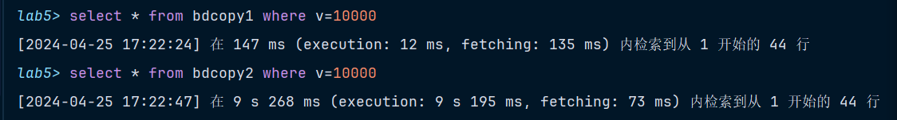

**速度差异对比**：`bdcopy1`建立B+树索引，用时$147ms$，`bdcopy2`没有建索引，用时$9.268s$，建立索引更快。

**原因分析**：

- B+树索引中的键值是有序的，这使得在查找特定值时，可以使用二分查找等高效算法，大大减少了查找所需的比较次数。
- B+树将所有数据在叶节点中有序存放并构成一个链表，缓存命中率更高


---
### 范围查询

```sql
select * from bdcopy1 where v > 10000;
select * from bdcopy2 where v > 10000;
```

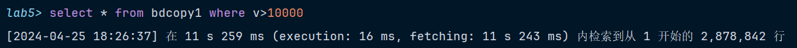

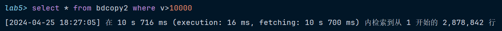

**速度差异对比**：`bdcopy1`用时$11.259s$，`bdcopy2`用时$10.716s$，二者用时接近

**原因分析**：

> PPT中说：**当要查询的记录数占记录总数的百分比非常大的时候，不用索引将比用索引更快。**

- 在本题中，由于查询记录数占总数百分比过大（$2878842/3200000 = 89.96\%$），**此时数据库查询已经不用索引而采用全表扫描，故速度与不用索引接近**，如下图使用`explain`查询的结果所示，`key`值为`null`

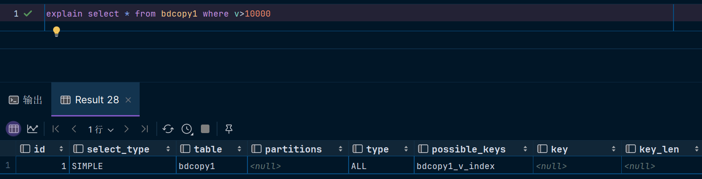

如果我们换一个更小的范围，会发现数据库查询开始使用索引，`key`值为B+树索引`bdcopy1_v_index`。

```sql
select * from bdcopy1 where v > 99000;
select * from bdcopy2 where v > 99000;
```

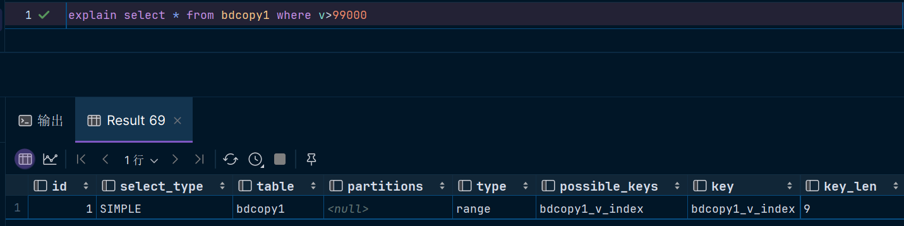

此时，速度差异对比如下，可以明显看出使用索引查询（$2.735s$）比不使用索引（$7.502s$）快得多。

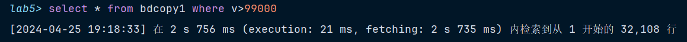

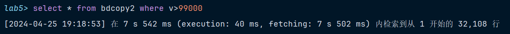

使用索引更快的原因是：

- B+树的叶子节点按照主键值的顺序排列。当查询一个范围时，B+树可以顺序遍历叶子节点，提高查询效率。

> 经测试，查询范围`v>95350`为数据库使用全表扫描和使用索引的分界线。此时查询记录数占总数百分比为$149726/3200000 = 4.68\%$。可见，$4.68\%$左右应为查询数据占总数百分比的分界线。


## Q2：实验散列索引

直接为bdcopy3建立hash索引：

```sql
select * from bdcopy1 where v = 80023;
select * from bdcopy3 where v = 80023;
```

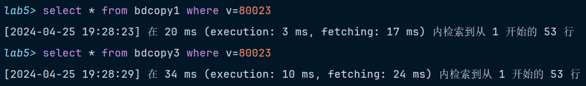

**速度差异对比**：`bdcopy1`用时$20ms$，`bdcopy3`用时$34ms$​，二者用时接近

**原因分析**：MySql默认的InnoDB引擎不支持hash索引，`bdcopy3`实际与`bdcopy1`一样建立了B+索引


---
### 建立hash索引 -> 等值查询

需要用**memory引擎**的**带散列索引**的表，只向`bdcopy4`中插入了416842条数据。

```sql
CREATE TABLE bdcopy4 (bid int, v bigint, s smallint, INDEX USING HASH (v)) engine = memory;
insert into bdcopy4 select * from bdtable
```

此时bdcopy4和5数据相同，4有hash索引，5没有索引。

```sql
select * from bdcopy4 where v = 80023;
select * from bdcopy5 where v = 80023;
```

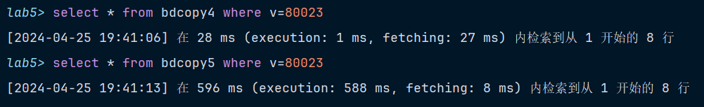

**速度差异对比**：`bdcopy4`用时$28ms$，`bdcopy5`用时$596ms$​，hash索引更快。

**原因分析**：hash索引只需一次磁盘IO就可以查到数据记录，等值查询只需计算哈希值，而哈希值作为索引，直接指向对应的数据位置，时间复杂度仅为$O(1)$。


## Q3：实验聚簇索引

### 等值查询

```sql
select * from bdcopy1 where bid = 1919810;
select * from bdcopy2 where bid = 1919810;
```

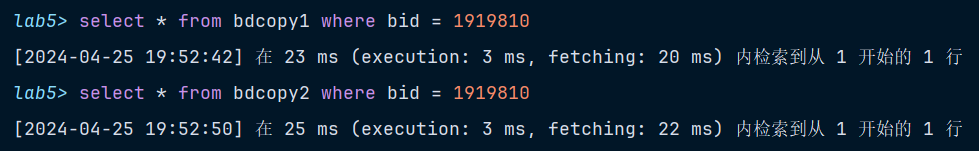

**速度差异对比**：`bdcopy1`建立B+树索引，用时$23ms$，`bdcopy2`建立聚簇索引，用时$25ms$，二者速度接近。

**原因分析**：B+树和聚簇两种索引在等值查询时效率接近，二者都能通过索引快速定位到数据，只是实现方式不同。

### 范围查询

```sql
select * from bdcopy1 where bid between 114514 and 214514;
select * from bdcopy2 where bid between 114514 and 214514;
```

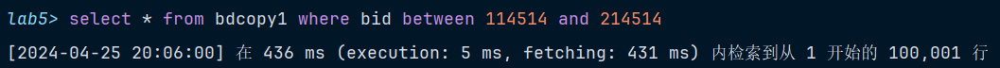

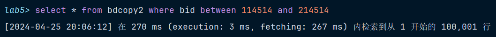

**速度差异对比**：`bdcopy1`用时$436ms$，`bdcopy2`建立聚簇索引，用时$270ms$，使用聚簇索引更快。

**原因分析**：

- 聚簇索引是一种特殊的索引类型，将索引和数据存储在同一个B+树中。
- 在聚簇索引列上的**查询速度比B+树索引快**
- 数据在**物理上按顺序排在数据页上**，重复值也排在一起，因而在使用包含范围检查（between、<、<=、>、>=）或使用`group by`或`order by`的查询时，可以大大提高查询速度


## Q4：实验联合索引

```sql
create index bdcopy2_v_s_index on bdcopy2 (v, s);	# 建立联合索引
```

### 联合查询

```sql
explain select * from bdcopy1 where v > 46118 and s = 0;
explain select * from bdcopy2 where v > 46118 and s = 0;
```

`bdcopy1`：

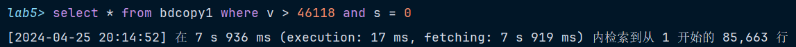


`bdcopy2`：

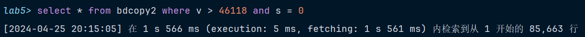


**速度差异对比**：`bdcopy1`没有索引，用时$7.936s$，`bdcopy2`使用联合索引，用时$1.566s$​​​，使用联合索引更快。

### 查询v

```sql
explain select * from bdcopy1 where v = 46118;
explain select * from bdcopy2 where v = 46118;
```

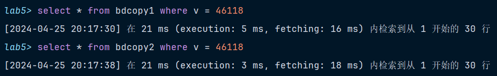

`bdcopy1`：


`bdcopy2`：


**速度差异对比**：`bdcopy1`使用B+树索引，用时$21ms$，`bdcopy2`使用联合索引，用时$21ms$​，二者一样快。

### 查询s

```sql
explain select * from bdcopy1 where s = 0;
explain select * from bdcopy2 where s = 0;
```

`bdcopy1`：

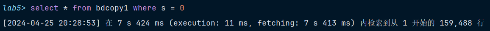


`bdcopy2`：

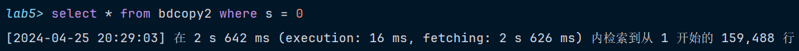


**速度差异对比**：`bdcopy1`没有索引，用时$7.424s$，`bdcopy2`使用联合索引，用时$2.642s$，使用联合索引更快。

### 原因分析

- `bdcopy2`建立了联合索引，在分别查询`v`、`s`、以`v`和`s`同时为条件时，都使用了索引查询，能够提高查询速度；而`bdcopy1`中只有字段v有B+树索引，使得字段`v`的查询速度和`bdcopy2`持平，而其他两个查询的速度都不及`bdcopy2`。


## Q5：实验函数索引

```sql
explain select * from bdcopy1 where bid / 2 = 30000;
explain select * from bdcopy1 where bid = 30000 * 2;
```

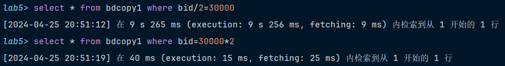

`bdcopy1`：


`bdcopy2`：


**速度差异对比**：**计算式在等号左边**的查询没有使用索引，用时$9.265s$，**计算式在等号右边**的查询使用了聚簇索引，用时$40ms$，后者更快。

**原因分析**：

- **计算式在等号左边**的查询涉及到了对 `bid` 列进行数学运算，这会导致**每一行数据都需要进行计算**来检查是否符合条件，无法利用索引来加速查询。数据库需要逐行检查每一行的 `bid` 值是否满足条件。
- **计算式在等号右边**的查询中，条件 `bid = 30000 * 2` 是一个**等值查询**，可以利用聚簇索引快速定位到符合条件的行。这种情况下，数据库不需要对每一行进行计算，因此查询速度会更快。
