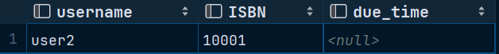
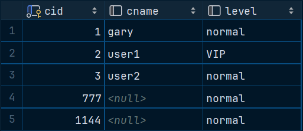

# **数据库第六次上机**

> #### 22373386 高铭

## TASK 1：存储过程或自定义函数实现用户操作

### Q1 使用游标

> **用户密码检查/修改**： 接收四个参数（用户名，密码，新密码，动作），若动作为1，则检查用户名和密码是否和密码表中存的相符，相符则返回 true，不相符返回false；若动作为2，则首先检查用户名、密码是否相符，若不相符返回false，相符则将密码表中的密码改成新密码，返回true。密码要求只包含数字和字母，长度大于等于4、小于等于10；

代码如下：

```sql
create procedure user_check (
    in uname varchar(50),
    in old_pwd varchar(30),
    in new_pwd varchar(30),
    in action int,
    out judge bool
) begin
    declare _username varchar(50);
    declare _pwd varchar(30);
    declare done bool default 0;
    declare pwd_cursor cursor for select username, password from account;
    -- 游标执行结束时将会设置done变量为1
    declare continue handler for not found set done = 1;
    set judge = false;  -- judge初值为false
    open pwd_cursor;
    while done = 0 do
        fetch pwd_cursor into _username, _pwd;
        if _username = uname and _pwd = old_pwd then
            set judge = true;
            # 若动作为2,则将密码表中的密码改成新密码
            if action = 2 then
                update account set password = new_pwd where username = _username;
            end if;
        end if;
    end while;
    close pwd_cursor;
end;
```

`account`表内数据如下图所示：


共测试了四组数据，测试语句如下代码，结果在下面分别给出图片。

```sql
call user_check('gary','111aa','asdfgh',1, @judge);			# return true
call user_check('user1','13456a','helloworld',1, @judge);	# return false: wrong password
call user_check('user2','114514eee','00000', 2, @judge);	# return true & update
call user_check('databasee','hahaha2','aaaaaa', 2, @judge); # return false: wrong username
select @judge;
```

- 第一组：


- 第二组：

  

- 第三组：

  

  

- 第四组：

  

### Q2

> **借书**：接收两个参数（用户名，ISBN），没有足够的书、用户不存在或一个人借阅两本同样的书时返回false，合法执行后，借阅记录表会新增一条记录，书库对应书的数量也需要减1，并返回true；

代码如下：

```sql
create procedure borrow_book(
    in uname varchar(50),
    in i varchar(50),
    out judge bool
) begin
    set judge = false;
    if exists(select * from account where username = uname) then
        if exists(select * from stack where ISBN = i and amount >= 1) then
            if not exists(select * from record where ISBN = i and username = uname) then
                set judge = true;
                insert into record values (uname, i, null, null, null);
                update stack set amount = amount - 1 where ISBN = i;
            end if;
        end if;
    end if;
end;
```

`stack`表和`record`表内数据分别如下图所示（本题为图简便，涉及`time`的值均为`null`）：


共测试了四组数据，测试语句如下代码，结果在下面分别给出图片。

```sql
call borrow_book('user114514', '10001', @judge);	# false 用户不存在
call borrow_book('user2', '10002', @judge);	# false 没有足够的书
call borrow_book('user1', '10001', @judge); # false 一人借阅两本同样的书
call borrow_book('user3', '10001', @judge); # true
select @judge;
```

- 第一组：

  

- 第二组：

  

- 第三组：

  

- 第四组：

  

  可见：`record`多了一条记录（第4条），书10001的库存自减一

  

  

### Q3

> **还书**：接收两个参数（用户名，ISBN），未查询到借阅记录时返回false，合法执行后，借阅记录表对应记录会修改还书时间，书库对应书的数量需要加1，并返回true；

代码如下：

```sql
create procedure return_book(
    in uname varchar(50),
    in i varchar(50),
    out judge bool
) begin
    set judge = false;
    if exists(select * from record where ISBN = i and username = uname) then
        set judge = true;
        # now() - 还书时间记为调用该存储过程的时间
        update record set return_time = now() where ISBN = i and username = uname;
        update stack set amount = amount + 1 where ISBN = i;
    end if;
end;
```

`record`和`stack`表和Q2结束时一样。共测试了三组数据，测试语句如下代码，结果在下面分别给出图片。

```sql
call return_book('user2', '10002', @judge); # false: no record
call return_book('user1', '10001', @judge); # true
call return_book('user3', '10001', @judge); # true
select @judge;
```

- 第一组：

  

- 第二组：

  

  成功还书，`stack`和`record`表如下所示

  

  

- 第三组：

  

  成功还书，`stack`和`record`表如下所示

  

  

### Q4

> **查看当前借阅记录**：接受一个参数（用户名），返回该用户名的当前借阅中的记录(用户名, ISBN, 到期时间)

代码如下：

```sql
create procedure lookup_record(
    in uname varchar(50)
) begin
    if not exists(select * from record where username = uname) then
        select 'error: no record of such user!';
    else
        select username, ISBN, due_time
        from record where username = uname;
    end if;
end;
```

共测试了四组数据，测试语句如下代码，结果在下面分别给出图片。

```sql
call lookup_record('user0');	# no such user
call lookup_record('gary');		# no record
call lookup_record('user1');	# output correctly
call lookup_record('user2');	# output correctly
```

- 第一组

  

- 第二组

  

- 第三组

  

- 第三组

  


## Task2：触发器相关实验

Q6中的DML检验在各触发器建立以后执行。

### Q1

> 建表： fruits（fid， fname， price）， sells（fid，cid， sellTime， quantity），customer （cid， cname， level)，在fruits表和customer 表插入至少一条数据。

`fruits`表：


`sells`表：


`customer`表：


### Q2

> 写一个`sells`表触发器**`check_fid_exist`**，当插入新的用户购买记录之前，检查插入的新的购买记录中的`fid`值在`fruits`表中是否存在。若不存在，则引发错误，提示信息为”该水果数据不存在“

```sql
create trigger check_fid_exist
    before insert on sells
    for each row
    begin
        if not exists(
            select * from fruits where fid = NEW.fid
        ) then
            SIGNAL SQLSTATE '45000' SET MESSAGE_TEXT = '该水果数据不存在';
        end if;
    end;
```

检验：

```sql
insert into sells values (1,1,null,99);		# success
insert into sells values (4,2,null,999);	# fail
insert into sells values (0,3,null,1);		# fail
```

语句1：


语句2和3结果相同，只展示语句2：


### Q3

> 写一个`sells`表触发器**`check_cid_exist`**，当插入新的用户购买记录之前，检查新的购买记录中的用户`cid`在`customer`表中是否存在。若不存在，则将该用户ID插入到`customer`表中（`cname`为空，`level`设为`normal`）

```sql
create trigger check_cid_exist
    before insert on sells
    for each row
    begin
        if not exists(
            select * from customer where cid = NEW.cid
        ) then
            insert into customer values(NEW.cid, null, 'normal');
        end if;
    end;
```

检验：

```sql
insert into sells values (2,3,null,10086);	# success
insert into sells values (1,777,null,999);	# trigger, insert into customer
insert into sells values (4,4,null,1);		# ought to trigger both, but only Q2 can be triggered
```

语句1：


语句2：

`sells`：


`customer`：


语句3：


仅触发了`check_fid_exist`触发器，本题实现的`check_cid_exist`并未触发。

### Q4

> 写一个`sells`表触发器**`triADD`**：当插入新的用户购买记录之后，检查该用户购买的总价值（每种水果价格 * 销售量的和 ）超过1万元就设置`customer`表的`level`为`VIP`，超过2万元设置为`SVIP`，低于1万元则置为`normal`。

```sql
create trigger triADD
    after insert on sells
    for each row
    begin
        declare total_value int;
        select sum(price * quantity) into total_value
        from fruits, sells
        where sells.fid = fruits.fid 
        	and cid = new.cid;		# don't forget this statement!!
        if total_value > 20000 then
            update customer set level = 'SVIP' where cid = NEW.cid;
        elseif total_value > 10000 then
            update customer set level = 'VIP' where cid = NEW.cid;
        else
            update customer set level = 'normal' where cid = NEW.cid;
        end if;
    end;
```

检验：

```sql
insert into sells values (1,2,null,2000); # cid = 2, total = 2000*10+8*3 = 20024
insert into sells values (3,1,null,3000); # cid = 1, total = 3000*6+4*8 = 18032
insert into sells values (2,1144,null,1000); # new cid = 114514, total = 1000*8 = 8000
insert into sells values (3,3,null,5);	  # cid = 3, total = 6*5+10*2 = 50
```

执行上述语句后的`sells`、`customer`表如下所示：


### Q5

> 写两个`sells`表触发器**`triDEL`**和**`triUPT`**，若删除或修改`sells`表记录，也重新计算并重置客户的`level`值。

```sql
create trigger triDEL
    after delete on sells
    for each row
    begin
        declare total_value int;
        select sum(price * quantity) into total_value
        from fruits, sells
        where sells.fid = fruits.fid
          and cid = old.cid; # don't forget this statement!
        if total_value > 20000 then
            update customer set level = 'SVIP' where cid = old.cid;
        elseif total_value > 10000 then
            update customer set level = 'VIP' where cid = old.cid;
        else
            update customer set level = 'normal' where cid = old.cid;
        end if;
    end;

# 检验：
delete from sells where fid = 3 and cid = 1;    
# now cid = 1: total = 32
delete from sells where fid = 2 and cid = 2;    
# now cid = 2: total = 20000
```

执行上述语句后的`sells`、`customer`表如下所示：




```sql
create trigger triUPT
    after update on sells
    for each row
    begin
        declare total_value int;
        select sum(price * quantity) into total_value
        from fruits, sells
        where sells.fid = fruits.fid
          and cid = old.cid; # don't forget this statement!
        if total_value > 20000 then
            update customer set level = 'SVIP' where cid = old.cid;
        elseif total_value > 10000 then
            update customer set level = 'VIP' where cid = old.cid;
        else
            update customer set level = 'normal' where cid = old.cid;
        end if;
    end;

update sells set quantity = 3000 where fid = 2 and cid = 1; 
# now cid = 1: total = 24000
update sells set quantity = 1500 where fid = 1 and cid = 777; 
# now cid = 777: total = 15000
```

执行上述语句后的`sells`、`customer`表如下所示：


