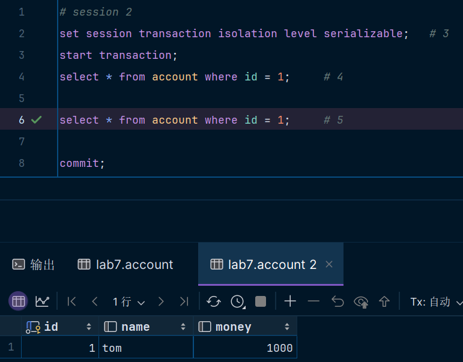
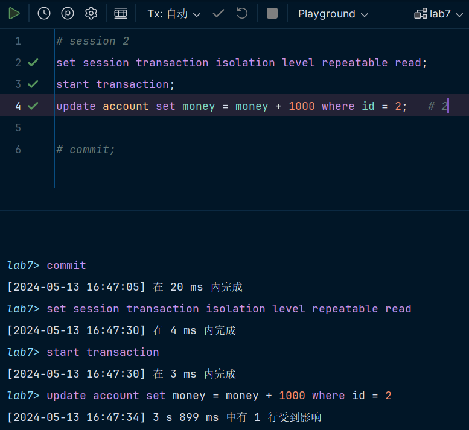

# **数据库第七次上机**

> #### 22373386 高铭

## TASK 1：隔离级别的验证

### Q1 脏读

隔离级别为`read uncommitted`语句2、4、5的输出结果分别为2000、2000、1000。

语句2：

语句4：

语句5：

分析：

- 语句2：`money`属性自增1000，查询 session 1 更新后的金额为2000。
- 语句4：`read uncommitted`隔离级别为读未提交，该语句会读入 session 1 修改后的脏值即2000。
- 语句5： session 1  `rollback`，`money`的修改被取消， session 2 读取的是原本的数据1000。

### Q2 脏读

#### 隔离级别为`read committed`

语句2、4、5的输出结果分别为2000、1000、1000。

语句2：

语句4：

语句5：

分析：

- 语句2：`money`属性自增1000，查询 session 1 更新后的金额为2000。
- 语句4：`read committed`隔离级别能够避免读脏数据，因此语句4读取的是 session 1 修改前的数据1000。
- 语句5： session 1  `rollback`，`money`的修改被取消， session 2 读取的是原本的数据1000。

#### 隔离级别为`repeatable read`

语句2、4、5的输出结果分别为2000、1000、1000。

语句2：

语句4：

语句5：

分析：

- 同`read committed`，`repeatable read`能避免读脏数据，执行结果相同。

#### 隔离级别为`serializable`

语句2、4、5的输出结果分别为2000、无法输出、1000。

语句2：

语句4：

语句5：

分析：

- 语句2：`money`属性自增1000，查询 session 1 更新后的金额为2000。
- 语句4：`SERIALIZABLE`是最严格的隔离级别之一，**事务被完全隔离**，每个事务的执行都不会受到其他事务的影响。因此 session 1 先对数据库进行`update`操作， session 2 就无法执行数据库的查询操作，只有`rollback`或`commit`以后才能执行。
- 语句5： session 1  `rollback`，`money`的修改被取消， session 2 读取的是原本的数据1000。

### Q3 不可重复读

语句2、4的输出结果分别为0、1000。

语句2：

语句4：

分析：

- `read committed`读取提交后的数据，语句2读取原数据0， session 2 修改money并提交，于是 session 1 的语句4读到新数据1000。

### Q4 不可重复读

#### 隔离级别为`repeatable read`

语句2、4的输出结果分别为0、0。

语句2：

语句4：

分析：

- `repeatable read`采取**快照读**的机制，即在事务开始时记录一个快照，用于在整个事务期间提供一致的数据视图。这样即使其他事务在事务执行期间修改了数据，当前事务**仍然能够看到事务开始时的数据状态**，从而保证了可重复读性。因此， session 1 开始的`money`值和 session 2 修改事务后的`money`都为0。

#### 隔离级别为`serializable`

语句2的输出结果分别为0，语句4之前 session 2 中的`update`语句无法执行。

语句2：

语句4：

分析：

- 第一次查询显然为0，对第二次查询，同Q2，`serializable`隔离级别下， session 1 先行对数据库进行操作，在没有`commit`或`callback`的情况下， session 2 无法进行修改。

### Q5 不可重复读 - 行锁

T2时刻：语句2不能执行。

T4时刻：语句2可以执行，但由于没有提交，因此`account`表中`money`值仍为0。

分析：

-  session 1 对`select`语句使用了`lock in share`，加了S（共享）锁，使得 session 2 只能读不能写，因此T2时刻不能执行`update`语句。当 session 1  `commit`以后，锁被释放， session 2 的更新操作才可以执行。

### Q6 幻读1

语句2：正常查询

语句6：插入`alen`的信息，`money`默认为0

语句4：由于隔离级别为`repeatable read`，根据快照读的机制，语句4查询的值和事务开始的数据一样，和语句2相同。

语句7：`account`表在本事务被更新，再次查询将不是快照数据，而是更新后的数据。

### Q7 幻读1

语句2：

语句4：`serializable`只能等前一个事务执行完后一个事务才能顺序执行，语句5无法执行，所以语句4查询的值和语句2一样。

### Q8 幻读1

在 session 1 加了S锁的情况下，`repeatable read`和`serializable`都无法执行语句5，session 2 只能读不能写，因此不能执行`insert`语句。

### Q9 不可重复读 - 行锁

语句2无法执行：

语句3正确执行，执行`commit`后删除表中数据：

分析：

- session 1 加了S锁，其他事务只能加S锁，不能加X锁。由于innoDB对`insert/update/delete`语句会加排他锁（X锁） ，该语句将不会执行。

## Task 2 死锁

### Q10

执行到语句3：A事务即进程138，正在等待锁释放

产生死锁：

死锁后，查找到仍在运行的死锁进程138：

手工杀死它，死锁消失

原因分析：

- A 事务 `UPDATE tableA`，对 table A 加锁
- B 事务`UPDATE tableB`，对 table B 加锁
- A 事务`UPDATE tableB`，对 table B 加锁
- B 事务`UPDATE tableA`，对 table A 加锁，这时会发生死锁，因为A事务已封锁了数据对象A和B，B事务已封锁数据对象A，此时B事务请求对A已封锁的数据对象B加锁，两事务将会互相等待。

### Q11

> TASK1中的实验session1与session2均设置为相同的隔离级别，思考不同场景下，若两个会话的隔离级别不同会发生什么？

若两个会话的隔离级别不同，最后查询的值需要具体情况具体分析。

例如Q2中，如果 session1 的隔离级别为`read committed`，session 2 的隔离级别为`read uncommitted`，语句2、4、5的输出结果分别为2000、2000、1000；

而如果 session1 的隔离级别为`read uncommitted`，session 2 的隔离级别为`read committed`，语句2、4、5的输出结果分别为2000、1000、1000。
