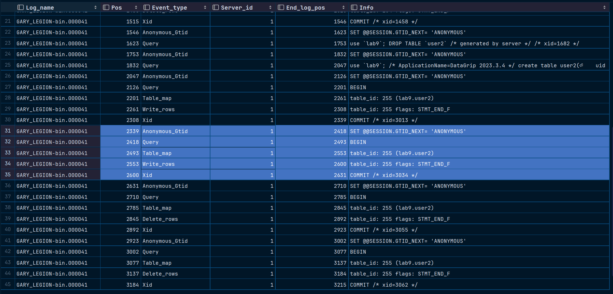

# **数据库第八次上机**

> #### 22373386 高铭

## TASK 1：逻辑备份

### 1. 建表

```sql
create database lab9;
create table user(
    uid int primary key,
    name varchar(100),
    money int
);
insert into user values(1, 'A', 2000), (2, 'B', 3000);
```


### 2. 使用mysqldump工具备份数据库

```cmd
C:\Program Files\MySQL\MySQL Server 8.0\bin>mysqldump -uroot -p lab9 user > lab9_backup.sql
Enter password: ********
```


### 3. 删除该表

```sql
drop table user;
```

恢复前：


### 4. 恢复数据库

```cmd
C:\Program Files\MySQL\MySQL Server 8.0\bin>mysql -uroot -p lab9 < lab9_backup.sql
Enter password: ********
```

恢复后如下图，可见恢复操作成功。


## TASK2：增量备份

### 1. 建表

```sql
create table user2(
    uid int primary key,
    name varchar(100),
    money int
);
insert into user2 values(1, 'A', 2000), (2, 'B', 3000);
```


### 2&3. 删除A用户、删除B用户

```sql
delete from user2 where name = 'A';
delete from user2 where name = 'B';
```

恢复前：


### 4. 使用日志通过位置恢复B用户

查询日志：日志文件名为`GARY_LEGION-bin.000041"`。

高亮部分为插入B用户的操作。start-position=2339，stop-position=2631



```cmd
C:\Program Files\MySQL\MySQL Server 8.0\bin>
mysqlbinlog  --no-defaults --start-position=2339 --stop-position=2631 "C:\ProgramData\MySQL\MySQL Server 8.0\Data\GARY_LEGION-bin.000041" | mysql -uroot -p
Enter password: ********
```

由下图可看出，B用户被成功恢复。


### 5. 使用日志通过时间恢复A用户

如图为通过`show binlog events`语句查询到的插入A用户的日志。start-position=2047，stop-position=2339


cmd命令行执行语句：

```cmd
mysqlbinlog --no-defaults "C:\ProgramData\MySQL\MySQL Server 8.0\Data\GARY_LEGION-bin.000041"
```


查询到2047~2339的时间戳为 ·

进行恢复操作：

```cmd
C:\Program Files\MySQL\MySQL Server 8.0\bin>
mysqlbinlog  --no-defaults  --start-datetime="2024-05-23 16:17:43" --stop-datetime="2024-05-23 16:18:32" "C:\ProgramData\MySQL\MySQL Server 8.0\Data\GARY_LEGION-bin.000041" | mysql -uroot -p
Enter password: ********
```

由下图可看出，A用户被成功恢复。

