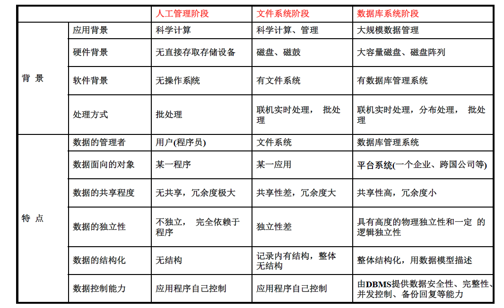

# 01 - 概述

---

**成绩构成**：

|项目|占比|
|:--:|:--:|
|平时（考勤+作业）|10%|
|数据库系统开发大作业|10%|
|期末考试|60%|
|课程实验|20%|
--------------

## 1.1 为什么学数据库

多数软件（尤其企业级软件）都需要进行**数据管理**
数据库：数据建模、数据操作、数据检索、数据安全……
重要：IT核心，基础设施，基础学科：Turing奖，数据库带动巨大软件产业，卡脖子

## 1.2 数据库相关概念

### 1.2.1 数据&信息

1. **信息**：是影响动态系统状态的时间，是人脑的输入，可以被记录和被传播
2. ⭐️**数据**：是用于记录信息、对客观事物进行记录并可以鉴别的符号，是对事物进行定性或定量描述的值。**数据与其语义密不可分。**
3. 数据+解释=信息，数据是信息的**载体**，信息是数据的**解译**

### 1.2.2 数据管理

任务：数据存储（Storage）、数据维护（Maintenance）、数据查询（Query）

### 1.2.3 数据库 DataBase, DB

- **数据库**是长期存储在计算机内、有组织的、可共享的大量数据的集合，其中的数据按一定的数据模型组织、描述和储存，具有较小的冗余度、较高的数据独立性和易扩展性，并可为各种用户共享。

- 三个基本特点：**永久存储、有组织、可共享。**

### 1.2.4 数据库管理系统 DataBase Management System, DBMS

- 是位于用户与操作系统之间管理数据库的一种大型复杂软件系统。

- 功能：

  - 数据定义功能

  - 数据组织、存储、管理功能

  - 数据操纵功能

  - 数据库事务管理和运行管理

  - 数据库的建立与维护等

### 1.2.5 数据库系统 DataBase System, DBS

- 基于数据库建立的一种信息系统
- 通常由应用程序、数据库、数据库管理系统和用户组成
- 数据库用户：数据库管理员（DBA）、应用系统开发人员、终端用户

## 1.3 数据管理发展历史

1. 手工处理阶段：数据不保存，没有对数据进行管理的软件系统，没有文件的概念，数据面向应用

2. 文件系统阶段：

   特点：数据以文件形式可长期保存下来，文件系统可对数据的存取进行管理，文件形式多样化，程序与数据间有一定独立性。

   缺点：数据冗余度大，数据独立性低，数据一致性差

3. 数据库系统阶段

   特点：

   + **数据结构化**：描述数据本身和数据之间的**联系**

   + **数据共享**：数据**考虑所有用户的数据需求**、面向整个系统组织，而非面向某个具体应用，同一部分数据也可为多用户共享。**低冗余**

   + **数据独立性**：数据库中的**数据与应用程序之间**不存在依赖关系，而是相互独立的。

     + 物理独立性：修改数据库的物理存储模式而不必重写应用程序的能力
     + 逻辑独立性：修改数据库的逻辑模式而不必重写应用程序的能力

   + **方便的用户接口**：标准化的**非过程式语言SQL**，很方便地操纵数据库

   + **统一的数据管理与控制功能**：数据的完整性，数据的安全性，并发控制

     

## 1.4 数据库结构

### 1.4.1 数据库模式结构

+ **模式（Schema）**：数据库逻辑结构和特征的描述，反映数据的结构及其联系，是相对稳定的，用DDL来严格定义。
+ **模式的一个实例**：是模式的一个具体值，反映数据库某一时刻的状态。同一模式可有很多实例，实例随数据库中的数据的更新而变动
+ 用户使用数据库就是按照模式所描述的结构，在模式的实例中存取数据
+ ==三级模式==结构：对数据的三个抽象级别
  
  1. **外模式**（子模式/用户模式）-  用户层
     + 数据库用户使用的**局部**数据的逻辑结构和特征的描述，基于**数据视图**（view）实现
     + 地位：**介于模式与应用之间**。**模式与外模式的关系：一对多**。外模式通常是**模式的子集**。一个数据库可以有多个外模式，反映了不同的用户的应用需求、看待数据的方式、对数据保密的要求。对模式中同一数据，在外模式中的结构、类型、长度、保密级别等都可以不同
     + 外模式与应用：一对多
     + 用途：保证数据库安全性和数据独立性
  2. **模式**（概念模式）-  逻辑层，上文已提及
     + 描述数据库中全体数据的逻辑结构和特征，是所有用户的公共数据视图
     + 一个数据库**只有一个**模式
     + 地位：是数据库系统模式结构的**中间层**，与物理存储细节和硬件环境无关，与具体应用程序、开发工具、程设语言无关
     + 模式的定义：①逻辑结构，②数据间的联系，③数据有关的安全性、完整性要求。
  3. **内模式**（存储模式）-  物理层
     + 一个数据库**只有一个**内模式
     + 是数据物理结构和存储方式的描述，是**数据在数据库内部的表示方式**
+ ==两级映像==：在DBMS内部实现这三个抽象层次的联系和转换
  
  1. **外模式/ 模式映象**：
     
     + 将外模式映射为概念模式，从而支持**数据概念视图向外部视图的转换**。
     + 便于用户观察使用数据。
     + 实现手段：**数据视图**（View）。
     + 作用：保证数据的**逻辑独立性**。
     + > 模式改变时，只需修改有关外模式/模式影响，外模式保持不变，应用也不必修改
  2. **模式/ 内模式映象**：
     + 定义了**数据全局逻辑结构与存储结构之间**的对应关系。例如，说明逻辑记录和字段在物理文件内部是如何表示的。
     + 便于计算机存储和处理。
     + 作用：保证数据的**物理独立性**。

### 1.4.2 数据库功能结构

- 数据库管理系统运行着很多例程来完成数据管理功能。

1. **查询处理器**：查询分析、检查、优化、执行
2. **存储管理器**：根据查询执行层的操作指令，在数据存储器中完成数据的增删改查操作
3. **安全管理器**：外围级防御、访问级防御、数据级防御

### 1.4.3 数据库体系结构

​	数据库的组件构成和相互之间的交互作用。

- **集中式(Centralized)**：早期的，客户端**不运行程序**，数据管理和业务处理由CPU负责
- **客户-服务器式(Client-Server, CS)**：客户端运行应用程序，数据库部署于中心服务器，通常采用**单体数据库结构**
- **分布式(Distributed)**：**数据规模巨大**，单体数据库无法处理时，可以使用并行、分布式架构，扩展容量和处理能力，提升可用性
- **并行式(Parallel)**
- **云数据库**：使数据库成为社会/行业的信息基础设施，实现**更灵活的资源调度和管理**
