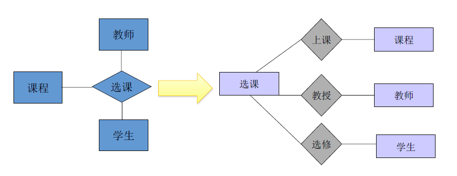
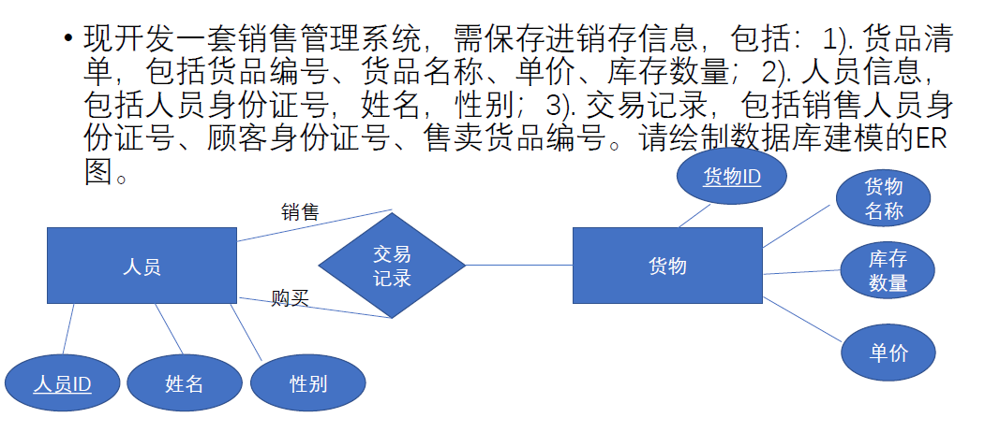

# 第二章 数据模型

# 02 - 数据模型-概念模型

## 2.1 什么是数据模型

- 模型：是对**现实世界**的抽象，常用于帮助人们提取问题本质，从而更容易找到解决办法
- 数据模型：是**现实世界数据特征**的抽象，是用来描述数据的一组概念和定义。数据在计算机中的**组织结构**，和施加在这个结构上的**处理方法**，即是数据模型
- 不同的数据模型代表了不同的观察世界的角度，代表了不同的抽象方法

1. **概念数据模型**

   - 是独立于计算机系统的数据模型，不涉及信息在计算机中的表示，只用来描述某个特定组织所关心的信息结构，是**对现实世界**的**第一层抽象**。
   - 按**用户的观点**对数据建模，强调其语义表达能力，是**用户和数据库设计人员之间进行交流**的语言和工具。

2. **逻辑数据模型**

   + 直接面向数据库的逻辑结构，是对现实世界的第二层抽象。它直接与DBMS有关，有严格的形式化定义、DB语言，以便在计算机系统中实现。

   + 有层次模型、网状模型、关系模型等。

   + > [!NOTE]
     >
     > **逻辑数据模型是区分不同类型数据库的依据，并在很大程度上决定了数据库的性能和应用范围。**
     >
     > 就是通常所说的数据模型

3. **物理数据模型**

   - 反映了数据在存储介质上的组成结构，并描述了访问机制、如何表达记录结构、记录顺序和访问路径等信息。

## 2.2 概念模型

基本要求：较强的语义表达能力，能够方便、直接地表达应用中的各种语义知识；简单、清晰、易于用户理解。

### 2.2.1 ER数据模型

- **两种常用抽象手段**：
  1. **分类（Classification）**：司机，学生，赛事……
     - 定义某一类概念作为**现实世界中一组对象的类型**
     - 在特定的上下文里，这些对象具有某些共同的特性和行为
  2. **聚集（Aggregation）**：学生的学号、姓名、专业……
     - 定义某一类型的**组成成分**
     - 根据上下文管理需求，给出指定类型的特征集合

ER模型的观点：世界是由一组称作**实体**的基本对象和这些对象之间的**联系**构成的

- **三个基本元素**：

  1. **实体(Entity)**：客观存在并可以相互区分的客观事物或抽象事件

     实体集：同型实体的集合（e.g. 课程={语文, 数学, 英语}）。经常把实体集简称为实体

  2. **属性(Attribute)**：实体所具有的某一特性，一个实体由若干属性刻画。

     > [!IMPORTANT]
     >
     > 属性类型不同的实体属于不同的实体集，**属性类型相同的实体属于同一实体集**！
     >
     > 例如，员工和顾客都只有ID属性时，才同属人员实体！！！

     - **域（Domain）**：属性的取值范围。
     - **属性的类型**：单值属性、多值属性（例如某人电话号）；简单属性、复合属性
     - **键（key）**：实体集中**能唯一标识实体的属性或属性组**。两个以上属性组成的键称为**复合键**(compound key)。实体集中的每一个实体，在键属性上的取值各不相同

  3. **联系(Relation)**：由一系列的实体间对应关系所组成

     + 联系的键是**复合键**，由来自于各相关实体集的键属性组成
     + 也可以用属性来刻画联系的特性

- **ER图（ER diagram）**：

  - **实体**：矩形框
  - **实体的属性**：椭圆框，连线到响应实体
  - **实体之间的联系**：菱形框，连到有关的实体

- **联系的元（degree）**：参与联系的实体的个数

- **联系的基数比约束(Mapping Cardinality Constraints)**：表示一个实体可以通过联系关联到的另一个实体集中实体的数量。==**画ER图时要表明**==

  - 一对一联系（1:1）：班级与班长，观众与座位
  - 一对多联系（1:n）：班级与学生，公司与职员。表示可以为：1的那一方用箭头，n的一方没有箭头
  - 多对多联系（m:n）：教师与学生，工厂与产品

- **一元联系**：sometimes，二元联系关联的两个实体集实际上属于同一个实体集的两个副本，可将其合并。在一元联系中，需要**用角色来区分同一实体集的不同副本**。

- **多元联系**：:star::star::star:牢记**三元联系转换为二元联系的方法**！（把关系作为一个实体）

- **约束（Constraints）**：是一种对数据库的断言（assertion），数据库应保证该断言成立：丰富了数据的语义，保证数据的有效性和完整性，实现更高效的存储和数据查询（后续详述）
- **键约束（Key Constraints）**：可以容易地引用实体
  - **超键（super key）**是实体集中的一个或一组属性，用它们**可以唯一的确定每一个实体**
  - **候选键（candidate key）**是某个超键的==最小集==。若存在多个候选键，则可以任选一个作为该实体集的**主键（primary key）**

### 2.2.2 ER模型建模

建模准则：

1. **忠实于用户需求**

2. **KISS准则（keep it simple and stupid）**

3. **设计上避免冗余**

   - 冗余：用两个以上不同的实例描述同一件事情

   - 冗余会导致空间浪费，更会带来数据不一致

    > [!TIP]
     >
     > my understanding：一个实体不能是另外一个实体的属性，一件事尽可能少画框

4. **能抽象为属性的，就不要抽象为实体**

    > [!CAUTION]
     >
     > 只有在符合下面两个情况之一的时候才需要把事物抽象为实体：
     >
     > 1. 事物有**至少一个非键属性**（不属于键的属性）:
     >    学生（<u>姓名</u>） VS 书（<u>书名</u>，页数，出版年代）
     > 2. 事物处于“一对多”或“多对多”**联系中“多”那一端**
     >
     > 不符合以上情况的事物，都可以抽象为属性。

   - 反过来，应该是实体的，也不要强行拆解为属性

### 2.2.3 ER模型小结

- 客观性：ER模型是在客观事物或系统的基础上形成的，在**某种程度上反映了客观现实**，反映了**用户的需求**。
- 主观性：ER模型又不等同于客观事物的本身，它往往**反映事物的某一方面**，至于选取哪个方面或哪些属性、如何表达，则**决定于观察者本身的目的与状态**。
- 设计过程：
  1. 先设计**实体类型**（找出逻辑独立的事物，即**管理对象**）；
  2. 再设计**联系类型**（确定**实体之间相互影响的关系**）；
  3. 最后为实体和联系确定**属性**。
- ER模型应该充分反映用户需求，要得到用户的认可才能确定下来。

> [!IMPORTANT]
>
> last tip: ER图可以没有联系，不要想复杂！一定要记住标识1:n，m:n什么的

> 作业题：
>
> 1、现开发一套销售管理系统，需保存交易记录信息，包括销售人员身份证号、顾客身份证号、售卖货品名称、数量、单价。请绘制数据库建模的 ER 图。
>
> - 这道题看似的实体顾客、销售员、货品（虽然它有很多属性），实际上都是交易记录的属性而已
>
> 2、现开发一套销售管理系统，需保存进销存信息，包括： 1). 货品清单，包括货品编号、货品名称、单价、库存数量； 2). 交易记录，包括销售人员身份证号、顾客身份证号、售卖货品编号。请绘制数据库建模的 ER 图。
>
> - 这道题销售员和顾客都只有ID这一属性，不用抽象出实体，二者共同作为交易方的属性，和货物产生“交易记录”这一联系
>
> 3、注意顾客和销售员这两个实体集同属人员实体集，可以合并成一元联系
>
> 
