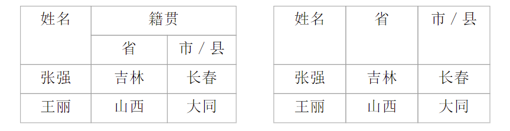
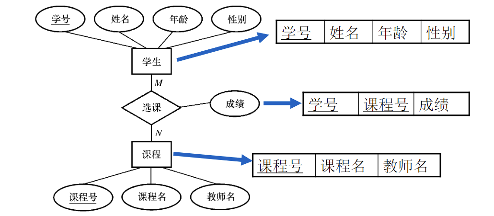
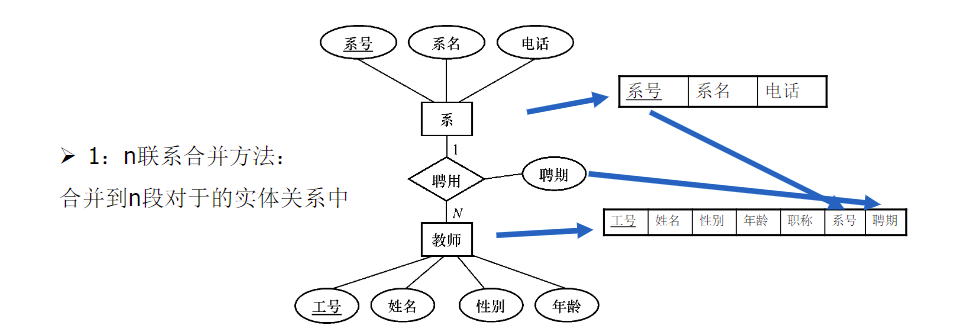
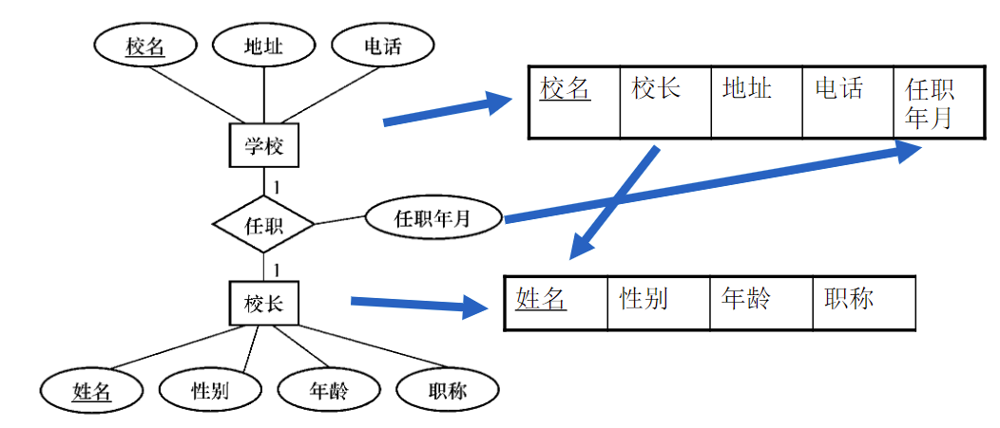
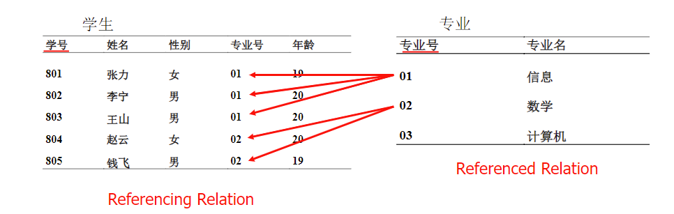

# 第二章 数据模型

# 03 - 数据模型-逻辑模型

## 2.3 逻辑模型

### 2.3.1 逻辑模型

* 是对现实世界的第二层抽象。负责**将概念数据模式映射为数据库的逻辑结构**。
* **直接与DBMS有关**，有严格的形式化定义，以便在计算机系统中实现。
* 通常有一组严格定义的无二义性语法和语义的**DB语言**，用来**定义、操纵**DB中的数据。
* **三要素**：数据结构、数据操作、数据约束
* 逻辑数据模型的发展：层次->网状->关系->XML、面向对象

### 2.3.2 关系模型

#### 1. 关系模型概述

+ 历史：E.F.Codd, IBM, 1970
+ ER模型 vs 关系模型：都用于数据建模

| ER模型 | 关系模型 |
| :------: | :-------: |
|概念多：实体、关系、属性|只有一个概念：关系|
|适于描述应用需求|用一组表描述世界|
|不适合在计算机上实现（只有数据结构，没有定义数据操作）|适合在计算机上实现|

#### 2. 关系数据结构

+ 关系模型用**二维表格结构**来表示实体和实体之间的联系，这是关系模型的本质
+ 关系模型是各个关系的框架的集合，即关系模型**是一些表格的格式**，其中包括关系名、属性名、关键字等
> 关系的框架称为**关系模式**(relation schema)
> 关系框架和符合该框架的关系值称为**关系实例**(relation instance)

+ 关系模型**不存在**“***联系***”这一数据结构

+ 一个关系中存放2类信息：**一类是描述实体本身的信息，一类是描述实体之间的联系的信息**

+ 关系的定义：数据**二维表**。可以用集合代数给出二维表“关系”定义
    + **域（domain，D）**：一组具有相同数据类型的值的集合，又称为值域。
    
      **基数（Cardinality）m**：域中包含值的个数。
    
    + **笛卡尔积（Cartesian product）**：
        + $ D_1×D_2×...×D_n=\{(d_1,d_2,...,d_n)|d_i∈D_i, i=1,2,...,n\}. $
        + 笛卡尔积每一个元素$(d_1,d_2,...,d_n)$叫一个n元组，简称**元组（Tuple）**. 
        + 元素中的每一个$d_i$叫一个**分量（Component）**，来自相应的域$(d_i∈D_i)$
        + 笛卡尔积的基数$M$：所有$D_i$基数的乘积：$M=\prod \limits_{i=1}^nm_i$
        + 笛卡尔积可用二维表表示
        
    + 关系的定义：数学上，笛卡尔积$$D_1×D_2×...×D_n$$的**任一子集**称为定义在域$D_1,D_2,...D_n$上的**n元关系（Relation）**，可用$R(D_1，D_2......D_n)$​表示。==实际应用中，关系是笛卡尔积所取的**有意义的**子集。==
    
    + 关系的二维表表示
        + **表的框架**由域$D_i(i=1,2,...,n)$构成；
        + 表的**任意一行对应一个元组**；表的**每一列来自同一域**；
        + 域可以相同，每列起一名字，称为**属性**。属性名唯一，属性的取值范围叫**值域**；
        + 具有相同关系框架的关系（域不一定相同！）称为**同类关系**。
    
+ 关系的性质：
  1. 关系中**不允许出现相同的元组**，作为集合元素的元组应该是唯一的。
  2. 关系中元组的**顺序（即行序）是无关紧要的**，因为集合元素是无序的。
  3. 关系中**属性的顺序也是无关紧要的**，即列的顺序可以任意交换。交换时，应连同属性名一起交换，否则将得到不同的关系。
  4. **同一属性**名下的各个属性值必须来自**同一个域**，是**同一类型**（int，char等）的数据
  5. 关系中各个属性**必须有不同的名字**，不同的属性可来自同一个域，即它们的分量可以取自同一个域。
  6. 关系中每一分量**必须是不可分的数据项**（即排除了多值属性和复合属性）。满足此条件的关系称为**规范化关系**，否则称为非规范化关系。下图中，左为非规范化（复合属性），右为规范化。
   

+ ER模型向关系模型转化：
  + 规则1（实体类型的转换）：将每个**实体类型转换成一个关系模式**，实体的属性即为关系模式的属性，实体标识符即为关系模式的键。
  
  + 规则2（二元联系的转换）：
    1. 把实体转化为关系
    2. 把**m:n联系**转化为关系，最后出来**3张表：m端，联系，n端**。例：
    
    > [!NOTE]
    >
    > 对于1:n联系和1:1联系，最好将1:n或1:1联系合并到相关联的实体转换出来的关系中，这样的好处是可以**减少表的数量**，**更方便查询并加快查询速度**。
    
    3. 对于**1:n联系**的处理：合并到**n端**对应的实体关系中（将**1端的标识符**和**关系**融合进n的表中），最后出来**2张表：1端和合并后的n端**。例：
    
       若合并到1端对应的实体关系中，会出现数据冗余，且违反主键约束。
    
    4. 对于**1:1联系**的处理：可以合并到**任意端对应的实体关系中**。但应与常用实体相合并。最后出来**2张表：不常用的1端和合并后常用的1端**。例：学校更常用
    
    > 对于1：n联系的处理和1：1联系的处理：原则把关系是合并到**相关联的实体转换出来的关系中**，可以减少表数量，更方便查询、加快查询速度
    
  + 三元联系：
    + **1:1:1** - 联系与其中一个实体集合并
    + **1:1:N** - 联系与N端实体集合合并
    + **1:M:N** - 联系转换为独立的关系模式，**主键为1端实体集的主键**
    + **M:N:P** - 联系转换为独立的关系模式，主键为三个实体集的主键的组合

> [!IMPORTANT]
>
> 作业的启示：实际应用时，联系的主键过多时要使用一个物理主键（例如作业中采购可用采购单号表示，而非采购员编号、供应商编号、商品编号）

#### 3. 关系的完整性（约束）

关系模型中的**完整性约束**：对数据库状态的预测或断言，总是为真。——编程实现

1. **域完整性（Domain Integrity）**
   + 属性值应符合域的取值范围
   + 可以用于增强数据类型（例：为年龄属性设定<=150的域完整性约束）
   + **对属性值能否为空（NULL）的检查**也是域完整性约束的一部分（NULL代表**值未知**或**值不存在**）
   
2. **实体完整性（Entity Integrity）**
   
   + 每张表要**有主键来约束**
   + 主属性（构成主键的属性）应同时满足：**<u>不能为空</u>、取值唯一**
   
3. **参照完整性（Referential Integrity）**
   
   + 在关系模型中实体及实体间的联系都是用关系来描述的，因此可能存在着关系与关系间的引用（reference），用**外键（Foreign Key）**来表示。
   
   + 参照完整性规则：外键上的取值只能是空值，或等于被参照关系中某个元组的主键值
   
   + > [!NOTE]
     >
     > 设$F$是基本关系$R$的一个或一组属性，但不是关系$R$的键，$K_S$是基本关系$S$的==主键==。如果$F$与$K_S$相对应，则称$F$是$R$的外键。
   
   + **外键存在于引用表，来自于被引用表的主键。**
   
   + **$R$** - 参照关系（Referencing Relation），**$S$** - 被参照关系（Referenced Relation）
   
   + 例：图中专业号是外键，$R$是学生，$S$是专业
   
   + 关系$R$和$S$**不一定是不同的关系**
   
   + :star2:参照关系$R$的外键$F$的值或者取空值，或者与目标关系$S$的主键$K_S$**定义在同一个（或一组）域上**
   
   + 外键并**不一定要与相应的主键同名**
     + 外键与相应的主键属于不同关系时，往往取相同的名字，以便于识别
   
4. **用户定义的完整性**
   
   + **针对某一具体关系数据库的约束条件**，反映某一具体应用所涉及的数据必须满足的语义要求。
   + 关系模型应**提供定义和检验这类完整性的机制**，以便用统一的系统的方法处理它们，而不要由应用程序承担这一功能。
   + 示例：课程（<u>课程号</u>，课程名，学分，选课人数）
    “课程名”属性必须取唯一值；非主属性“课程名”也不能取空值；“学分”属性只能取值$\{1,2,3,4\}$
