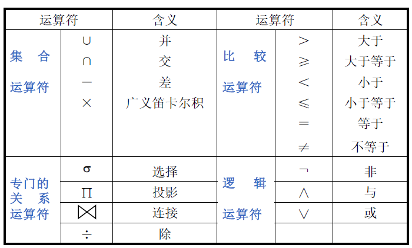
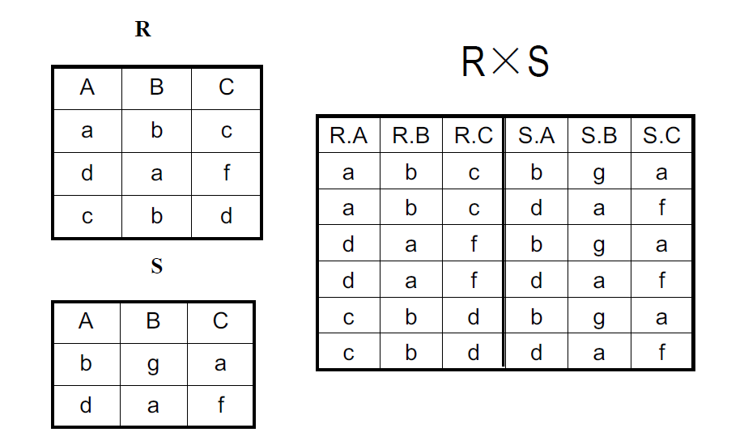
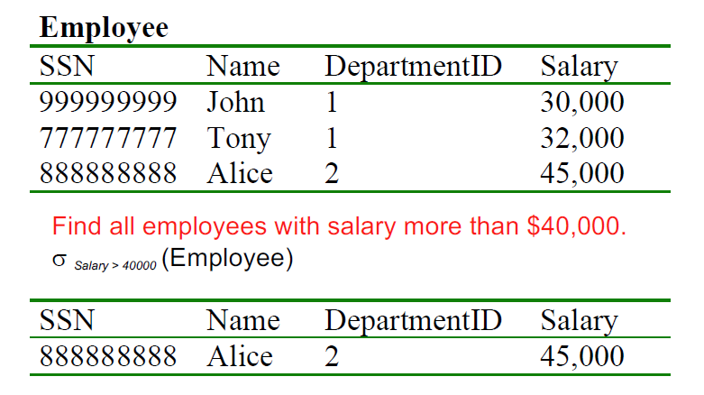
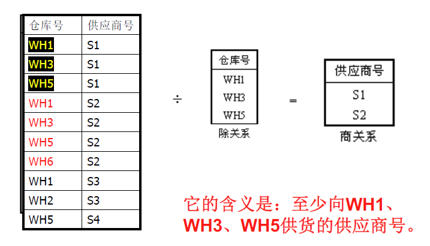
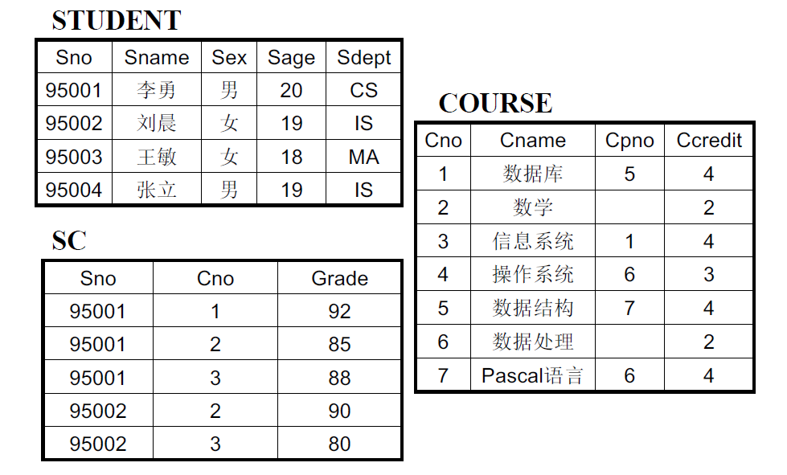

# 04 - 数据模型-关系代数

## 2.3 逻辑模型

### 2.3.2 关系模型

#### 4. 关系代数（操作）

1. **由来**
   数据库语言中**查询是最主要的部分**，查询的条件要使用**关系运算表达式**来表示。
   因此，关系运算是设计关系数据语言的基础。
   按表达查询的方法不同，关系运算可分为**关系代数**和**关系演算**两大类。

2. **定义**

   + 关系代数（Relational Algebra）：以关系为运算对象。

   + 关系代数运算三要素：运算对象——关系、运算结果——关系、运算符——四类

   + **四类关系运算符**：

   + 另一个概念：**基本运算**——集合并、集合差（没有交）、广义笛卡尔积、<u>选择、投影</u>
     + 由基本运算可以推导出其他所有运算

1. **集合的并、交、差运算**——从行的角度进行

   - 两个关系$R$和$S$若**进行并、交、差运算，则它们必须是<u>相容</u>的**：

     - $R$和$S$必须同元，即属性数目必须相同
     - 对所有$i$，$R$的第$i$个属性的域必须和$S$的第$i$个属性的域相同

   - **并运算（Union）**：
     $$
     R\cup S=\{t\,|\,t\in R\or t\in S\}
     $$

     - 两个n元关系，且两者**对应属性数据类型**相同。

     - 结果仍为n元关系，由**属于$R$或属于$S$的元组**构成。运算结果中应消除重复行。

   - **差运算（Difference）**：
     $$
     R-S=\{t\,|\,t\in R\and t\notin S\}
     $$

     - 结果为n元关系，由**属于R且不属于S的元组**构成

   - **交运算（Intersection）**：
     $$
     R\cap S=\{t\,|\,t\in R\and t\in S\}
     $$

     - 其结果仍为n元关系，由**既属于R而又属于S的元组**构成。

     - ==可以通过差运算来重写==：
       $$
       R\cap S=R-(R-S)
       $$

   - **广义笛卡尔积（Extended Cartesian Product）**：

     - 笛卡尔积：**集合运算** vs. 广义笛卡尔积：**关系运算**

     - 两个关系$R$，$S$，其度（degree）分别为$n$，$m$，则它们的广义笛卡尔积是所有这样的元组集合：元组的前n个分量是$R$中的一个元组，后m个分量是$S$中的一个元组。

     $$
     R\times S=\{t\,|\,t=\left\langle r,s\right\rangle\and r\in R\and s\in S\}
     $$

     - $R\times S$的度为$R$与$S$的度之和，$R\times S$​的元组个数为R和S的元组个数的乘积。

     - > [!WARNING]
       >
       > 规定，当R和S之一为空集时，$R\times S$​的结果为空集

     

2. **专门的关系运算**

   - **选择（selection）**：选择运算是从指定的关系中**选择某些元组**形成一个新的关系，被选择的元组是用满足某个逻辑条件来制定的。
     $$
     \sigma _F(R)=\{t\,|\,t\in R\and F(t)=true\}
     $$

     - 其中，$R$是**关系名**，$\sigma$是**选择运算符**，$F$​是**逻辑表达式**。==——水平方向==
     - 例子：逻辑条件为$Salary>40000$

     
     
   - **投影（projection）**：投影运算对指定的关系进行投影操作，根据该关系分两步产生一个新关系：
     
     1. **选择指定的属性**，形成一个可能含有重复行的表格
     2. **删除重复行**，形成新的关系
     
     $$
     \Pi_A(R)=\{r.A\,|\,r\in R\}
     $$

     
     - 其中，$R$是**关系名**，$\Pi$是**投影运算符**，$A$是**被投影的属性或属性集**——垂直方向
     - 投影运算**可以改变**关系的**属性次序**
     - 投影后取消了某些属性列，就可能出现重复行，应该取消重复行。故投影之后，不但减少了属性，**元组也可能减少**，新关系与原关系不相容。
     
   - **连接（join）**：
   
     - 连接是两个表之间的运算，通常是具有**一对多**联系的父子关系。故连接过程一般是由**参照关系的外键和被参照关系的主键**来控制的，这样的属性通常被称为**连接属性**。
   
     - 定义：从两个广义笛卡尔积中选取给定属性间满足$\theta$操作的元组。
   
     $$
     R\mathop{\bowtie}\limits_{A\theta B} S=\{t\,|\,t=<r,s>\and\ r\in R\and s\in S\and r[A]\;\theta\;s[B]\}
     $$
   
     - $\theta$为算数比较符，当$\theta$为**等号**时称为**等值连接**；$\theta$为“$<$”时，称为小于连接；$\theta$为“$>$”时，称为大于连接。此类连接被统称为**$\;\theta\;$连接**。
   
   - **自然连接（natural join）**（最常用的连接）
   
     - 从2个关系的广义笛卡尔积中选取**相同属性列上取值相等**的元组，并***去掉重复的属性列***。
   
     $$
     R\bowtie S=\{t\,|\,t=<r,s>\and\ r\in R\and s\in S\and r[B]=s[B]\}
     $$
   
     - **等值连接**：从2个关系（R、S）的笛卡尔积中选取属性（A、B）值相等的元组
     - 自然连接是特殊的等值连接，即**在等值连接中取消重复属性**
     - 派生运算：
   
     $$
     R\bowtie S=\Pi_X(\sigma_{r[A_i]=s[B_j]}(R\times S))
     $$
   
    - **外连接（outer join）**：为避免自然连接时因失配而发生的信息丢失，可以假定**往参与连接的一方表中**附加一个**取值全为空值的行**，它和参与连接的**另一方表中**的任何一个**未匹配上的元组都能匹配**，称之为外连接。
   
      - 外连接 = 自然连接 + 失配的元组
      - 外连接的形式：左外连接$R⟕S$（左边的所有元组都在，往右边的补null）、右外连接$R⟖S$、全外连接$R⟗S$。
      - 左/右/全外连接 = 自然连接 + 左/右/两侧表中**失配的元组（悬浮元组）**
      - 全外连接 = 左外连接$\;\cup\;$右外连接

   - **除（divide）**

     - 除运算常用于包含语义“至少…”的寓意的查询或运算。
     - 设$R(X,Y)$和$S(Y)$是两个关系，则：

     $$
     R(X,Y)\div S(Y)=\Pi_X(R)-\Pi_X(\Pi_X(R)\times \Pi_Y(S)-R)
     $$

     - 除运算定义：设有关系$R(X,Y)$和$S(Y)$，其中X、Y可以是单个属性或属性集，则：

     $$
     R\div S=\{r.X\,|\,r\in R\,\and Y_X \supseteq S\}
     $$

     > [!IMPORTANT]
     >
     > 书上定义：设关系$R$除以关系$S$的结果为关系$T$，则$T$包含所有在$R$但不在$S$中的属性及其值，且$T$的元组与$S$的元组的所有组合都在$R$中。
     >
     > 计算方法：先算$R$中所有$R-S$属性的象集，再算$S$在$R\cap S$上的投影，看$R$中哪个$R-S$包含了这个投影。
     
     - my understanding: R与S除运算的结果是：至少拥有S表中所有属性取值的 R表中**其他属性取值**
     
     - 练习：
     
       1. 查询至少选修了一门其直接先行课为5号课程的学生姓名。
     
       $$
       \Pi_{Sname}(\sigma_{Cpno=5}(COURSE)\bowtie SC \bowtie \Pi_{Sno,Sname}(STUDENT))
       $$
     
       2. 查询选修了全部课程的学生号和姓名
     
       $$
       (\Pi_{Sno,Cno}(SC)\div\Pi_{Cno}(COURSE))\bowtie\Pi_{Sno,Sname}(STUDENT)
       $$
     
     - 思考题：查询最多选修了一门其直接先行课为5号课程的学生姓名
     
       方法：检索两门以上先行课为5号的（在选课表中任选S1和S2，连接起来看），然后用学生全集减去
       $$
       \Pi_{Sname}(STUDENT)-\Pi_{Sname}(\sigma_{S_1.Cpno=5\and S_2.Cpno=5}(S_1\mathop{\bowtie}\limits_{S_1.Sno=S_2.Sno}S_2))
       $$
     

