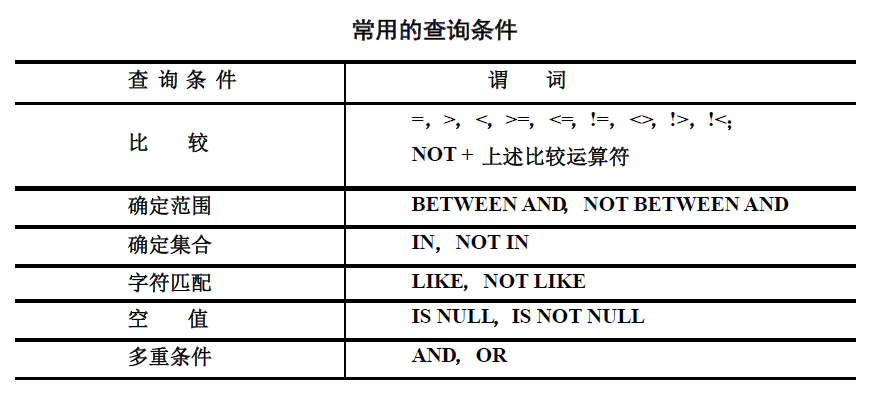

# 第三章 SQL语言

# 05 - SQL语言

[TOC]


SQL语言概述

- SQL的特点：
  - 综合统一：数据定义、查询、操纵、控制等方面功能
  - 高度非过程化
  - 面向集合的操作方式（元组的集合）
  - 以同一种语法结构提供两种使用方法：命令方式和程序方式
  - 语言简洁，易学易用


## 3.1 查询语言

查询语句基本结构：

```sql
SELECT desired attributes
    FROM one or more tables
    WHERE condition about tuples of the tables
    GROUP BY one or more attributes
    ORDER BY one or more attributes
```

- SELECT：指定要显示的**属性列**

- FROM：指定**查询对象(基本表或视图)**

- WHERE：指定**查询条件**

- GROUP BY：对查询结果**按指定列的值分组**，**该属性列值相等的元组为一个组**。通常会在每组中作用集函数。

- HAVING：筛选出只有**满足指定条件的组**

- ORDER BY：对查询结果表按指定**列值的升序或降序排序**


用到的示例关系模型：学生-课程数据库

- 学生表：Student(<u>Sno</u>，Sname，Ssex，Sage，Sdept)
- 课程表：Course(<u>Cno</u>，Cname，<u>Cpno</u>，Ccredit)
- 学生选课表：SC(<u>Sno</u>，<u>Cno</u>，Grade)


### 3.1.1 单表查询

查询仅涉及一个表：

1. 选择表中若干列
2. 选择表中的若干元组
3. 对查询结果排序
4. 使用集函数
5. 对查询结果进行分组

#### 1. 选择表中若干列

- **查询全体学生的详细记录**：`SELECT * FROM Student;`

- **查询经过计算的值**：`SELECT`子句的 <目标列表达式> ：算术表达式、字符串常量、函数、列别名等

  - **函数**：`LOWER()`

  - 使用**列别名**：`SELECT Sname AS NAME`，AS可省略


#### 2. 选择表中的若干元组

- **保留重复行**：用ALL关键字，*可省略*：`SELECT ALL Sno FROM SC;`

- **消除取值重复的行**：使用`DISTINCT`短语。

> [!WARNING]
>
> DISTINCT短语的作用范围是所有目标列，不能`SELECT DISTINCT Cno, DISTINCT Grade FROM SC;`

- **查询满足条件的元组**：用`WHERE`子句

  

  - 例1：查询年龄在20~23岁（包括20岁和23岁）之间的学生的姓名
    - `SELECT Sname FROM Student WHERE Sage BETWEEN 20 AND 23;`

  - 例2：查询既不是信息系、数学系，也不是计算机科学系的学生的姓名
    
    - > 值表：用逗号分隔的一组取值，如该例
    
    - `SELECT Sname FROM Student WHERE Sdept NOT IN ('IS','MA','CS');`
    

- **字符串匹配**：`WHERE <Attribute> (NOT) LIKE <pattern>`。

  - pattern是匹配模板：固定字符串或含通配符的字符串。

  - 通配符：`%` - 任意长度（可为0）的字符串；`_` - 代表任意单个字符

  - 例：查询名字中第二个字为“阳”的学生的姓名和学号

  - `SELECT Sname, Sno FROM Student WHERE Sname LIKE '_阳%';`

    > [!WARNING]
    >
    > 当用户要查询的字符串本身就含有`%`或`_`时，要使用`ESCAPE '<换码字符>'`短语对通配符转义。
    >
    > 例：查询以“DB_”开头，且倒数第3个字符为 i 的课程的详细情况
    >
    > - `SELECT * FROM Course WHERE Cname LIKE 'DB*_%i__' ESCAPE ‘*’;`

  - 当固定字符串匹配，可用‘=’代替‘LIKE’；

  - 对于包含单引号的字符串，用两个单引号代替字符串中的一个单引号

- **多重条件查询**：用逻辑运算符AND，OR和 NOT 来联结多个查询条件

- **涉及空值的查询**：

  - Where 语句中的条件表达式有三种可能的计算结果：**True，False，或者 UnKnown**
  - 任何一个值与**NULL**进行 **比较**，返回的**结果是UnKnown**
  - Where子句对被查询表中每一条记录进行条件表达式的计算，**只有在计算结果为True时当前记录才会被选中**

  

  - 测试是否空值需用谓词 `IS NULL` 或 `IS NOT NULL`，**不能用**`= NULL`


#### 3. 对查询结果排序

==使用`ORDER BY`子句：可以按一个或多个属性列排序。升序：ASC；降序：DESC；缺省值为升序==

- 当排序列含空值时：ASC：排序列为空值的元组**最后显示**；DESC：排序列为空值的元组**最先显示**
- 例：查询全体学生情况，查询结果按所在系的**系号升序**排列，同一系中的学生按**年龄降序**排列。
  - `SELECT * FROM Student ORDER BY Sdept, Sage DESC;`

> [!NOTE]
>
> Order子句只能出现在select语句的最后部分


### 3.1.2 聚集和分组——容易出难题

#### 4. 使用集函数（aggregation function）

==在SELECT子句中使用**有且只有5个**集函数，对指定的列进行聚合计算==

- 计数 COUNT（[DISTINCT|ALL] <列名> | *）；

- 计算总和 SUM；计算平均值 AVG；求最大值 MAX；求最小值 MIN（[DISTINCT|ALL] <列名>）——**不能是`*`**

- COUNT可用`*`，其他不可；可用DISTINCT以**取消指定列中的重复值**。

  - 例：查询选修了课程的学生人数

  - `SELECT COUNT(DISTINCT Sno) FROM SC;`


  ***列名只能写一个！！***

- **空值不加入集函数的计算**；如果列中没有非空值，则集函数结果会**返回空值**


#### 5. 对查询结果进行分组

- ==使用`GROUP BY`子句分组==，作用对象是**查询的中间结果表**
  - **细化集函数的作用对象**
  
  - 未对查询结果分组时，集函数将**作用于整个查询结果**
  
  - 对查询结果分组后，集函数将**分别作用于每个组**
- 分组方法：按指定的一列或多列值分组，**值相等的为一组**
- 使用`GROUP BY`子句后，`SELECT`子句的列名列表 和 输出结果中==只能出现分组属性和集函数==

反例：

> [!IMPORTANT]
>
> `SELECT`中的字段要么是被分组的字段（能确保每组只有1个值），要么被包含在集函数中（统计值，输出结果只有1个值）

- 使用`HAVING`短语筛选最终输出结果：

  - 只有满足`HAVING`条件的**组**才输出
  - `HAVING`短语**作用于组**，从中选择满足条件的**组**，而`WHERE`子句**作用于基表或视图**，从中选择满足条件的**元组**
  - `HAVING`子句中出现的列只能是在`group by`子句或集函数中出现的列

  

  特别注意：`WHERE`子句不能使用集函数
  
  上例中不能写成`SELECT Sno FROM SC WHERE COUNT(*) >= 3 GROUP BY SNO`
  
  

### 3.1.3 多表查询——连接查询

#### 广义笛卡尔积

不带连接谓词的连接（SQL-89）：`SELECT Student.* , SC.* FROM Student, SC`

SQL-92标准中广义笛卡尔积被称为交叉连接（`CROSS JOIN`），一般格式：

```sql
SELECT <属性或表达式列表>
	FROM <表名> CROSS JOIN <表名>
```

#### 等值连接（含自然连接）

等值连接：

- Where子句中的连接运算符为=号的连接操作：`[<表名1>.]<列名1> = [<表名2>.]<列名2>`

  - 引用表1和表2同名属性，需要加表名前缀；引用唯一属性名可省略
  - 内连接（INNER JOIN，SQL-92），一般格式：

  ```sql
  SELECT <属性或表达式列表>
  FROM <表名> [INNER] JOIN <表名>
  ON <连接条件>
  [WHERE <限定条件>]
  ```

自然连接：去掉等值连接的重复属性列

####  非等值连接查询

​	连接运算符不是=号的连接

#### 自身连接查询

- 一个表与其自己进行连接

- 需要给表的两个副本起别名以示区别
- 例：查询每一门课的间接先修课（即先修课的先修课）

```sql
SELECT FIRST.Cno, SECOND.Cpno
FROM Course AS FIRST, Course AS SECOND
WHERE FIRST.Cpno = SECOND.Cno;
```

#### 外连接查询

WHERE语句中（SQL92的FROM语句中）：

- LEFT OUTER JOIN 或 LEFT JOIN；

- RIGHT OUTER JOIN 或 RIGHT JOIN；

- FULL OUTER JOIN 或 FULL JOIN（MySQL中不支持全外连接，可用Left join Union Right join）

```sql
SELECT <属性或表达式列表>
FROM <表名> [LEFT | RIGHT | FULL] [OUTER] JOIN <表名>
ON <连接条件>
[WHERE <限定条件>]
```

查询每个学生及其选修课程的情况，**包括没有选修课程的学生**：

```sql
SELECT Student.*
FROM Student Right Outer Join SC
on Student.Sno = SC.Sno;	# 不能写成：Where Student.Sno=Sc.Sno
```

> `JOIN ON`效果等同于`FROM`用逗号连接后再用`WHERE`筛选

#### 复合条件连接查询

WHERE子句中含多个连接条件


### 3.1.4 子查询

一个SELECT-FROM-WHERE语句称为一个查询块

- 通常将一个查询块嵌套在另一个查询块的WHERE子句或HAVING短语的条件中
- 子查询中**不能使用ORDER BY子句**
- 可插入到FROM子句中，需要起别名，有些数据库不支持；甚至可插入SELECT中，确保返回结果为单列单行，多数数据库不支持

**分类**：

​	不相关子查询：**由里向外逐层处理**。每个子查询在上级查询处理之前求解，子查询的结果用于建立父查询的查找条件

​	相关子查询：子查询的查询条件依赖于父查询

1. **带有IN谓词的子查询**：将第一步查询嵌入第二步查询的条件中

   【例36】：查询与“刘晨”在同一个系学习的学生。——不相关子查询

   ```sql
   SELECT Sno, Sname, Sdept
   FROM Student S1   # 可以定义别名简化书写
   WHERE S1.Sdept IN
       (SELECT Sdept 
        FROM Student S2  # 可以定义别名简化书写
        WHERE S2.Sname = '刘晨');
   ```

2. **带有比较运算符的子查询**

   当能确切知道内层查询返回单值时，可用比较运算符

   > 子查询一定要跟在比较符（例如=号）之后！

   【例36】：查询与“刘晨”在同一个系学习的学生。==可以用=代替IN==

   ```sql
   SELECT Sno，Sname，Sdept FROM Student
   WHERE Sdept =
       SELECT Sdept FROM Student
       WHERE Sname= '刘晨';
   ```

3. **带有ANY或ALL谓词的子查询**

   

   ANY和ALL谓词有时可以用集函数实现

   |         |  =   | <>或!= |    <     |        <=         |  >   |        >=         |
   | :-----: | :--: | :----: | :------: | :---------------: | :--: | :---------------: |
   | **ANY** |  IN  |   --   | ==<MAX== |       <=MAX       | >MIN |       >=MIN       |
   | **ALL** |  --  | NOT IN | ==<MIN== | <=MIN(查询最小值) | >MAX | >=MAX(查询最大值) |
   
   【例38】查询其他系中**比信息系任意一个(其中某一个)**学生年龄小的学生姓名和年龄
   
   ```sql
   SELECT Sname, Sage
   FROM Student
   WHERE Sage < ANY (SELECT Sage
                     FROM Student
                     WHERE Sdept= 'IS')
   	AND Sdept <> 'IS';		/* 注意这是父查询块中的条件 */
   ```
   
   【例39】用集函数实现【例38】：
   
   ```sql
   SELECT Sname，Sage
   FROM Student
   WHERE Sage <
           (SELECT MAX(Sage)
           FROM Student
           WHERE Sdept= 'IS')
       AND Sdept <> 'IS';
   ```
   
   【例40】查询其他系中**比信息系所有学生**年龄都小的学生姓名及年龄。
   
   - 把【例38】的`ANY`改成`ALL`即可


4. **带有EXISTS谓词的子查询**——相关子查询

   - 带有EXISTS谓词的子查询不返回任何数据，只产生逻辑真值“true”或逻辑假值“false”。

   - 内层查询结果非空，则返回真值；查询结果为空，则返回假值

   - 由`EXISTS`**引出的子查询**，其目标列表达式通常都用`*` ，因为带`EXISTS`的子查询只返回真值或假值，给出列名无实际意义

   - 例：

     ```sql
     Select * from A where exists (select * from B where B.a=A.a)
     ```
     
     - 逐行考察A中元组，对A的某一行，考察EXISTS子句里的查询，看B是否选中元组。
     
     - 若选中B中元组则`EXISTS`子句返回TRUE并且返回A表的该行，否则FALSE，该行不被选中。
     
   - **`EXISTS`谓词也可以用于不相关子查询**（子查询语句中不含父查询的属性）
   
     - 形式为：`select * from a where exists (select * from b)`
   
   - 一些带EXISTS或NOT EXISTS谓词的子查询**不能被其他形式的子查询等价替换**，但是==所有带IN谓词、比较运算符、ANY和ALL谓词的子查询**都能用带EXISTS谓词的子查询等价替换**！==
   
   【例41】查询所有选修了1号课程的学生姓名。
   
   ```sql
   SELECT Sname
   FROM Student
   WHERE EXISTS
       (SELECT *
        FROM SC		/* 相关子查询，子句中出现了Student */
        WHERE Sno = Student.Sno AND Cno = '1');
   ```
   
   【例36】查询与“刘晨”在同一个系学习的学生。改成EXISTS：
   
   ```sql
   SELECT Sno, Sname, Sdept
   FROM Student S1
   WHERE EXISTS
       SELECT *
       FROM Student S2
       WHERE S2.Sdept = S1.Sdept AND S2.Sname = '刘晨';
   ```
   
   
   
   > 下面的两个例子只能用`EXISTS`谓词实现查询
   >
   > 1. 用`EXISTS`/`NOT EXISTS`实现全称量词：
   >
   >    【例42】查询选修了全部课程的学生姓名
   >
   >    $(\forall x)P\equiv\neg(\exist x(\neg P))$​ ，即不存在这样的学生，他的选课不在全部课程表里面。
   >
   >    ```sql
   >    SELECT Sname FROM Student
   >    WHERE NOT EXISTS
   >        (SELECT * FROM Course
   >        WHERE NOT EXISTS
   >            (SELECT * FROM SC
   >            WHERE Sno= Student.Sno
   >            AND Cno= Course.Cno));
   >    ```
   >
   > 2. 实现逻辑蕴含：
   >
   >    【例43】查询至少选修了学生95002选修的全部课程的学生号码
   >
   >    $(\forall y)p\rightarrow q\equiv\neg\exist y(p\and\neg q)$​，即学生X不存在这样的课程y，学生95002选修了y，而他没有选。
   >
   >    ```sql
   >    SELECT DISTINCT Sno
   >    FROM SC SCX
   >    WHERE NOT EXISTS
   >        (SELECT *
   >         FROM SC SCY
   >         WHERE SCY.Sno = '95002' AND NOT EXISTS
   >            (SELECT *
   >             FROM SC SCZ
   >             WHERE SCZ.Sno = SCX.Sno AND SCZ.Cno = SCY.Cno));
   >    ```


### 3.1.5 集合查询

- 并操作`(subquery) UNION (subquery)`

  【例44】查询计算机科学系的学生及年龄不大于19岁的学生。

  ```sql
  SELECT *
      FROM Student
      WHERE Sdept = 'CS'
  UNION
  SELECT *
      FROM Student
      WHERE Sage <= 19;
  ```

- 交操作`(subquery) INTERSECT (subquery)`，MySQL不支持

  【例45】查询计算机科学系选修95001号课程的学生的学号。

  ```sql
  SELECT Sno
      FROM Student
      WHERE Sdept = 'CS'
  Intersect
  SELECT Sno
      FROM SC
      WHERE Cno = '95001';
  ```

- 差操作`(subquery) EXCEPT (subquery)`，MySQL不支持

  【例46】 查询计算机科学系没有选修95001号课程的学生的学号。

  ```sql
  SELECT Sno
      FROM Student
      WHERE Sdept = 'CS'
  EXCEPT
  SELECT Sno
      FROM SC
      WHERE Cno = '95001';
  ```

  

## 3.2 DDL语言

Data Definition Language：完成数据库对象的创建、删除和修改

### 定义基本表

格式：

```sql
CREATE TABLE <表名>
	(<列名> <数据类型> [<列级完整性约束条件>]
	[, <列名> <数据类型> [<列级完整性约束条件>]] ...
	[, <表级完整性约束条件> ]);
```

> < **列级完整性约束条件** >：涉及相应属性列的完整性约束条件
>
> < **表级完整性约束条件** >：涉及一个或多个属性列的完整性约束条件

常用完整性约束：

- 主键约束：PRIMARY KEY
- 唯一性约束：UNIQUE
- 非空值约束：NOT NULL
- 参照完整性约束：REFERENCES

### 删除基本表

格式：

```sql
DROP TABLE <表名>;
```

### 修改基本表

格式：

```sql
ALTER TABLE <表名>
	[ADD <新列名> <数据类型> [完整性约束]]	# 增加新列和新的完整性约束条件
	[DROP <完整性约束名>]					# 删除指定的列或完整性约束条件
	[MODIFY <列名> <数据类型>];			# 修改列名和数据类型
```

能否实际修改成功，需要看具体情况。

【例4】向Student表增加“入学时间”列，其数据类型为日期型。

```sql
ALTER TABLE Student ADD Scome DATE;
```

【例6】将年龄的数据类型改为半字长整数。

```sql
ALTER TABLE Student MODIFY Sage SMALLINT;
```

【例7】删除学生姓名必须取唯一值的约束。
```sql
ALTER TABLE Student DROP UNIQUE(Sname);
```


## 3.3 DML语言

Data Modification Language：数据更新语言，不返回关系表，而是会改变数据库的内容

### Insert 插入一条或多条元组

格式：

```sql
INSERT
	INTO <表名> [(<属性列1>[, <属性列2 >...)]	# 属性列表可以省略，有潜在危险
	VALUES (<常量1> [, <常量2>] ...)		  # 一般数据库VALUES语句只能跟一条巨鹿		
```

- `INTO`子句：

  - 指定要插入数据的表名和属性列，顺序**可以与表定义的顺序不一致**。
  - 没有指定的属性列取**空值**
  - 若不指定属性列，需要插入**顺序与定义一致的完整元组**。

  后面跟`VALUES`：插入单条元组

  后面跟子查询语句：插入子查询结果。

  例：对每一个系，求学生的平均年龄，并把结果存入数据库。
  
  ```sql
  # 第一步：建表
  CREATE TABLE Deptage
  	(Sdept CHAR(15), Avgage SMALLINT)
  # 第二步：插入数据
  INSERT INTO Deptage(Sdept，Avgage)
      SELECT Sdept, AVG(Sage)
      FROM Student
      GROUP BY Sdept
  ```
  
  > [!WARNING]
  >
  > 不要忘了INTO子句！！
  
  

### Delete 删除一条或多条元组

格式：

```
DELETE FROM <表名>
[WHERE <条件>];
```

> [!WARNING]
>
> 不要忘了FROM！！

三种删除方式：删除某一个元组的值、删除多个元组的值、带子查询的删除语句


### Update 更新现有一条或多条元组中的值

格式：

```sql
UPDATE <表名>
	SET <列名> = <表达式>[, <列名>=<表达式>]...
	[WHERE <条件>];
```

三种修改方式：修改某一个元组的值、修改多个元组的值、带子查询的修改语句

例：将计算机科学系全体学生的成绩置零。

```sql
UPDATE SC
SET Grade=0
WHERE 'CS'=
    (SELECT Sdept
    FROM Student
    WHERE Student.Sno = SC.Sno)；
```


## 3.4 DCL语言

Data Control Language， 数据控制语言，后续学习


## 3.5 视图

### 定义

视图是一种虚表（virtual table），是从一个或几个基本表（或视图）导出的表。	

- **视图其实是在数据字典中存储的一条`Select`语句**
- DBMS执行`CREATE VIEW`语句时只是把视图的定义存入数据字典，并不执行其中的`SELECT`语句
- 在对视图查询时，按视图的定义从基本表中将数据查出
- 对于某些视图（可更新视图），可以对视图执行数据更新操作，数据库会根据视图定义去更新对应的基本表数据

格式：

```sql
CREATE VIEW
	<视图名> [(<列名> [, <列名>]...)]
	AS <子查询>
	[WITH CHECK OPTION];

# 例：
CREATE VIEW TopScore AS 
    SELECT IDCourse, MAX(Score)
        FROM GradeBook
        GROUP BY IDCourse
        ORDER BY IDCourse;
```

在定义视图时，组成视图的属性列名需全部省略或全部指定

- 当如下情形时，全部省略：
  - 视图属性由子查询中`SELECT`目标列中的诸字段组成

- 当如下情形时，需明确指定视图的所有列名：
  1. 某个目标列是**集函数**或**列表达式**（比如`2024 - Sage`）、
  1. 多表连接时选出了几个同名列作为视图的字段
  1. 需要在视图中为某个列启用新的更合适的名字


也可以基于视图建立新的视图：

```sql
CREATE VIEW IS_S2(Sno, Sname, Grade) AS
    SELECT Sno，Sname，Grade
    FROM IS_S1	# 这是一个视图
    WHERE Grade >= 90;
```

> 不建议以`SELECT * `方式创建视图，因为这样创建的视图可扩展性差

### 使用

- 视图查询：对视图的查询与对基本表的查询**完全相同**
- 视图更新：与基本表也完全相同。
  - 但存在一些不可更新视图（视图属性含有**集函数**等），不能唯一/有意义地转换成对相应基本表的更新

### With Check Option

透过视图进行增删改操作（`DML：INSERT, UPDATE, DELETE`）时，不得破坏视图定义中的谓词条件（即子查询中的条件表达式`where`）

例如，建立信息系学生的视图。

```sql
CREATE VIEW IS_Student AS
    SELECT *
    FROM Student
    WHERE Sdept= 'IS'
WITH CHECK OPTION
```

若插入记录：`Insert into IS_Student values(95008, '韩萍', 20, 'CS')`，会产生报错（她是计院的，不是信息系的）

### 作用

> 考试的时候不要定义视图再做查询实现，写一条SQL语句即可

- 当视图中数据不是直接来自基本表时，定义视图能够**简化用户的操作**
  - 基于多张表连接形成的视图
  - 基于复杂嵌套查询的视图
  - 含导出属性的视图
- 使用户能**以多种角度看待同一数据**
  - 视图对基本表进行数据抽取和组合，适应数据库共享的需要
- 对重构数据库提供了一定程度的逻辑独立性
  - 将来自2个基本表的数据关联起来——使**用户的外模式**保持不变

- 能够对机密数据**提供安全保护**
  - 对不同用户**定义不同视图**，使每个用户只能看到他有权看到的数据
  - 通过WITH CHECK OPTION对关键数据施加操作限制