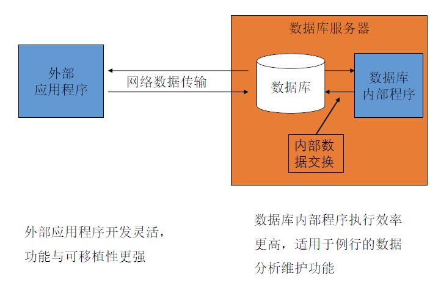
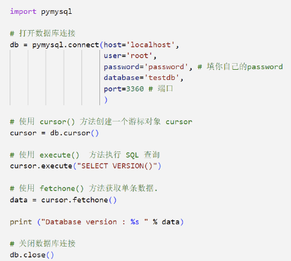
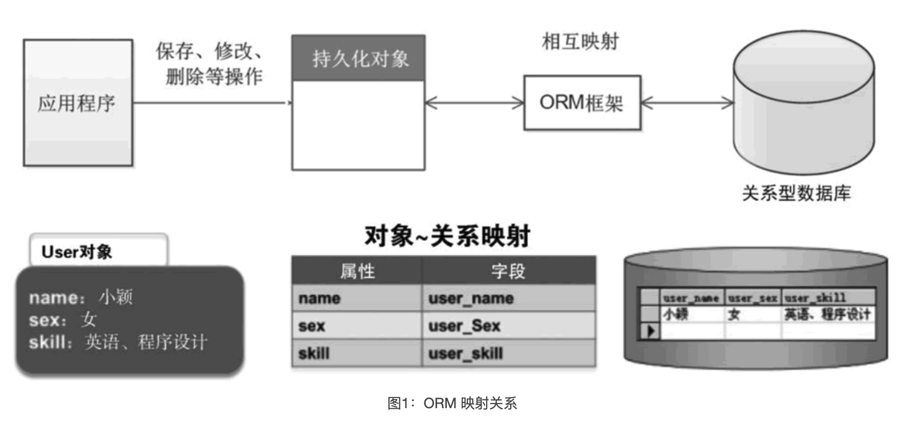
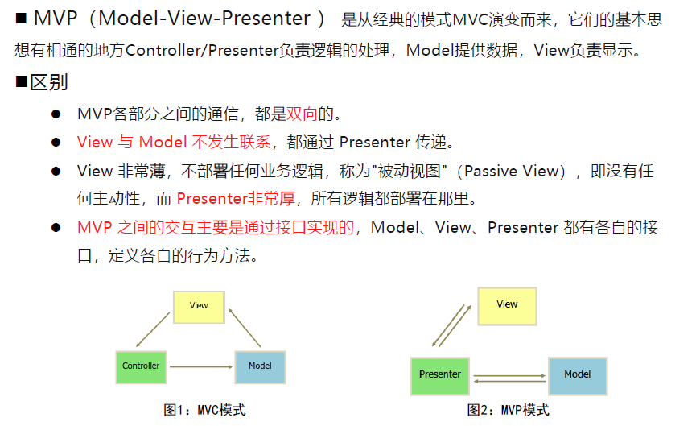
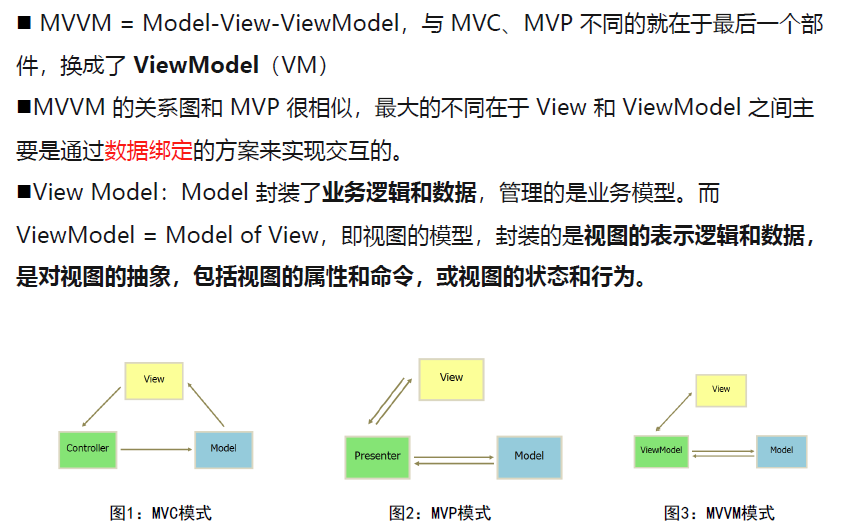

# 第四章 数据库编程

# 06 - 数据库编程

[TOC]


## 4.1 数据库编程 - 1

### 4.1.1 数据库程序开发

- SQL有其缺点：主要用于数据查询和更新

- 对数据的分析处理主要由数据库应用程序来完成

  - 两种形式：数据库内部应用程序、数据库外部应用程序

  


### 4.1.2 数据库内部编程

数据库内部程序的常见形式：存储过程、函数、触发器

#### 存储过程

- 由过程化SQL语句书写的过程，经编译和优化后**存储在数据库服务器中**，使用时只要调用即可。

- 通常将多次重复执行的代码段**编写成一个过程**（procedure or function)，保存在数据库中

- 优点

  - SQL与模块化编程结合，可完成复杂业务功能
  - 创建时预编译，提高SQL执行效率
  - 位于数据库服务器上，调用时无需通过网络传输大量数据
  - 可作为安全机制加以充分利用：可防止SQL注入式的攻击

- **创建**：

  ```sql
  CREATE PROCEDURE procedure_name (
  	[ IN | OUT | INOUT ] param_name type [ ,... ]
  # param_name: 调用时给出的参数值，必须指定数据类型。参数也可以定义输入/输出参数。默认为输入参数。
  )
  [ BEGIN ]
  	sql_statement	# 一个过程化SQL块。包括声明部分和可执行语句部分
  [ END ]
  ```

- **删除与调用**：

  ```sql
  DROP PROCEDURE prodedure_name
  CALL procedure_name (param_name type [ ,... ])	# CALL方式激活存储过程的执行
  ```

- 数据库提供过程化编程语言：变量、流程控制、常用数据库函数与命令…

- 在过程化编程中**嵌入SQL语句**，例：

  ```sql
  declare v_score int;
  select score into v_score from sc where cno=55 and stuid=001;
  Set v_score=v_score+1;
  Update sc set score=v_score where cno=55 and stuid=001;
  ```

- **动态SQL**：根据用户输入参数和/或数据库状态，动态确定程序中的SQL语句内容

  - Prepare：组装SQL
  - Execute：动态执行SQL语句

  ```sql
  CREATE PROCEDURE count_field(IN FIELDNAME VARCHAR(255), IN FIELDVALUE INT)
  BEGIN
      SET @sql = CONCAT('SELECT COUNT(*) FROM stu WHERE ', FIELDNAME, '= ?'); 
      # CONCAT - 字符串拼接函数。上句作用是形成一个动态SQL查询语句
      PREPARE stmt FROM @sql;			# 将@sql编译为可执行的语句stmt
      SET @fieldvalue = FIELDVALUE;	# 将FIELDVALUE变量赋值给@fieldvalue
      EXECUTE stmt USING @fieldvalue;	# 执行准备好的 SQL 查询语句，用@fieldvalue替换?占位符
      DEALLOCATE PREPARE stmt;		# 释放了之前准备的 SQL 语句，以节省资源
  END;
  ```

- **游标编程**——便于处理一行或部分行的机制，是对SELECT查询的扩展

  - 可以对查询语句返回的行结果集中的每一行进行操作。功能：
    - 定位到结果集中的指定行
    - 从结果集的当前位置检索一行或多行
    - 可对结果集中当前位置的行进行数据修改
    - 可以显示其它用户对结果集中的数据库数据进行的数据更改

  - 步骤：

    1. 定义并声明游标变量：`DECLARE`
    2. 打开游标变量：`OPEN`
    3. 从结果集里抽取记录：`FETCH`
    4. 关闭游标变量：`CLOSE`

  - 示例：

    ```sql
    CREATE PROCEDURE stu_count(c_age int)
    BEGIN
        DECLARE p_age int; # 声明变量
        DECLARE p_c int;
        -- 声明游标结束判断变量，默认值为0;
        DECLARE fetchSeqOk boolean DEFAULT 0;
        DECLARE my_cursor CURSOR for select age FROM t_user; -- 定义游标
        -- 定义了一个处理程序，在游标遍历完所有记录时将fetchSeqOk设置为1，表示游标结束。
        DECLARE CONTINUE HANDLER FOR NOT FOUND SET fetchSeqOk = 1;
        -- 在MySql中，造成游标溢出时会引发mysql预定义的NOT FOUND错误
        SET p_c = 0;
        # 打开游标
        OPEN my_cursor;
            WHILE fetchSeqOk = 0 DO  -- 判断是不是到了最后一条数据
                fetch my_cursor into p_age; -- 游标改变位置指向下一行，取下一行数据
                IF p_age < c_age THEN
                    SET p_c = p_c + 1;
                END IF;
            END WHILE;
            Select p_c as concat('小于', c_age, '岁的总人数'); -- 输出结果
        CLOSE my_cursor; -- 关闭游标，释放内存
    END
    ```

- **自定义函数**

  - 需求例：输入：字符串；输出：第一个字母大写，后面的字母小写
  - 实现：

  ```sql
  CREATE FUNCTION 'capitalize'(input_string VARCHAR(255))	# 函数名要加单引号，PPT有误
  DETERMINISTIC	# 函数确定语句，不加会报错，PPT没有
  RETURNS VARCHAR(255)
  BEGIN
      DECLARE output_string VARCHAR(255);
      SET output_string = CONCAT(UPPER(LEFT(input_string,1)), LOWER(SUBSTRING(input_string, 2)));
      RETURN output_string;
  END
  # 使用：
  select capitalize('samPLeSTring');
  select capitalize(stu_name) from stu;
  ```


## 4.2 数据库编程 - 2

### 4.2.1 数据库访问与Python MySQL Client

#### 数据库访问

- 各种高级编程语言都提供访问和操作数据库的类库
- 用类库开发数据库的基本过程（JDBC）：
  1. Establish a **Connection**
  2. Create SQL **Statements**
  3. Execute **SQL** Statements
  4. GET **ResultSet**
  5. **Close** connections

#### 4.2.2 Python3 MySQL Client

- **数据库连接**：`db = pymysql.connect(...)`

​	

- **创建数据库表**：

  ```python
  cursor = db.cursor()		# 使用cursor()方法建立游标对象cursor
  cursor.execute("DROP TABLE IF EXISTS EMPLOYEE")	# 使用方法执行SQL，若表存在则删除
  sql = """ CREATE ..."""
  cursor.execute(sql)
  ```

- **数据库插入操作**：

  ```py
  # sql 查询语句
  sql = "INSERT..."
  try:
  	cursor.execute(sql)	# 执行SQL语句
  	db.comnmit()		# 提交到数据库执行
  except:
  	db.rollback()		# 如果发生错误则回滚
  ```

- **数据库查询操作**：

  - `fetchone()`: 该方法获取下一个查询结果集。结果集是一个对象；
  - `fetchall()`: 接收全部的返回结果行，返回值为二维数组
    - 用法：`results = cursor.fetchall()`
  - `rowcount`: 这是一个只读属性，并返回执行`execute()`方法后影响的行数。

- **数据库更新操作**：将`sql`语句设为`UPDATE...`即可
- **数据库删除操作**：将`sql`语句设为`DELETE...`即可

- **执行事务**：
  - 事务机制可以确保数据一致性。
  - 事务应该具有4个属性：原子性（atomicity）、一致性（consistency）、隔离性（isolation）、持久性（durability）。通常称为ACID特性。
  - Python DB API 2.0 的事务提供了两个方法 `commit`或`rollback`。
  - `commit()`方法游标的所有更新操作，`rollback()`方法回滚当前游标的所有操作。每一个方法都开始了一个新的事务。


### 4.2.3 ORM—对象-关系映射

**阻抗失配（Impedance mismatch）**：

- 大多数系统：**数据库**进行数据管理，**面向对象语言**开发上层应用
- 数据存取的时候必须在对象与二维表间建立映射关系
- 关系模型建模能力有限，**面向对象方法无法贯彻到**关系数据库中
- 应用程序**必须嵌入SQL语言才能操纵数据库**

> 面向对象的设计方法的目标：**对处理过程建模**
>
> 将对象映射到表会遇到很大困难：对象含有**复杂结构**；存在大的**非结构化的对象**；存在**类继承**
>
> 映射的结果很可能是：表存取的效率很差；或在表中检索对象很困难

**ORM（Object-Relation Mapping）**：

- 用户开发和维护一个**中间件层**，负责将**对象数据**映射到**关系数据库的表中**
- 系统中**其它模块**可以通过OR映射层**以操作对象的方法操作关系表中的数据**
- OR映射对前端开发人员**屏蔽了数据库底层细节**，使得他们可以专注于业务流程的实现，**极大提高了应用系统开发的生产率**

ORM实现方案：Active Record / Data Mapper




#### Active Record：将数据访问逻辑放在域对象中

将对象和数据库表看作是**一一对应的关系**，一个对象对应一个数据库表中的一行数据，对象和行数据之间的映射关系由ORM框架自动维护**通过对象的属性来操作数据表**，例如修改对象的属性后，直接通过ORM框架更新到数据库表中。

- **优点**：简单，容易理解
- **缺点**：耦合度高，性能较差
- 多使用内置的ORM类和方法

#### Data Mapper

将对象和数据库表看作是**两个独立的概念**，对象类与数据库表之间**没有必然的联系**，需要**手动定义对象属性和数据表的字段之间的映射关系**。对象的读写操作**不直接与数据库交互**，而是通过**数据访问对象**（Data Access Object，DAO）来实现。

- **优点**：灵活性高，选择需要的对象属性存储；应用层和数据层相对独立，隐藏彼此细节；性能好

- **缺点**：复杂，部署困难

ORM优点：提高开发效率；数据库平台透明；数据库结构自动维护；代码可读性高

ORM缺点：需要一定的学习成本；性能问题；不适用于复杂场景


### 4.2.4 开发模式：MVC/MVP/MVVM

MVC = Model - View - Controller，MVP = Model - View - Presenter，MVVM = Model - View - View Model。

目的都是为了将业务和视图的实现代码分离，从而使同一个程序可以使用不同的表现形式。这三个架构模式，都分别有三个不同的部件，都有相同的 Model 层和 View 层。

#### MVC

视图（View）表示用户界面，负责向用户展示数据和接受用户输入

控制器（Controller）负责协调视图和模型之间的交互，处理用户输入并相应地更新视图和模型。

模型（Model）表示应用程序的业务数据和业务规则，负责读取和存储数据，控制业务逻辑。

- 设计模式：组合模式、策略模式、观察者模式

- 优点：耦合度低，重用性高，生命周期成本低，部署快，可维护性高，有利软件工程化管理

- 缺点：没有明确的定义，不适合小型、中等规模应用程序，增加复杂性，视图对模型数据低效率访问，控制器臃肿，视图与控制器紧耦合

#### MVP



#### MVVM



优点：低耦合，可重用性，独立开发，可测试

缺点：学习曲线陡峭，复杂性增加，内存开销增大，调试难度增加，可读性下降

#### RESTful API

REST（Representational State Transfer），表述性状态转移，是一种基于 HTTP 协议的网络服务架构风格，通过使用如`GET、POST、PUT、DELETE`等 HTTP 方法来执行数据操作。**REST并没有一个明确的标准，而更像是一种设计的风格，基于这个风格设计的软件可以更简洁，更有层次，更易于实现缓存等机制。**

- **资源与URI**
  - URI（Uniform Resource Identifier）：资源的唯一标记
- **统一资源接口**

- **资源的表述**

- **资源的链接**

- **状态的转移**