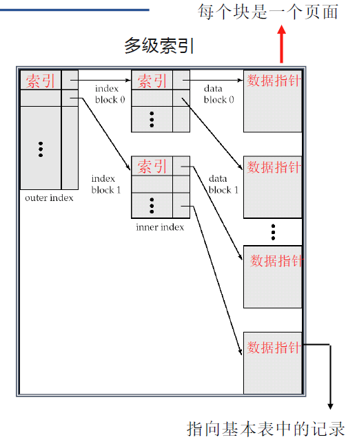
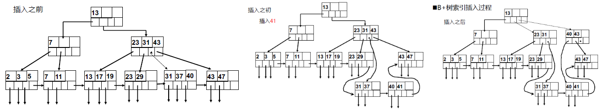
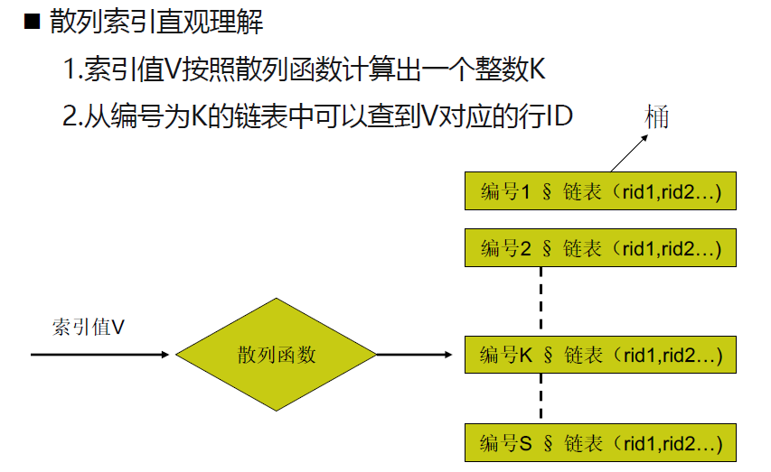

# 第五章 存储与索引

# 07 - 索引

## 5.1 存储介质

**存储器分类**：

- 一级存储－－内存 —— 常用数据
- 二级存储－－磁盘 —— 业务数据
- 三级存储－－大容量存储器（磁带机、DVD等） —— 归档数据

**磁盘读写时延**：寻道时延、旋转时延、数据读写时延

- 顺序读写：快（只有读写时延）

- 随机读写：慢（寻道+旋转+读写）

1. 在内存中存放常用数据
2. 尽量减少磁盘IO
3. 磁盘最小存取单元是页面（访问磁盘数据时，一次读取整个页面的数据）
4. 局部性原理：要尽量将相关的或常用的数据放在同一个页面上（尽量顺序读写）

## 5.2 数据的存储结构

### 数据库逻辑存储结构

- 块
  - 数据库中最小的分配单元，2~32KB，一次I/O将读写一整个快
- 区
  - 磁盘上连续的块的组合
- 段
  - 由一个或多个盘区组成，只存储一类数据对象：表段、索引段、回滚段等
  - **通常数据库中每个表对应于一个段**
- 表空间
  - 逻辑上：由0个或多个段组成
  - 物理上：由一个或多个数据文件组成
  - 一个段不能跨越一个表空间，但可跨越表空间内的文件
  - 设置表空间的作用是将数据对象的逻辑结构和物理结构统一起来
- 数据库
  - 包含一个或多个表空间
  - 组成数据库的表空间和数据文件是一对多关系

### 文件组织结构

- 堆组织表
  - 记录顺序没有限制，将记录简单排列在文件中
  - 数据排列顺序是不可预测的
- 索引组织表
- 聚簇表
  - 索引聚簇表
  - 散列聚簇表

## 5.3 索引

对数据库表中的一个或多个列的值排序，提高主表查询速度

若想按特定列的值查找数据，索引比直接搜索能更快获取信息（**二分法查找**，$O(log_2n)$）

### 多级索引

> 单级索引效率还是太低：1M条记录，20次IO
>
> 改进：多级索引：B+树索引
>
> 

#### B+树索引

数据库系统中使用最广泛

**特点**：

- 将索引键组织成一棵**平衡树**，即从树根到树叶的所有路径一样长
- 数据（指向基本表记录存储位置的指针）**存储在叶结点**
- 最底层的叶节点包含每个索引键和指向被索引行的指针（行id）
- 叶节点之间**有通道可供平行查询**
- 每一个叶节点都**和磁盘页面大小一致**
- 查询的时间复杂度：$O(log_mn) $(m为分叉数，即B+树的阶）

**与B树不同**：B树在每个节点都存储数据

**为何不用B树**？

- B树将数据（行id）放到非叶节点中，导致每个节点能存放的索引项减少，树的层级更多，检索时需要更多磁盘IO

- B+树将所有数据在叶节点中有序存放并构成一个链表
  - 范围查询的效率更高
  - 缓存命中率更高（空间局部性原理）
- B+树的更新维护代价更小：插入删除不会引起过多I/O操作，插入后仍然平衡，保持很好性能

B+树索引的效率

- 一般B+树保持三层，故只需3次磁盘I/O即可获得数据物理存储地址
- 若将B+树的根节点和中间节点存入缓存，则只需1次磁盘I/O就能读取数据

当要查询的记录数占记录总数的百分比非常大的时候，不用索引将比用索引更快

#### 散列索引（Hash Index）

只需一次磁盘IO就可以查到数据记录

如果桶（hash表项）的数量足够多，则每个桶通常占用一个磁盘页面

但如果记录数很多，则会出现一个块中容纳不下新记录的情况，这时可以增加一个溢出块到桶的链上。

> 若溢出块太多，将大大增加磁盘I/O次数

特点：

- 散列索引是CPU密集型的，B+树是I/O密集型的（I/O次数多于散列索引）
- 散列索引在**进行等值查找时速度很快**，但散列索引**无法用于范围查找**
- 不适合在重复值很多的列上建立哈希索引
- 哈希索引重构代价很大，不适合在更新频繁的表中建立哈希索引

#### 聚簇索引（Cluster Index）

大多数关系表以堆组织表的形式存放。建立聚簇索引后，数据在物理文件中的存放位置不再是无序的，而是根据索引中键值的逻辑顺序决定了表中相应行的物理顺序，即形成**索引组织表**

特点

- 物理顺序只有一个，因此一张表**只能有一个**聚簇索引
- 在聚簇索引列上的**查询速度比B+树索引快**
- 数据在**物理上按顺序排在数据页上**，重复值也排在一起，因而在使用包含范围检查（between、<、<=、>、>=）或使用`group by`或`order by`的查询时，可以大大提高查询速度
- **DML频繁的表中不要建立聚簇索引**，因为会带来大量索引数据维护的开销
- MySQL在**表的主键上**建立聚簇索引

#### 联合索引

> 通过在（a，b）字段上建立联合索引，可以获得比单独建立a字段索引和b字段索引更快的查找速度

最左前缀原则：只有在查询条件中使用了联合索引的最左前缀（左边字段）时，该联合索引才会生效

- 例1：`Select * from Emp where age / 2 > 20`中，age上建立的索引失效
- 例2：`Select * from Emp where to_char(birth_day,'YYYY-MM-DD' = ‘2022-11-10’`中，需要用到函数索引：将`to_char(birth_day,'YYYY-MM-DD')` 定义为索引