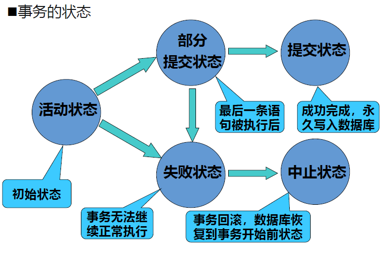
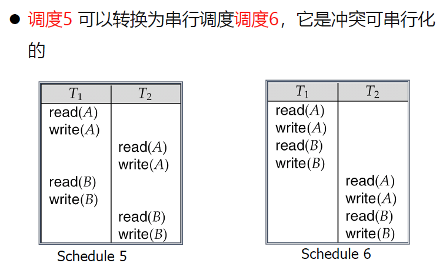

# 第八章 并发控制

# 10 - 事务管理

## 8.1 并发控制

数据资源共享，为了充分利用数据库资源，数据库用户对数据库系统**并行存取数据**

**数据库的一致性**：在任何时刻用户面对的数据库都是符合现实世界的语义逻辑的

- 多个用户并发存取同一数据块时，如果对并发操作不加控制可能会产生不正确的数据，破坏数据的一致性
- DBMS必须对并发操作进行控制，避免破坏数据一致性
- 数据库并发控制以**事务**为基本单位进行，对事务所操作的数据**施加封锁**来实现一致性
  - 这种数据一致性约束属于动态关系约束


## 8.2 事务（Transaction）

事务：**用户定义的**一个数据库操作序列，是不可分割的工作单位（要么全做，要么全不做）

> [!CAUTION]
>
> 事务和程序是两个概念：
>
> - 一个事务可以是一条或一组连续的SQL语句
> - 一个对数据库进行操作的==应用程序可以包含多个事务==，这些事务是串行的

事务开始与结束可由用户显式控制，若用户未显示定义，则由DBMS按照缺省规定自动划分事务

用户自定义的事务：以`Begin transaction`开始，以`Commit`或`Rollback`结束。

- `commit`：事务的提交，将事务中所有对数据库的更新写回磁盘上的物理数据库中，此时事务正常结束
- `rollback`：事务的回滚，即事务运行过程中发生故障，事务不能继续执行，系统将事务中对数据库的所有已完成的**更新操作全部撤销，再回滚到事务开始时的状态**

例：事务开始 -> 系统在A账户删除100元 -> 系统在B账户增加100元 -> 事务结束

```sql
BEGIN TRANSACTION
    READ A
    A = A - 100
    IF A < 0 THEN	/* A款不足 */
        BEGIN
            DISPLAY "A款不足"
            ROLLBACK
        END
    ELSE			/* 拨款 */
        BEGIN
            READ B
            B = B + 100
            DISPLAY "拨款完成"
            COMMIT
        END
```

事务：**并发控制**的基本单位，遇到数据库错误后进行**数据恢复**的处理单位

事务由有限的数据库操作序列组成，但并非任意数据库操作序列都能成为事务，需要有如下4个特征。


### 8.2.1 ACID特征

#### 原子性（Atomicity）

- 事务中包含的所有操作**要么全做，要么全不做**
- 系统应保证只执行了一部分的事务不会对数据库状态产生影响（钱打了一半出现错误，账户钱不能少）

#### 隔离性（Isolation）

- 并发执行的**各个事务之间不能互相干扰**
- 一个事务**内部**的操作及使用的数据对**其他**并发事务是**隔离**的
- 每个事务在执行的时候应感觉不到其他事务的存在

#### 一致性（Consistency）

- 是原子性和隔离性的结果
- 数据库在事务执行前是一致的，执行过程中可能暂时出现不一致，而当**事务执行完后，数据库仍会处于一致性状态**

#### 持久性（Durability）

- 一个事务一旦提交（commit）之后，它对数据库的**影响必须是永久的**。系统发生失效不能改变事务的持久性。


### 8.2.2 事务的状态



数据库的恢复机制保证了**原子性和持久性**的实现

- 一种简单的恢复机制： shadow-database影子数据库技术

  - 假定同时只有一个事务是活动的（不存在隔离性问题）

  - 对数据库的更新都在影子数据库上进行。当事务更新都完成后，数据库指针`db-pointer`指向影子数据库，将之变成当前数据库。若事务出现错误，则删除影子数据库

- 恢复机制**不能解决**事务并发执行情况下的数据**一致性、隔离性**问题


### 8.2.3 事务的并发执行

- 当同一数据库系统中有多个事务并发运行时，如果不加以适当控制，可能会破坏事务的隔离性，产生数据的不一致性。

- 并发操作带来的数据一致性——丢失修改、不可重复读、读脏数据

- 优点：
  - 提高系统吞吐量
  - 减少平均响应时间

#### 1. 丢失修改（lost update）——写写冲突

- 事务1与事务2从数据库中读入同一数据并修改，事务2的提交结果破坏了事务1提交的结果，导致**事务1的修改被丢失**。也称脏写（dirty write）——写写冲突

  |         $T_1$         |         $T_2$         |
  | :-------------------: | :-------------------: |
  |       读$A=16$        |                       |
  |                       |       读$A=16$        |
  | $A = A - 1$；写$A=15$ |                       |
  |                       | $A = A - 1$；写$A=15$ |

#### 2. 不可重复读（non-repeatable read）——读写冲突

- 指事务1读取数据后，事务2执行更新操作，使事务1**无法再现前一次读取结果**。

- 三种情况：事务1读取某一数据后，

  1. 事务2对其做了修改，当事务1再次读该数据时，得到与前一次不同的值。
  
     |                    $T_1$                    |             $T_2$             |
     | :-----------------------------------------: | :---------------------------: |
     |       读$A=50$；读$B=100$；求和$=150$       |                               |
     |                                             | 读$B=100$；$B=B*2$；写$B=200$ |
     | 读$A=50$；读$B=200$；求和$=250$（验算不对） |                               |
  
  2. 事务2删除了其中部分记录，当事务1再次读取数据时，发现某些记录神秘地消失了。
  
     |              $T_1$              | $T_2$ |
     | :-----------------------------: | :---: |
     | 读$A=50$；读$B=100$；求和$=150$ |       |
     |                                 | 删除B |
     |       读$A=50$；未读取到B       |       |
  
  3. 事务2插入了一些记录，当事务1再次按相同条件读取数据时，发现多了一些记录。
  
  > 后两种不可重复读有时也称为幻影现象（phantom row）

#### 3. 读“脏”数据（dirty read）——写读冲突

事务1修改某一数据，并将其写回磁盘。事务2读取同一数据后，**事务1由于某种原因被撤消**，这时事务1已修改过的数据恢复原值，事务2读到的数据就与数据库中的数据不一致，是不正确的数据，又称为“脏”数据。

|          $T_1$          |      $T_2$      |
| :---------------------: | :-------------: |
| 读$C=100$；$C=C*2$；写C |                 |
|                         |    读$C=200$    |
|  ROLLBACK，C恢复为100   |                 |
|                         | $C=200$为脏数据 |


### 8.2.4 事务并发控制机制

对事务的并行运行顺序进行合理安排，达成事务的隔离性和一致性

主要手段：调度、锁、协议

#### 调度（Schedule）

- 是并发运行的事务中各条指令的执行序列
  - 应当对**各事务**所有指令的执行时间顺序做出安排
  - 应当**保留同一事务**中各指令原有的执行顺序
- 对并行事务中并行操作的调度有很多方案 ，而不同的调度方案可能会产生不同的结果。

- 将所有事务**串行**起来的调度策略**一定是正确的调度策略**。
  - 以**不同的顺序串行执行**事务也有可能会产生不同的结果，但由于不会将数据库置于不一致状态，所以**都可以认为是正确的**。


并行调度的可串行化：

- 串行调度能够保证数据库的一致性
- 几个事务的并行执行是正确的，当且仅当其**结果与按某一次序串行地执行它们时的结果相同**。这种并行调度策略称为**可串行化（Serializable）**的调度

- ==可串行化是并行事务正确性的唯一准则==
- 判断标准——我们只讨论冲突可串行化：
  - 冲突可串行化（conflict serializability）和视图可串行化（view serializability）

##### 冲突可串行化

现有事务 $T_i$ 和 $T_j$ 及各自的指令 $l_i$ 和 $l_j$，当且仅当有一个数据项$Q$**被 $l_i$ 和 $l_j$ 都访问**， 且**至少有一个指令**对$Q$进行**写入操作**的时候，两个指令发生冲突。

- 如果一个调度$S$可以通过一系列的==非冲突指令顺序调换==而被转换为另一个调度$S’$， 则我们说$S$和$S’$是**冲突等价的**（conflict equivalent）

- 如果$S’$是一个串行化调度，这时我们说**$S$​是冲突可串行化的**（conflict serializable）

  

##### 前驱图（Precedence graph）

- 是一种有效的冲突可串行化的测试方法
- 是一种有向图
  - 顶点是事务的名称
  - 对于两个顶点：事务$T_i$和$T_j$，如果这两个事务冲突，且是事务$T_i$先访问的冲突资源，则画一个从$T_i$到$T_j$的弧。
  - 可以在弧上标注冲突资源的名称

当且仅当前驱图是**无环**（acyclic）的时候，对应的调度是冲突可串行的

- 此时，冲突等价的串行化调度的事务执行顺序可以通过对图的拓扑排序（topological sorting）方法获得

  > 拓扑排序：每次排上一个没有前驱的顶点。若都有前驱，证明图有环。

**可恢复的调度**：若事务 $T_j$ 读取了一个事务 $T_i$ 之前写入的数据，则 $T_i$ 的提交操作应在 $T_j$ 的**提交**操作之前发生，可以避免前述数据回滚导致的不一致问题（人话：事务写入数据后，如果有要读它的，写入的事务一定要先于读取的事务提交）

**级联回滚**：某调度失败，需要回滚，需要引起其他调度的一连串回滚，导致事务运行不畅，浪费大量计算资源

**无级联调度**：是可恢复调度，是较高的调度要求。

- 若事务 $T_j$ 读取了一个事务 $T_i$ 之前写入的数据，则 $T_i$ 的提交操作应在 $T_j$ 的**读取**操作之前（==更严格，不仅是可恢复的调度的提交之前==）发生


## 8.3 封锁方法（Locking）

封锁就是事务T在对某个数据对象（例如表、记录等）操作之前，先向系统发出请求，对其加锁

加锁后事务T就对该数据对象有了一定的控制，在事务T释放它的锁之前，**其它的事务不能更新此数据对象**。

封锁是实现并发控制的一个非常重要的技术

DBMS通常提供了多种类型的封锁。一个事务对某个数据对象加锁后究竟拥有什么样的控制是由封锁的类型决定的

基本封锁类型：

- **排它锁**（exclusive lock，简记为**X锁**），写锁
  - 若事务T对数据对象A加上X锁，则只允许T读取和修改A，其它任何事务**都不能再对A加任何类型的锁**，直到T释放A上的锁
- **共享锁**（Share lock，简记为**S锁**），读锁
  - 若事务T对数据对象A加上S锁，则其它事务**只能再对A加S锁，而不能加X锁**，直到T释放A上的S锁。
  - 这就保证了其他事务在T释放R上的S锁之前，**只能读取R**，而不能再对R作任何修改

> 封锁协议：基于锁，设计一组规则，安排一组并发事务交错运行的指令，使得产生的调度可串行、可恢复，甚至无级联
>
> - 内容：何时申请X锁或S锁；持锁时间、何时释放

### 8.3.1 三级封锁协议（Lock protocol）

> 讨论封锁的时机，目的是从不同程度上解决数据不一致性问题

#### 一级封锁协议

- 事务T在**修改（写入）**数据R之前必须先对其**加X锁，直到事务结束才释放**
  - 正常结束（COMMIT）
  - 非正常结束（ROLLBACK）
- 1级封锁协议**可防止丢失修改**
- 在1级封锁协议中，如果是读数据，不需要加锁的，所以它**不能保证可重复读和不读“脏”数据**。

#### 二级封锁协议

- 在1级封锁协议**基础上**，要求事务T在**读取**数据R前必须**先加S锁，==读完后即可==释放S锁**
  - 2级封锁协议**可以防止丢失修改和读“脏”数据**。
- 在2级封锁协议中，由于读完数据后即可释放S锁，所以它**不能保证可重复读**。

#### 三级封锁协议

- 在**1级**封锁协议基础上，要求事务T在**读取**数据R之前必须**先加S锁**，==**直到事务结束才释放**==
- 3级封锁协议**可防止丢失修改、读脏数据和不可重复读**。

三级封锁协议与事务隔离级别

- 数据库标准对事务处理的性能和一致性进行了平衡，定义了4种隔离级别

- 数据库允许用户根据业务需要自行选择隔离级别，1到4并发程度降低，数据安全增强

  1. **读未提交**（Read Uncommitted）

     当两个事务A、B同时进行时，即使A事务没有提交，所做的修改也会对B事务内的查询产生影响。对数据进行修改时，会加上共享锁。

  2. **读已提交**（Read committed）

     只有在事务提交后，才会对另一个事务产生影响。【多数数据库默认的隔离级别】

  3. **可重复读**（Repeatable Read）

     当两个事务同时进行时，其中一个事务修改数据对另一个事务不会造成影响，即使修改的事务已经提交也不会对另一个事务造成影响。

  4. **串行化**（Serializable）

     两个事务同时进行时，一个事务读取的数据也会被锁定，不能被别的事务修改

### 8.3.2 两阶段封锁协议（2PL）

能够保证并发结果正确性

内容：

- 在对任何数据进行读、写操作之前，事务**首先要获得对该数据的封锁**
- 在释放一个封锁之后，<u>事务</u>**不再获得任何其他封锁**

第一阶段：获得封锁，也称为扩展阶段

第二阶段：释放封锁，也称为收缩阶段

> 例：
>
> 事务1的封锁序列：遵守两段锁协议
>
> Slock A ... Slock B ... Xlock C ... Unlock B ... Unlock A ... Unlock C；
>
> 事务2的封锁序列：不遵守两段锁协议
>
> Slock A ... Unlock A ... Slock B ... Xlock C ... Unlock C ... Unlock B；

> [!NOTE]
>
> 若并行执行的所有事务均遵守两段锁协议，则对这些事务的所有并行调度策略都是可串行化的。
>
> 对一组遵守两段锁协议的事务，可以实现可串行化调度，使得其并行执行的结果一定是正确的。
>
> 事务遵守两段锁协议是可串行化调度的充分条件，但不是必要条件。即，可串行化的调度中，不一定所有事务都必须符合两段锁协议

**两段锁协议可以解决所有数据不一致问题**，但不能解决级联回滚问题

- 方案：严格的两段锁协议（与第三级封锁协议一致，遵循第三级封锁协议的事务必然遵守两阶段锁协议）
  - 增加规则：事务获得的锁只有在事务结束时才释放

### 8.3.3 死锁

产生原因：两个或多个事务已经封锁一些数据对象，又都请求对已经被其他事务封锁的数据对象加锁，出现死等待

#### 1. 预防死锁

一次封锁法：

- 要求每个事务必须一次将所有要使用的数据全部加锁，否则就不能继续执行
- 存在的问题：将以后要用到的全部数据加锁，势必扩大了封锁的范围，从而降低了系统的并发度

#### 2. 诊断与解除

- 允许死锁发生
- 解除死锁
  - 由DBMS的并发控制子系统定期检测系统中是否存在死锁
  - 一旦检测到死锁，就要设法解除
- 等待图法检测死锁：T1等待T2，则T1指向T2画一条有向边。
  - 系统周期性检查，如果存在回路，则出现死锁，选择一个事务回滚，打破死锁。