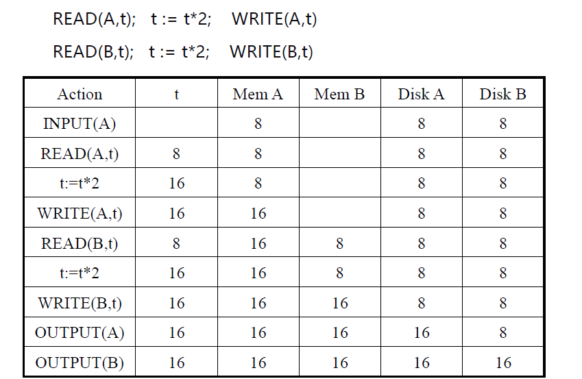
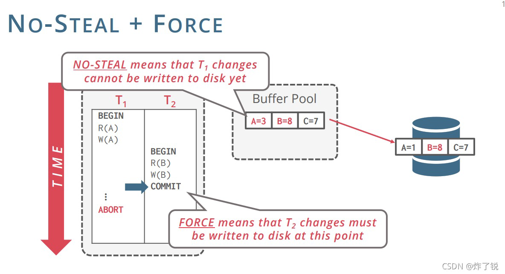
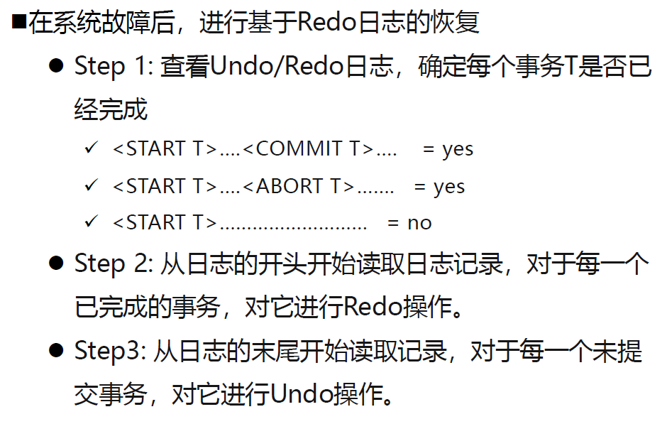
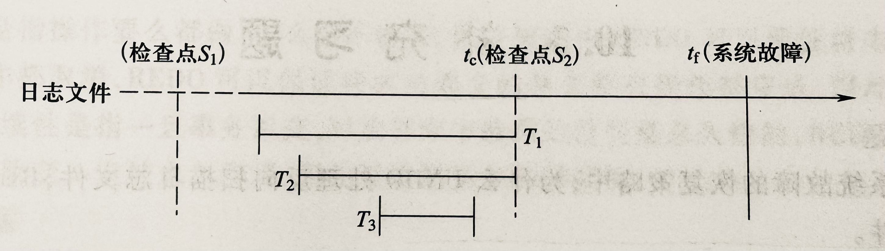

# 第九章 备份与恢复

# 11 - 备份与恢复

[TOC]

分类：

- 逻辑备份恢复：利用SQL从数据库提取数据，存入文件。使用DBMS提供的导出/导入工具包实现。备份效率低，适用于小型数据库迁移和数据维护
- **物理备份恢复**：基于数据文件，备份效率高，对数据库运行性能影响小。备份策略复杂

备份与恢复策略以应对故障。

DBMS提供恢复子系统，保证故障发生后，能把数据库的数据从错误状态恢复到某种逻辑一致的状态

恢复技术保证了事务的原子性（事务全做或全不做）和持久性（已提交事务对数据库影响是持久的）

## 9.1 故障的种类

### 1. 事务故障

某个事务在运行过程中由于种种原因未运行至正常终止点就夭折了。

> **只影响故障事务（程序）本身。**

常见原因：输入数据有误、运算溢出、应用程序出错、并行事务死锁……

**事务故障的恢复**：

- 夭折的事务可能已经把对数据库的部分修改写回磁盘
- 撤销事务（UNDO）
  - 对未提交的事务强行回滚（ROLLBACK），清除事务对数据库的所有修改，消除未提交事务的影响
  - 保障事务原子性

### 2. 系统故障

整个系统的正常运行突然被破坏，所有正在运行的事务都非正常终止，内存缓存区信息全部丢失，==外存数据未受影响==

> **影响到当前正在运行的事务或部分已经运行完结的事务**

原因：停电、硬件错误、DBMS代码错误、操作员操作失误……

**系统故障的恢复**：

- 清除尚未完成的事务对数据库的所有修改（还没COMMIT）：
  - 系统重启时，恢复程序要强行撤销（UNDO）所有未完成事务
- 将缓冲区已完成事务提交的结果写入数据库（已经COMMIT）：
  - 系统重启时，恢复程序要重做（REDO）所有已提交的事务
- 实现上，**需要日志文件的帮助**

### 3. 介质故障

硬件故障使存储在外存中的数据部分丢失或全部丢失。可能性最小，破坏性最大

> **影响到内存中的数据和磁盘上的数据**

**介质故障的恢复**：

- 装入数据库发生介质故障前某个时刻的数据副本
- 重做自此时始的所有成功事务，将这些事务已提交的结果重新记入数据库
- 实现上，需要**数据转储副本**（即备份数据）和**日志文件**的帮助

## 9.2 恢复的实现技术

恢复操作的基本原理：冗余。利用存储在系统其它地方的冗余数据来重建数据库中已被破坏或不正确的那部分数据。

关键问题：如何建立冗余数据？数据转储、登录日志文件。如何利用这些冗余数据事实数据库恢复？

### 9.2.1 数据转储

转储是指DBA将整个数据库复制到磁带或另一个磁盘上保存起来的过程。这些备用的数据文本叫后备副本或备份。

#### 静态转储与动态转储

- **静态转储**：在系统中无运行事务时进行转储
  - 转储开始时数据库处于一致性状态
  - 转储期间不允许对数据库的任何存取、修改活动。
  - **优点**：实现简单
  - **缺点**：降低数据库的可用性——转储必须等用户事务结束，新事务必须等转储结束
- **动态转储**：转储操作与用户事务并发进行，允许对数据库存取或修改
  - **优点**：不用等待正在运行的用户事务结束，不影响新事务运行
  - **缺点**：不能保证副本的数据正确有效
  - 利用动态转储得到的副本进行故障恢复
    - 需要把动态转储期间各事务对数据库的修改活动登记下来，建立**日志文件**
    - **后备副本加上日志文件**才能把数据库恢复到某一时刻的正确状态

#### 全量转储与增量转储

- **全量转储**：每次转储全部数据文件
  - 恢复方便，但会影响数据库运行
  - 通常隔一段时间做一次全量转储，做为增量转储和恢复的基准
- **增量转储**：只转储上次转储后更新过的数据
  - 恢复策略复杂，但备份时对数据库影响小

### 9.2.2 登记日志文件（Log File）

- 日志文件记录事务对数据库更新操作
- 不同事务的日志记录交错存储
- 顺序写入，写入效率高
- 事务操作**先写入日志文件**，写成功后再写入数据缓冲区，最后择机写入数据文件

内容：

- 各个事务的开始标记(BEGIN TRANSACTION)
- 各个事务的结束标记(COMMIT或ROLLBACK)
- 各个事务的数据修改操作
- 与事务有关的内部操作（如检查点等信息）

日志文件作用：

- 发生系统故障时，利用日志文件进行故障恢复
- 故障时已提交事务进行重做（Redo）操作，未提交事务进行撤销（Undo）操作

**事务原语**：

- `INPUT(X)`
  - 把数据项 X **读到内存缓冲区**
- `READ(X,t)`
  - 把数据项 X **拷贝到事务的本地变量 t 中**
- `WRITE(X,t)`
  - 把事务本地变量 t **拷贝回数据项 X**
- `OUTPUT(X)`
  - 将数据项 X **写到磁盘里**记录下来

### 9.2.3 备份与恢复的环境设定

缓冲区内容和磁盘内容不一定一致

缓冲区处理策略：

- **Force**：内存中的数据最晚在commit的时候写入磁盘
- **No Force**：内存中的数据可以一直保留，在commit之后过一段时间再写入磁盘（系统崩溃时数据可能还没写入磁盘，没能持久化）
- **No Steal**：不允许在commit之前把内存中数据写入磁盘
- **Steal**：允许在事务commit之前把内存中的数据写入磁盘（系统崩溃时可能有未提交的数据被持久化了）
- 为提升数据读写性能，当前数据库常用 **No Force + Steal** 策略，为此也增加了数据恢复策略的复杂性

> No Steal和Force模式的恢复：
>
> - 未提交事务不可以写入磁盘（No Steal），提交事务必须写入磁盘（Force）
> - 系统故障时，**没有数据一致性问题**，无需恢复
>   - 未提交的事务修改的数据页还停留在内存中，断电后重启，内存中的数据自然也就消失了，自动回滚
>   - 已经提交的事务，其修改的数据页已经写入到磁盘进行持久化，并没有受到影响
> - 问题：每次事务都要进行磁盘随机写入（提交事务修改数据），性能很差

> No Steal和No Force模式的恢复
>
> - 未提交事务不可以写入磁盘（No Steal），**提交事务可以暂不写入磁盘**（No Force）
> - 系统故障时
>   - 未提交事务并不会受到影响，自动回滚
>   - **已提交事务的修改数据**可能还未写入到数据文件中，日志文件与数据文件不一致，持久性未能保证
>   - 为此需**引入Redo日志文件**，解决内存数据丢失的问题。

> Steal和Force模式的恢复
>
> - 未提交事务可以写入磁盘（Steal），提交事务必须写入磁盘（Force）
> - 系统故障时
>   - **未提交事务修改的数据**可能已经被持久化到了数据文件中，日志文件与数据文件不一致
>   - 已提交的事务，其修改的数据已经写入到磁盘进行持久化，并没有受到影响
>   - 为此需**引入Undo日志文件**，清除数据文件中的未提交数据。

> Steal和No Force模式的恢复
>
> - 未提交事务可以写入磁盘（Steal），提交事务可以暂不写入磁盘（No Force）
> - 性能最好
> - 系统故障时
>   - **未提交事务修改的数据**可能已经被持久化到了数据文件中
>   - **已提交事务修改的数据**可能还未写入到数据文件中
>   - 为此需**引入Undo日志文件和Redo日志文件**，共同解决数据一致性和持久化问题。

## 9.3 恢复的策略

### 9.3.1 基于Undo日志的恢复策略

记录内容：

`<START T>`	  标记事务的开始
`<COMMIT T>`	T 事务已经提交
`<ABORT T>`	  T 事务已被回滚
`<T,X,v>`	      T 事务已经更新数据项 X，其**更新前的旧值**是 v

- 规则1：如果事务 T 更新了数据项 X，则日志记录`<T,X,v>`必须在 X 被写入磁盘之前写入磁盘

- 规则2：如果事务 T 提交，则日志记录`<COMMIT T>`只有在 T 所做的所有修改都被写入数据文件后才能写入日志文件

- 即：==更新操作日志先写，commit操作日志后写==

基于Undo日志的恢复的思路：

- Step 1：查看Undo日志，**确定每个事务T是否已经完成**
  - `<START T>`….`<COMMIT T>`..... = yes
  - `<START T>`….`<ABORT T>`....... = yes
  - `<START T>`……………………… = no
- Step 2：撤销每个未完成的事务对数据的修改
  - 进行**反向操作**，如对于`delete`操作，执行对应的`insert`操作

基于Undo日志的恢复的步骤：

- 从日志文件尾部开始读取日志记录
- 若读到`<COMMIT T>`：标记 T 为结束状态
- 若读到`<ABORT T>`：标记 T 为结束状态
- 若读到`<T,X,v>`:
  - if T 不是结束状态：将`X=v`写入磁盘数据文件
    else T 是结束状态：忽略该记录
  - 若读到`<START T>`：忽略该记录

Undo日志恢复的每种操作都是幂等的（idempotent），这意味着如果我们在Undo日志恢复过程中再次遇到系统故障，**只需重新启动系统再次从头进行恢复，多次恢复不会影响系统数据**。

### 9.3.2 基于Redo日志的恢复策略

内容上其他均与Undo一致，`<T,X,v>`：T 事务已经更新数据项 X，其**新值**是 v

规则：如果事务 T 更新了数据项 X，则日志记录`<T,X,v>` 和`<COMMIT T>`必须在 X 被写入数据文件之前写入日志文件。

==更新操作和Commit操作：Redo日志文件先写，数据文件后写==

基于Redo日志的恢复的思路：

- Step 1：同Undo，查看Redo日志，确定每个事务T是否已经完成
- Step 2：从Redo日志的**开头**开始读取日志记录，对于每一个**已完成的事务，对它进行重做**操作。

> 比较：
>
> - Undo每次事务结束都对磁盘进行数据文件写入，性能差；Redo已提交事务对数据修改可延后写入数据文件，性能高
> - **Undo - 事务故障 - 原子性；Redo - 系统故障 - 持久性**

### 9.3.3 基于Undo/Redo日志的恢复策略

### 9.3.4 基于检查点的恢复策略

> 若从头开始进行基于整个日志文件的恢复，会耗费大量时间

- 在日志文件中增加检查点记录（checkpoint record）

- 增加一个“重新开始文件”，记录日志文件维护情况
- 以最新的检查点作为下次恢复工作的起点

检查点记录的内容：

1. 建立检查点时刻**所有正在执行的事务清单**
2. 这些事务**最近一个日志记录的地址**

重新开始文件的内容：记录各个检查点记录在日志文件中的地址

在检查点维护日志文件

1. 将当前日志**缓冲区**中的所有日志记录写入**磁盘**的日志文件上。
2. 在**日志文件中写入一个检查点记录**。
3. 将当前数据**缓冲区**的所有数据记录写入**磁盘的数据库**中。
4. 把检查点记录在日志文件中的地址写入一个**重新开始文件**。

建立检查点：按照预定周期，或按照规则条件（如日志被写满一半）

检查点之前提交的事务不需要恢复

对于检查点之后才提交的事务，其恢复过程
1. 从重新开始文件中找到最后一个检查点记录在日志文件中的地址
2. 由该地址在日志文件中找到最后一个检查点记录
3. 由该检查点记录得到检查点建立时刻所有正在执行的事务
4. 从检查点开始正向扫描日志文件，直到日志文件结束，对读到的事务建立已提交和未提交队列
5. 对已提交事务进行Redo操作，对未提交事务进Undo操作

---

> 具有检查点的恢复技术有什么优点？试举一个具体例子加以说明。

- 利用日志技术进行数据库恢复时，恢复子系统**必须搜索整个日志**，这将耗费大量的时间。此外，需要REDO处理的事务实际上**已将其更新操作结果写到数据库**中，恢复子系统又重新执行了这些操作，浪费了大量时间。检查点技术就是为了解决这些问题。

  

- 在采用检查点技术之前，恢复时需要从头扫描日志文件，而利用检查点技术只需要从$t_c$开始扫描日志，这就缩短了扫描日志的时间。

- 事务$T_3$的更新操作实际上已经写到数据库中了，进行恢复时没有必要再REDO处理，采用检查点技术做到了这一点。

---

> 试述使用检查点方法进行恢复的步骤。

1. 在重新开始文件中，找到**最后一个检查点记录**在日志文件中的地址，由该地址在日志文件中找到最后一个检查点记录。

2. 由该检查点记录得到检查点建立时刻**所有正在执行的事务清单**ACTIVE-LIST。

   这里建立两个事务队列：

   - UNDO-LIST：需要执行 undo 操作（撤销）的事务集合；
   - REDO-LIST：需要执行 redo 操作（重做）的事务集合。

   把ACTIVE-LIST暂时放入UNDO-LIST队列，REDO-LIST队列暂为空。

3. 从检查点开始正向扫描日志文件，

   - 如有新开始的事务$T_i$，把$T_i$暂时放入UNDO-LIST队列；
   - 如有提交的事务$T_j$，把$T_j$​​​​从UNDO-LIST队列移到REDO-LIST队列，直到日志文件结束。

4. 对UNDO-LIST中的每个事务执行UNDO操作，对REDO-LIST 中的每个事务执行REDO操作。