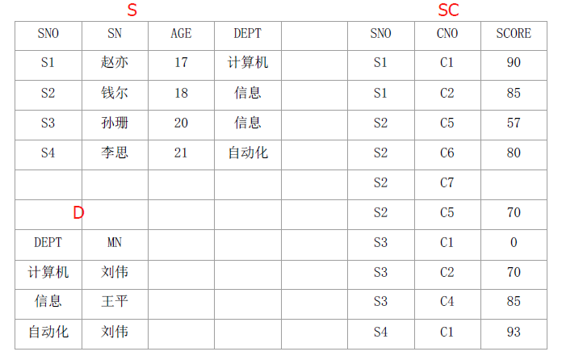
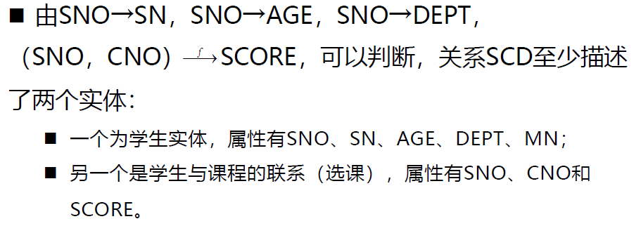
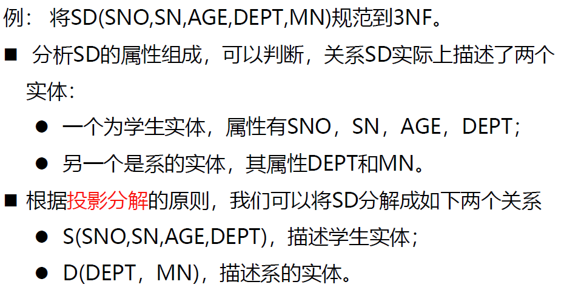
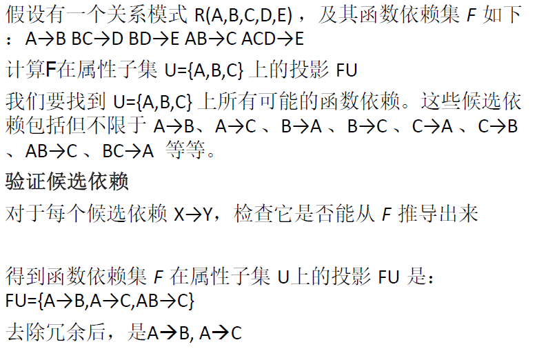
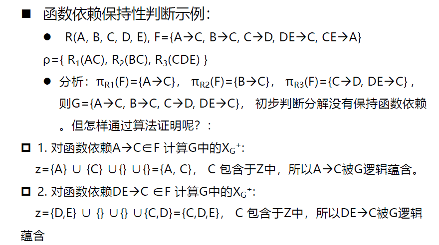
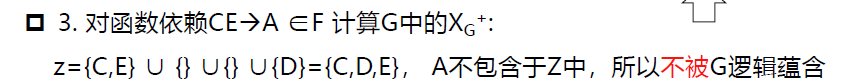
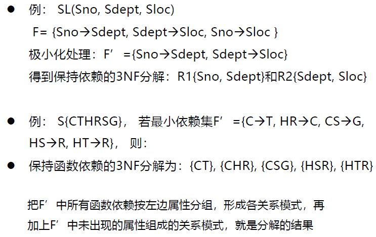
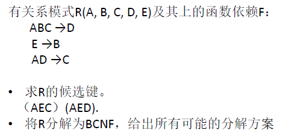

# 第十章 关系数据理论

# 12 - 规范化理论

[TOC]

规范化理论：由E.F.Codd提出

设计适合的关系数据库系统，关键是关系数据库模式的设计

关系数据库的规范化理论主要包括三个方面的内容：

1. 函数依赖——核心，是模式分解和模式设计的基础
2. 范式（Normal Form）——模式分解的标准
3. 模式分解

一个好的关系模式应具备四个条件：

1. 尽可能少的数据冗余：SCD拆分成三个表，插入一个系只需D中插入一条记录
2. 没有插入异常：学生未选课，只在关系S中插入学生记录，与选课关系无关
3. 没有删除异常：学生毕业，只需删除S中的学生记录，D中系的信息仍保留
4. 没有更新异常：没有重复存储，学生改名只需改S表即可

**关系的规范化**：按照一定的规范设计关系模式，将结构复杂的关系分解成结构简单的关系，从而把不好的关系数据库模式转变为好的关系数据库模式

> 先讨论**属性间的依赖关系**，再讨论关系规范化理论

## 10.1 函数依赖

数据依赖：关系模式中的各属性之间相互依赖、相互制约的联系。分为函数依赖、多值依赖、连接依赖

函数依赖：关系模式中属性之间的一种逻辑依赖关系。

> SNO决定函数（SN，AGE，DEPT），或者说（SN，AGE，DEPT）函数依赖于SNO。

### 10.1.1 形式化定义

设关系模式$R(U,F)$，$U$是属性全集，$F$是$U$上的函数依赖集，$X$和$Y$是$U$的子集，如果对于$R(U)$的任意一个可能的关系$r$，**对于X的每一个具体值，$Y$都有唯一的具体值与之对应**，则称$X$决定函数$Y$，或$Y$函数依赖于$X$，记作$X→Y$。我们称$X$为决定因素，$Y$为依赖因素。当$Y$不函数依赖于$X$时，记作：$X\nrightarrow Y$。当$X→Y$且$Y→X$时，则记作：$X↔Y$。

> 对SCD，$U=\{SNO,SN,AGE,DEPT,MN,CNO,SCORE\}$。
>
> 显然，$SNO→SN，SNO→AGE，SNO→DEPT$。
>
> 有$(SNO,CNO)→SCORE$，$SNO\nrightarrow SCORE$

### 10.1.2 说明

1. **平凡的函数依赖与非平凡的函数依赖**

   - 当属性集Y是属性集X的子集时，则必然存在着函数依赖$X→Y$，这种类型的函数依赖称为平凡(Trivial)的函数依赖，否则非平凡的函数依赖。$(SNO,CNO)→SNO$。
   - 我们讨论的都是非平凡的函数依赖

2. **函数依赖是语义范畴的概念**

   - 我们只根据语义来确定函数依赖，而不能按照其形式化定义来证明一个函数依赖是否成立
   - 函数依赖反映了一种语义完整性约束（**由需求定义，而不能根据数据情况来找函数依赖**）

3. **函数依赖关系的存在与时间无关**

   - 函数依赖是指关系中的**所有元组**应该满足的约束条件，而非关系中**某个或某些元组**所满足的约束条件。
   - 当关系中的**元组增加、删除或更新后都不能破坏**这种函数依赖。
   - 因此，==必须根据语义来确定==属性之间的函数依赖，而==不能单凭某一时刻关系中的实际数据值==来判断。例如，不能说$SN\rightarrow SNO$

4. **函数依赖可以保证关系分解的无损连接性**

   - 设$R(X,Y,Z)$，$X$、$Y$、$Z$为不相交的属性集合，如果$X→Y$**或**$X→Z$，则有$R(X,Y,Z) = R1[X,Y]⋈R2[X,Z]$

   - 其中，$R1[X,Y]$表示关系$R$在属性$(X,Y)$上的投影

   - 即$R$等于其投影在$X$上的自然连接，这样便保证了关系$R$分解后不会丢失原有的信息，称作关系分解的无损连接性。

   - 基于上述原则的分解方法称为**投影分解**

   - 例如，
     $$
     有\;SNO→(SN,AGE,DEPT,MN);\\则\;SCD(SNO,SN,AGE,DEPT,MN,CNO,SCORE)\\
     =A[SNO,SN,AGE,DEPT,MN]⋈B[SNO,CNO,SCORE].
     $$
     也就是说，用其投影在SNO上的自然连接可复原关系模式SCD。==非常重要！在后面的关系规范化中会用到。==

### 10.1.3 分类

#### 完全函数依赖与部分函数依赖

- 如果$X→Y$，并且对于$X$的**任何一个真子集**$X^′$，都有$X^′\nrightarrow Y$，则**称$Y$对$X$完全函数依赖**（Full Functional Dependency），记作$X\overset{f}{\rightarrow}Y$。

- 如果对$X$的某个真子集$X^′$，有$X^′→Y$，则**称$Y$对$X$部分函数依赖**（Partial Functional Dependency），记作$X\overset{p}{\rightarrow}Y$。

  - 例如，在关系模式$SCD$中，因为$SNO\nrightarrow SCORE$，且$CNO\nrightarrow SCORE$，所以有：$(SNO,CNO)\overset{f}{\rightarrow}SCORE$ 。

  - 而$SNO→AGE$，所以$(SNO,CNO)\overset{p}{\rightarrow}AGE$

- 只有当决定因素是**组合属性**时，讨论部分函数依赖才有意义，当决定因素是**单属性**时，**只能是完全函数依赖**。

#### 传递函数依赖

- 设有关系模式$R(U)$，$U$是属性全集，$X$、$Y$、$Z$是$U$的子集，

- 若$X→Y$，但$Y\nrightarrow X$，而$Y→Z(Y∉X，Z∉Y)$，则称$Z$对$X$传递函数依赖（Transitive Functional Dependency），记作：$X\overset{t}{\rightarrow}Z$。

- 如果$X→Y$且$Y→X$，则$X↔Y$，这时称$Z$对$X$**直接函数依赖**，**而不是传递函数依赖**。
  - 例如，在关系模式SCD中，$SNO→DEPTN$，但$DEPTN\nrightarrow SNO$，而$DEPTN→MN$，则有$SNO\overset{t}{\rightarrow}MN$​。
  - 当学生不存在重名的情况下，有$SNO→SN$，$SN→SNO$，$SNO ↔ SN$，$SN→DEPTN$，这时$DEPTN$对$SNO$​是直接函数依赖，而不是传递函数依赖。

综上所述，函数依赖分为完全函数依赖、部分函数依赖和传递函数依赖三类，它们是规范化理论的依据和规范化程度的准则

### 10.1.4 用函数依赖定义候选键

- 设$K$为关系模式$R<U,F>$中的属性或属性组合。==若$K\overset{f}{\rightarrow}U$==，则$K$称为$R$的一个**候选键**（Candidate Key）。注意是完全函数依赖
- 若关系模式$R$有多个候选键，则选定==其中的一个==做为**主键**（Primary key）。
- 若$K$是$R$的一个候选键，并且$S⊃K$，则称$S$是$R$的一个**超键**（Super Key）
- 在任一候选键中出现过的属性称为**主属性**；主属性之外的称为非主属性

### 10.1.5 用函数依赖定义外键

- 关系模式$R$中属性或属性组$X$并非$R$的候选键，但$X$**是另一个关系模式的候选键**，则称$X$是$R$的**外键**（Foreign key）

## 10.2 范式

我们把关系数据库的规范化过程中为不同程度的规范化要求设立的不同标准称为**范式**（Normal Form）

满足最基本规范化要求的关系模式叫第一范式（1NF），$1NF⊃2NF⊃3NF⊃BCNF⊃4NF⊃5NF$

### 10.2.1 1NF

> 定义：如果关系模式$R$，其所有的属性**均为简单属性**，即每个属性域都是不可再分的，则称$R$属于第一范式，简称1NF，记作$R∈1NF$。

- 是最基本的规范形式，即关系中每个属性都是不可再分的简单项。

- 排除了多值属性、组合属性
- 弊端：大量的数据冗余，插入异常、删除异常、更新异常等

### 10.2.2 2NF

> 如果关系模式$R∈1NF$，且每个非主属性==都完全函数依赖==于$R$的每个关系键，则称$R$属于第二范式，简称2NF，记作$R∈2NF$​。

1. 从1NF关系中**消除非主属性对关系键的部分函数依赖**，则可得到2NF关系。
2. 如果R的关系键为单属性，或R的全体属性均为主属性，则R ∈ 2NF。

**2NF规范化**：把1NF关系模式通过**投影分解**转换成2NF关系模式的集合。

- 分解时遵循的基本原则就是**“一事一表”**，让**一个关系只描述一个实体或者实体间的联系**。如果多于一个实体或联系，则进行投影分解。

- 形式化描述：

- 设关系模式$R(X,Y,Z)$，$R ∈ 1NF$，但$R$不是2NF，其中，$X$是主属性，$Y$、$Z$是非主属性，且**存在部分函数依赖**，$X\overset{p}{\rightarrow}Y$。设$X$可表示为$X_1$、$X_2$，其中$X_1\overset{f}{\rightarrow}Y$。则$R(X,Y,Z)$可以分解为$R[X_1，Y]$和$R[X，Z]$​

  > 意思是，把部分函数依赖中，能构成完全函数依赖的一部分拎出来作为一个实体分解出去，其余保留

SCD（SNO, SN, AGE, DEPT, MN, CNO, SCORE）分解为

SD（SNO, SN, AGE, DEPT, MN）和 SC（SNO, CNO, SCORE），此时非主属性对主键完全函数依赖

缺点：仍存在着非主属性对主键的**传递依赖**：$SNO\overset{t}{\rightarrow}MN$。四种条件的问题集中在DEPT上

1. 数据冗余。每个系名和系主任的名字存储的次数等于该系的学生人数。
2. 插入异常。当一个新系没有招生时，有关该系的信息无法插入。
3. 删除异常。某系学生全部毕业而没有招生时，删除全部学生的记录也随之删除了该系的有关信息。
4. 更新异常。更换系主任时，仍需改动较多的学生记录。

### 10.2.3 3NF

> 如果关系模式$R∈2NF$，且每个非主属性==都不传递依赖==于$R$的**每个**关系键，则称$R$​属于第三范式

3NF规范化：把2NF关系模式通过**投影分解**转换成3NF关系模式的集合。

X：DEPT，Y：MN，Z：SNO, SN, AGE，有$X→Y$，则有$R(X,Y,Z) = R1[X,Y]⋈R2[X,Z]$

- 既没有非主属性对键的部分依赖，也没有非主属性对键的传递依赖，解决了2NF中存在的四种数据异常问题：冗余、插入、删除、更新。
- 但是：只限制了非主属性对键的依赖关系，而没有限制**主属性对键的依赖关系**（==主属性：任一候选键中出现过的属性==）。
- 对于关系模式SNC（<u>SNO</u>，SN(unique)，<u>CNO</u>，SCORE）
  - 若不重名，有两个候选键（SNO, CNO）和（SN, CNO），唯一的非主属性SCORE对键不存在部分函数依赖，也不存在传递函数依赖，故SNC∈3NF。
  - 但存在着主属性SN/SNO对键的部分函数依赖：$(SNO，CNO)\overset{p}{\rightarrow}SN$，$(SN，CNO)\overset{p}{\rightarrow}SNO$。存在数据异常：学生没选课，则没有学生姓名信息，产生插入异常……

### 10.2.4 BCNF

> 如果关系模式$R∈1NF$，且所有的函数依赖$X→Y(Y∉X)$，**决定因素$X$都包含了$R$的一个候选键**，（上面SNC的例子中，有$SNO→SN$，而单独一个SNO不是候选键）则称$R$属于BC范式（Boyce-Codd Normal Form），记作$R∈BCNF$​。

- 性质：满足BCNF的关系将消除任何属性（主属性或非主属性）对键的部分函数依赖和传递函数依赖。也就是说，如果R∈BCNF，则R也是3NF。

- BCNF的规范化：把3NF关系模式通过投影分解转换成BCNF关系模式的集合。

> SNC（<u>SNO</u>, SN, <u>CNO</u>, SCORE）分解：
>
> - S1（SNO, SN）描述学生实体；S2（<u>SNO, CNO</u>, SCORE）描述学生与课程的联系。

在函数依赖的范畴内，已经实现了模式的彻底分解，消除了产生插入异常和删除异常的根源，而且数据冗余也减少到极小程度

### 10.2.5 关系模式规范化

定义：一个低一级范式的关系模式，通过模式分解转化为若干个高一级范式的关系模式的集合

步骤：

1. 对1NF关系进行投影，消除原关系中**非主属性**对键的**部分函数依赖**，将1NF关系转换成若干个2NF关系。
2. 对2NF关系进行投影，消除原关系中**非主属性**对键的**传递函数依赖**，将2NF关系转换成若干个3NF关系。
3. 对3NF关系进行投影，消除原关系中**主属性对键的部分函数依赖和传递函数依赖**，也就是说使决定因素都包含一个候选键。得到一组BCNF关系。

### 10.2.6 非规范化设计

在特殊条件和要求下，适当地**降低甚至抛弃关系模式的范式**，不再要求一个表只描述一个实体或者实体间的一种联系。其主要目的在于**提高数据库的运行效率**。

非规范化处理的情形：

- 大量频繁的查询过程所涉及的表都需要进行**连接**；
- 主要的应用程序在执行时要将表**连接**起来进行查询；
- 对数据的计算需要**临时表或进行复杂的查询**。

主要技术：增加冗余或派生列，对表进行合并分割或增加重复表等

#### 1. 增加冗余或派生列

##### 增加冗余列

- 在多个表中具有相同的列，它常用来在查询时避免连接操作
- 可以在查询时避免连接操作，**但**它需要更多的存储空间，同时增加表维护的工作量。

##### 增加派生列

- 增加的列来自其它表中的数据，由它们计算生成。它的作用是在查询时减少连接操作，避免使用集函数。
- 除与冗余列同样的缺点之外，**还需**消耗计算资源在数据变化时对派生列的值进行及时维护。

#### 2. 对表进行合并、分割

##### 重新组表

- 许多用户需要查看两个表连接出来的结果数据，则把这两个表重新组成一个表来减少连接而提高性能。
- 可提高性能，**但**需要更多的磁盘空间，同时也损失了数据在概念上的独立性

##### 表分割

- 水平分割
  - 根据一列或多列数据的值把数据行放到两个独立的表中。
  - 方法：范围分区、散列分区、列表分区等
  - 适用情况：
    - 表很大，分割后可以降低在查询时需要读的数据和索引的页数，同时也降低了索引的层数，提高查询速度。
    - 表中的数据本来就有独立性，例如表中分别记录各个地区的数据或不同时期的数据，特别是有些数据常用，而另外一些数据不常用。
  - 需要把数据存放到多个介质上。
- 垂直分割
  - 把主键和一些列放到一个表，然后把主键和另外的列放到另一个表中。
  - 如果一个表中某些列常用，而另外一些列不常用，就可以采用垂直分割加快查询速度。
  - 缺点是需要管理冗余列，查询所有数据需要join操作。

非规范化设计的主要优点：

- 减少了查询操作所需的连接
- 减少了外部键和索引的数量
- 可以预先进行统计计算，提高了查询时的响应速度

非规范化存在的主要问题：

- 增加了数据冗余
- 影响数据库的完整性
- 降低了数据更新的速度
- 增加了存储表所占用的物理空间

## 10.3 模式分解

关系模式规范化依靠投影分解实现，但方法不唯一，不同分解得到不同结果

Among all methods, 只有能够保证分解后的关系模式与原关系模式**等价**的方法才是有意义的。

例如，关系模式SD(SNO, SN, AGE, DEPT, MN)，规范到3NF：

1. 分解为S(SNO, SN, AGE, DEPT)，D(DEPT, MN)，好！
2. 分解为S1(SNO, SN, AGE, DEPT)，D1(SNO, MN)，但有四种异常：新系没招生，系主任名字就不知道
3. 分解为S2(SNO, SN, AGE, MN)，D2(DEPT, MN)，丢失了SNO$\rightarrow$DEPT的完全依赖

### 10.3.1 模式分解的定义

- 关系模式$R<U,F>$（U是属性全集，F是函数依赖集）的一个分解：$ρ={ R_1<U_1,F_1>，R_2<U_2,F_2>，…，R_n<U_n,F_n>}$，$U=U_1∪U_2∪…∪U_n$，且不存在$U_i\subseteq U_j$，$F_i$ 为 $F$ 在 $U_i$ 上的**投影**

- 投影：函数依赖集合$\{X→Y|X→Y\in F^+∧\;XY\subseteq U_i\}$ 的一个覆盖 $F_i$ 叫作 $F$ 在属性 $U_i$ 上的投影

### 10.3.2 数据依赖的公理系统

#### 逻辑蕴含

- 对于满足一组函数依赖 F 的关系模式 $R<U, F>$，其任何一个关系 r，若函数依赖$X\rightarrow Y$都成立, 则称$F$逻辑蕴含$X\rightarrow Y$

#### Armstrong公理系统

- 一套推理规则，是模式分解算法的理论基础
- 用途：从一组函数依赖求得蕴含的函数依赖；求给定关系模式的候选键

> [!IMPORTANT]
>
> 对关系模式$R<U,F >$，有以下的推理规则：
>
> - A1. 自反律（Reflexivity）：若 $Y\subseteq X\subseteq U$，则 $X\rightarrow Y$为 $F$ 所蕴含。
> - A2. 增广律（Augmentation）：若 $X\subseteq Y$ 为 $F$ 所蕴含，且 $Z\subseteq U$，则 $XZ\rightarrow YZ$ 为 $F$ 所蕴含。
> - A3. 传递律（Transitivity）：若 $X\rightarrow Y$ 及 $Y\rightarrow Z$ 为 $F$ 所蕴含，则 $X\rightarrow Z$ 为 $F$​ 所蕴含。
>
> 注意：由自反律所得到的函数依赖均是平凡的函数依赖

根据A1、A2、A3，可以达到如下**三条推理规则**：

- 合并规则：由 $X→Y$，$X→Z$，有 $X→YZ$。
- 伪传递规则：由$X→Y$，$WY→Z$，有 $XW→Z$。
- 分解规则：由 $X→Y$ 及 $Z\subseteq Y$，有 $X→Z$。

根据合并规则和分解规则，可得**引理**：$X→A_1,A_2,…,A_k$ 成立的充分必要条件是 $X→A_i$ 成立

#### 函数依赖闭包

- 在关系模式$R<U, F>$中为 $F$ 所逻辑蕴含的函数依赖的全体叫作 $F$ 的闭包，记为$F^+$。计算是NP完全问题

##### 定义

- 设 $F$ 为属性集 $U$ 上的一组函数依赖，$X\subseteq U$，则 $X_F^+=\{ A | X→A能由 F 根据Armstrong公理导出\}$。$X_F^+$称为<u>属性集 $X$ 关于函数依赖集 $F$ 的</u>**闭包**

##### 引理

- 设 $F$ 为属性集 $U$ 上的一组函数依赖，$X,Y\subseteq U$，$X→Y$能由 $F$ 根据Armstrong公理导出的充分必要条件是$Y\subseteq X_F^+$（in my opinion, this is just another version of definition）

- 用途：将判定 $X→Y$ 是否能由 F 根据Armstrong公理导出的问题，转化为求出$X_F^+$，判定Y是否为$X_F^+$的子集的问题

##### 求属性集X（$X\subseteq U$）关于U上的函数依赖集 F 的闭包$X_F^+$的算法：

- 输入：X，F

- 输出：$X_F^+$

- 步骤：

  1. 令$X(0)=X$，i=0
  2. 求B，这里$B=\{A|(\exists V)(\exists W)(V→W\in F∧V\subseteq X(i)∧A\in W)\}$；==即**找左边为$X(i)$子集的那些函数依赖**==
  3. $X(i+1)=B∪X(i)$
  4. 判断$X(i+1)= X (i)$吗？
  5. 若相等或$X(i)=U $, 则$X(i)$就是$X_F^+$, 算法终止。
  6. 若否，则 $i=i+1$​，返回第（2）步。

  > 例子：已知关系模式$R<U,F>$，其中$ U=\{A，B，C，D，E\}$；$F=\{AB→C，B→D，C→E，EC→B，AC→B\}$。求得$(AB)_F^+=ABCDE$

建立公理系统体系目的：从已知的 f 推导出未知的 f

- 有效性：由F出发根据Armstrong公理推导出来的每一个函数依赖一定在F+中
- 完备性：F+中的每一个函数依赖，必定可以由F出发根据Armstrong公理推导出来

#### 最小依赖集

##### 函数依赖集等价

- 如果$G^+=F^+$，就说函数依赖集F 覆盖G（F是G的覆盖，或G是F的覆盖），或F与G等价。
- $F^+=G^+$ 的充分必要条件是$F\subseteq G^+$，和$G\subseteq F^+$
- 要判定$F\subseteq G^+$，只须逐一对 F 中的函数依赖$X→Y$，考察 Y 是否属于$X_{G^+}^+$​就行了。

##### 最小依赖集——分解到第三范式时要用的工具

如果函数依赖集 F 满足下列条件，则称 F 为一个==极小函数依赖集==。亦称为==最小依赖集或最小覆盖==。

1. F中任一函数依赖的右部仅含有一个属性。
2. F中不存在这样的函数依赖$X→A$，使得 F 与$F-\{X→A\}$等价。
3. F中不存在这样的函数依赖$X→A$， X 有真子集 Z 使得$F-\{X→A\}∪\{Z→A\}$与 F 等价。

**每一个函数依赖集 F 均等价于一个极小函数依赖集 $F_m$**。此 $F_m$ 称为 F 的最小依赖集

##### 最小依赖集构造方法

-  依据定义分三步对 F 进行“极小化处理”，找出F的一个最小依赖集。

1. 逐一检查 F 中各函数依赖$FD_i:\;X→Y$，若$Y=A_1A_2 …A_k,k>2$，则用 $\{X→A_j\;|\;j=1,2,…,k\}$ 来取代$X→Y$​。（**右边只有一个**）
1. 逐一检查 F 中各函数依赖$FD_i:\;X→A$， 令$G=F-\{X→A\}$，若$A\in X_G^+$，则从F中去掉此函数依赖。
3. 逐一取出 F 中各函数依赖$FD_i:\;X→A$，设$X=B_1B_2…B_m$，逐一考查$B_i(i=1,2,…,m)$，若$A\in(X-B_i)_F^+$ ，则以 $X-B_i$ 取代 X。（**左边两个及以上，则去掉一个看剩下的关于_F_的闭包是否包含A**）

> Exercise: $F = \{A→B，B→A，B→C，A→C，C→A\}$
>
> FOR A-B: AG+ = AC; B NOT IN AC, OK
> FOR B-A: BG+ = ABC; A IN ABC, GET RID
> FOR B-C: BG+ = B; C NOT IN B, OK
> FOR A-C: AG+ = ABC; C IN ABC, GET RID
> FOR C-A: CG+ = C; A NOT IN C, OK
>
> as a result, $F_m = \{A→B，B→C，C→A\}$​ is one of the 最小依赖集

- F的最小依赖集$F_m$不一定是唯一的，它与对各函数依赖$FD_i$及$X→A$中X各属性的处置顺序有关。

- 若改造后的 F 与原来的 F 相同，说明 F 本身就是一个最小依赖集。

  回顾：

> - 关系模式$R<U,F>$（U是属性全集，F是函数依赖集）的一个分解：$ρ={ R_1<U_1,F_1>，R_2<U_2,F_2>，…，R_n<U_n,F_n>}$，$U=U_1∪U_2∪…∪U_n$，且不存在$U_i\subseteq U_j$，$F_i$ 为 $F$ 在 $U_i$ 上的**投影**
>
> - 投影：函数依赖集合$\{X→Y|X→Y\in F^+∧\;XY\subseteq U_i\}$ 的一个覆盖 $F_i$ 叫作 $F$ 在属性 $U_i$ 上的投影

### 10.3.3 求F在$U_i$上的投影的计算方法

- 找到$U_i$​上所有可能的函数依赖

  - > 就是枚举！例如$U=\{A,B,C\}$，
    >
    > 候选依赖包括$A→B,A→C,B→A,B→C,C→A,C→B
    > ,AB→C,BC→A,AC→B$​

- 验证函数依赖是否可由F推导而来：对于每个$X\rightarrow Y$，检查Y是否属于$X_{U_i}^+$（此时还跟最小化依赖集无关）​

  - > 对于每种候选依赖，计算箭头左值的闭包，检验右值是否在里面：在则保留，否则丢弃

- 最小化依赖集

  - > 按照最小依赖集[构造方法](#####最小依赖集构造方法)

### 10.3.4 模式分解正确性的判定依据

1. 分解具有无损连接性：R与ρ在数据内容方面是否等价
2. 分解保持函数依赖：R与ρ在函数依赖方面是否等价

#### 1. 无损连接性

- 关系模式$R<U,F>$的一个分解 $ρ=\{ R_1<U_1,F_1>,R_2<U_2,F_2>,…,R_n<U_n,F_n>\}$
- 若R与$R_1、R_2、…、R_n$==自然连接==的结果相等，则称关系模式R的这个分解$ρ$​具有无损连接性

##### 判定方法

1. **列表法**

   1. 构造一个k行n列的二维表T，第 i 行对应于一个关系模式$R_i$，第 j 列对应于属性$A_j$，

      令：若**$A_j$属于$R_i$，则$t_{ij}=a_j$；否则$t_{ij}=b_{ij}$​**。

   2. 对于F中一个FD：$X→Y$，如果表格中有两行在X分量上相等，在Y分量上不相等，那么把这两行在Y分量上改成相等。如果Y的分量中有一个是$a_j$，那么另一个也改成$a_j$； 如果没有$a_j$，那么用其中的一个 $b_{ij}$​ 替换另一个(尽量取 i 值较小的那个)

   3. 若在修改的过程中，**发现表格中有一行全是a**，即a1,a2,…,an，那么可**立即断定ρ 相对于F 是无损连接分解**，此时不必再继续修改。若经过多次修改**直到表格不能修改之后**，发现表格中**不存在有一行全是a的情况，那么分解就是有损的**。特别要注意，这里有个循环反复修改的过程，因为一次修改可能导致表格能继续修改。

2. **定理法**（适合关系模式R分解为两个关系模式R1、R2时）

   定理：若关系模式$R<U,F>$中，被分解为$ρ =\{R_1<U_1,F_1>, R_2<U_2,F_2>\}$是R的一个分解，**若$R_1∩R_2→R_1-R_2$ 或者$R_1∩R_2→R_2-R_1$​，则称 ρ 具有无损连接性**

   > 例：$R<U,F>,\;F=\{B→C\}$R的一个分解为$R_1(A,B),R_2(B,C)$
   >
   > $R_1∩R_2$ 为B，$R_2-R_1$为C，因为$B → C$，因此分解是无损连接

   引理：设关系模式 R 具有函数依赖集 F，$ρ=\{ R_1,R_2, …,R_n\}$ 是R的一个分解，且是关于F无损连接性的分解，则有：

   - 对特定i，设$F_i=π_{R_i}(F)$($F_i$是F在$R_i$上的投影）, $σ=(S_1, S_2, …, S_m)$是$R_i$关于$F_i$的无损连接分解，则R到$\{ R_1,…, R_i-1,S_1, S_2, …,S_m, R_i+1, …,R_n\} $的分解是关于 F 无损连接的。

#### 2. 函数依赖保持性

设关系模式$R(U,F)$被分解为若干个关系模式$R_1(U_1,F_1)，R_2(U_2,F_2)，…, R_n(U_n,F_n)$，其中$U=U_1∪U_2∪ …∪U_N$，且不存在$Ui\subseteq Uj$，$F_i$为F在$U_i$上的投影。如果 **F 所蕴含的任意一个函数依赖一定也由$(F_1∪F_2…∪F_n)$所蕴含**，则称关系模式R的分解具有函数依赖保持性。

> [!NOTE]
>
> - 如果一个分解具有无损连接性，则它能够**保证不丢失信息**。
> - 如果一个分解保持了函数依赖，则它可以**减轻或解决各种异常情况**。
> - 分解具有无损连接性和分解保持函数依赖**是两个互相独立的标准**。具有无损连接性的分解不一定能够保持函数依赖。同样，保持函数依赖的分解也不一定具有无损连接性。

##### 判定方法

令$G=∪_{(i=1,…,k)}π_{Ri}(F)$， 只需检查G是否覆盖F

1. 对每个$X→Y∈F$， 计算G中的$X_G^+$(如果X不包含于$R_i$就不需计算了）：
   $Z=X$
   While Z发生变化 DO
   	For i=1 to k Do
   		$Z=Z ∪ ((Z ∩ R_i)_G^+∩R_i)$
2. 判断G是否逻辑蕴含 $X→Y$： 如果Z 包含Y，则G 逻辑蕴含$X→Y,$ 否则不是。
3. 判断 ρ 是否保持依赖： 如果**G 逻辑蕴含 F 中的每一个函数依赖**，则说ρ是保持函数依赖的分解，否则不是。

> 注意上述算法中，X只在初始化的时候出现，不要在算法中间出现。下面为例子。

### 10.3.5 正确分解到3NF和BCNF

#### 1. 分解到BCNF的无损连接分解法

- 关系模式$R(U,F)$
- 令$ρ=\{ R_1, R_2,...,R_n \}$
- 对每个模式$S∈ ρ$， 若$s ∉ BCNF$，则 s 上必有$X→A$成立且 X 不是 s 的超键（A ∉ X）。此时用模式S1, S2代替S，其中S1由A和X构成（可知S1 ∈ BCNF）， S2由S中除了A以外所有属性构成
- 重复上面一步，直至ρ中所有关系模式达到BCNF

> 可以无损连接的分解成BCNF，但有可能会丢失部分函数依赖

#### 2. 分解到3NF的保持依赖分解法

- 关系模式R（U，F），其中F是函数依赖集最小覆盖（保证分解时候不会有冗余的依赖）

- 分解：

  1. 把R 中不出现在F 中的属性去掉并单独组成一个模式U0

  2. 对于所有$X→A ∈F$，则以XA组成一模式Ui； 若有$X→A1$，$X→A2$，…，$X→Am$都属于F，则以XA1A2…Am组成一模式Uj（即将n个模式合并为一个模式）

  3. 取ρ为上述模式集合，则ρ为所求分解。

> 此方法不能保证无损连接

#### 3. 分解到3NF的既保持依赖，又无损连接的分解法

设ρ为按前述方法构造的R的一个分解，X是R的候选键。则：

- σ= ρ∪{X} 是R的一个分解， 若有某个Ui, X⊆Ui, 则将{X}从σ中去掉；若Ui ⊆X， 则将Ui从σ中去掉。这样处理得到的σ中的所有关系模式是3NF的，并且保持了函数依赖和无损连接性
- 人话：在前面的分解中加上候选键，若此时的各分解中有包含关系，去掉被包含的。

> 练习题见PPT/P150至最后

> PPT似乎妹讲的：==**求关系模式候选键**==
>
> - 从函数依赖集出发，把所有属性分为4类：
>   1. 全部出现在函数依赖的左半部
>   2. 全部出现在函数依赖的右半部
>   3. 出现在函数依赖的左右两边
>   4. 在每个函数依赖左右两边都不出现
>
> - 1和4一定在候选键组合中，3可能在候选键中，2一定不在候选键组合中
>   - 若1类属性闭包已经是U，就不用再做了
>   - 若不行，则依次同各个3类属性组合，直至闭包是U，则候选键就是这个组合。

看一道例题（PPT给的谜语人答案谁能看懂？？）

第一问候选键解法看上面即可，AE全部出现在左半部，故一定在候选键组合中，接着挨个试即可

第二问：

开始的顺序不一样，最终的解也可能不同（如PPT150）