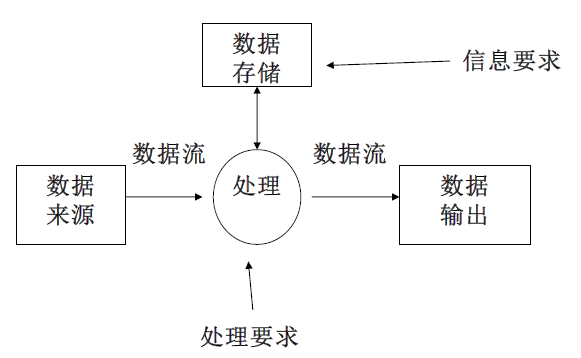
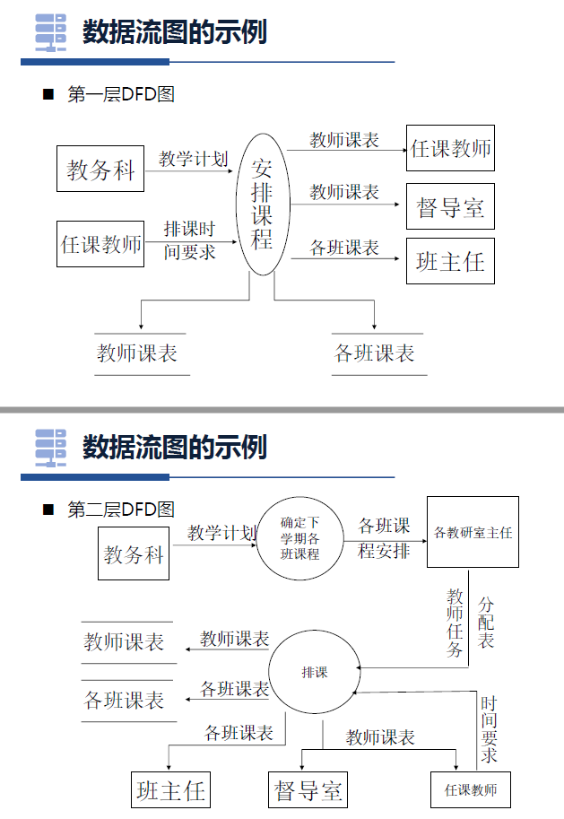
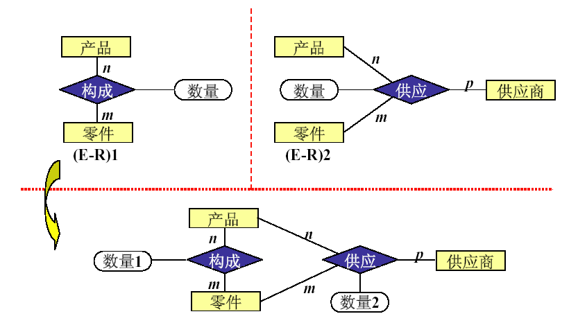
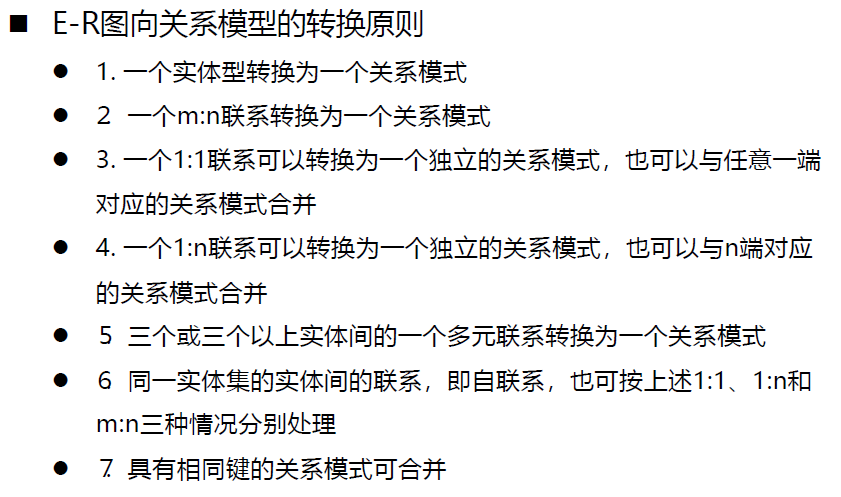

# 第十一章 数据库设计

# 13 - 数据库分析

[TOC]

## 11.1 概述

**任务**：根据用户需求研制数据库结构。具体地说，是指对于一个给定的应用环境，构造最优的数据库模式，建立数据库及其应用系统，使之能有效的存储数据，满足用户的信息要求和处理要求。

**内容**：静态结构设计、动态行为设计

- 结构设计：包括概念、逻辑、物理设计，又叫静态模型设计（静态、稳定、不易改变）

**数据库设计方法**：直观设计法（手工试凑，过时）、规范设计法（基于E-R模型、基于3NF、基于视图）

### 新奥尔良规范化设计方法

设计过程：

1. **需求分析阶段**
   - 准确了解与分析用户需求，是整个设计过程的基础，最困难、最耗时的一步
2. **概念结构设计阶段**
   - 是整个数据库设计的关键
   - 通过对用户需求进行综合、归纳与抽象，形成一个独立于具体DBMS的概念模型
3. **逻辑结构设计阶段**
   - 将概念结构转换为某个DBMS支持的数据模型，对其进行优化
4. **数据库物理设计阶段**
   - 为逻辑数据模型选一个最适合应用环境的物理结构（包括存储结构和存取方法）
5. **数据库实施阶段**
   - 根据逻辑设计和物理设计的结果；建立数据库；编制与调试应用程序；组织数据入库并试运行
6. **数据库运行和维护阶段**
   - 数据库应用系统经试运行后即可正式投入运行；运行过程中必须不断进行评价、调整与修改

## 11.2 需求分析（现实世界）

**任务**：详细调查现实世界要处理的对象，充分了解原系统工作概况，明确用户需求

**重点**：

- 信息要求：用户需要从数据库中获得的信息内容和性质；从信息要求可以导出数据要求，即要数据库存储的数据
- 处理要求：用户要完成的处理功能、处理响应时间要求、处理方式（批处理/联机处理）
- 安全性与完整性要求

过程：需求获取（与客户交流、形成需求文档）-> 需求分析与表达

**需求分析与表达的常用方法**：

- **自顶向下的结构化分析方法**（Structured Analysis，简称SA方法）
  - 从最上层系统组织机构入手，采用**逐层分解**方式分析系统，用==数据流图==和==数据字典==描述系统
- 面向对象的分析方法

### 数据流图（Data Flow Diagram，DFD）

是从实际系统抽象出来的、用特定的符号==反映系统的数据传递和变换过程==的图。它是系统的逻辑模型，与实际系统中具体的处理人员、处理工具和处理方式等无关，只反映==数据处理和传送的过程和方向==。

#### 组成成分

- **数据流**：沿箭头方向传递数据的通道，描述数据的流向。单箭头
- **处理**：对流入的数据进行的操作。数据流图的核心。圆圈
- **数据存储**：与处理有关的数据集合。双横线
- **实体**：描述数据流的起点和终点。方框

#### 画法：自顶向下，逐步求精

- 顶层图：描述系统范围和边界
- 底层图：描述一个简单的独立功能
- 中间图：描述上一层的某个处理，分解成几个独立的功能

由外向里的原则：在绘制顶层图时**先**考虑整个系统的**输入和输出数据流**，然后**再**考虑系统**内部的其他元素。**

注意：恰当命名，处理框编号

1. 首先把任何一个系统都抽象为下图：

2. 分解处理功能和数据
   - 分解处理功能：将处理功能的具体内容分解为若干子功能，再将每个子功能继续分解，直到把系统的工作过程表达清楚为止（上图下部）
   - 分解数据：（上图上部）
     - 在处理功能逐步分解的同时，其所用的数据也逐级分解，形成若干层次的数据流图
     - 数据流图表达了数据和处理过程的关系
3. 将分析结果再次提交给用户，征得用户认可

> 例：某学校排课业务流程调研如下：
>
> - **教务科**根据**各专业教学计划**统计出**各班级下学期所开课程情况**，并将该表交**各专业教研室主任**。
> - 各**教研室主任**为本室**教师**安排课程，每位教师写出自己的**上课要求，一并交教务科**。
> - 教务科安排排课人员**排课**。
> - 班级课表交**班主任**，教师课表交**任课教师和督导室**。
> - 各班课表和教师课表都要**留一份存档**。
>
> 

### 数据字典（Data Dictionary）

是各类数据描述的集合。是进行详细的数据收集和数据分析所获得的主要结果。在数据库设计中有重要地位。

**常用符号**：+表示“与”；[]表示“或”，即选择某一项；{}表示重复，即当中项要重复若干次；[]表示可选，即当中项可有可无

**五类条目**：数据项、数据流、数据存储、处理过程、数据结构。

数据字典通过对**数据项**和**数据结构**的定义来描述**数据流**、**数据存储**的逻辑内容。

#### 1 数据项

- 是数据的最小组成单位，不可再分。
- 对数据项的描述取值范围、与其他数据项的逻辑关系定义了数据的完整性约束条件
- 数据项描述 = {数据项名，数据项含义说明，别名，数据类型，长度，取值范围，取值含义，与其他数据项的逻辑关系}

#### 2 数据结构

- 数据结构反映数据之间的组合关系。由若干数据项组成，也可由若干数据结构组成，或二者混合
- 数据结构描述 = {数据结构名，含义说明，组成：{数据项或数据结构}}

#### 3 数据流

- 是数据结构在系统内传输的路径
- 数据流描述 = {数据流名，说明，数据流来源，数据流去向，组成：{数据结构}，平均流量（单位时间传输次数），高峰期流量}

#### 4 数据存储

- 是数据结构停留或保存的地方，也是数据流的来源和去向之一（上面定义的）
- 数据存储描述 = {数据存储名，说明，编号，流入的数据流，流出的数据流，组成：{数据结构}，数据量（每次存取多少数据），存取方式（批处理/联机处理，检索/更新，顺序/随机检索）}

需求分析最终结果是需求规格说明书，需求规约是概念设计的最主要依据。

## 11.3 概念结构设计（人脑）

**概念结构设计**：将需求分析得到的**用户需求**抽象为**信息结构**即概念模型的过程

概念结构是各种逻辑模型的共同基础，它比逻辑模型更独立于机器、更抽象，从而更加稳定。

### 特点：

- 能真实、充分地反映现实世界，包括事物和事物之间的联系，能满足用户对数据的处理要求。是对现实世界的一个真实模型。
- 易于理解，从而可以用它和不熟悉计算机的用户交换意见，用户的积极参与是数据库的设计成功的关键。
- 易于更改，当应用环境和应用要求改变时，容易对概念模型修改和扩充。
- 易于向关系、网状、层次等各种数据模型转换。

### 方法和步骤

抽象数据并设计局部视图 -> 集成局部视图，得到全局概念结构

常用策略：自顶向下进行需求分析，自底向上设计概念结构

### 设计内容

数据抽象：分类、聚集、概括，详见ER模型章节

局部视图设计，设计分E-R图的步骤如下

#### 1、选择局部应用

选择==中层==数据流图作为设计分E-R图的依据：较好反映系统中各局部的子系统组成。

让图中每一部分对应一个局部应用，然后以数据流图为出发点设计分E-R图

#### 2、逐一设计分E-R图

**任务**：

- 标定局部应用中的**实体、属性、码，实体间的联系**
- 将各局部应用涉及的**数据**分别从数据字典中抽取出来，参照数据流图，标定各局部应用中的**实体、实体的属性、标识实体的码**，确定实体之间的**联系及其类型**（1:1，1:n，m:n）
- 注意区分实体和属性（准则参见ER模型一章）

**步骤**：

1. 以数据字典为出发点定义E-R图。数据字典中的“数据结构”、“数据流”和“数据存储”等已是若干属性的有意义的聚合
2. 按上面给出的准则进行必要的调整。

#### 3、集成局部视图，得到全局概念结构

对各个局部视图进行合并，集成为总E-R图（整体的数据概念结构）

**步骤**：合并 -> 修改与重构

各个分E-R图存在冲突，会存在不一致的地方，合并的关键在于合理消除各分E-R图的冲突

**冲突的种类**：

1. **属性冲突**——讨论、协商解决

   - 属性域冲突：属性值的类型（学号）、取值范围或取值集合不同
   - 属性取值单位冲突（身高cm or m）

2. **命名冲突**——讨论、协商解决

   - 同名异义：不同意义的对象在不同的局部应用中具有相同的名字（房间：宿舍？教室？）
   - 异名同义（一义多名）：同一意义的对象在不同的局部应用中具有不同的名字（教科书：课本？教材？）

3. **结构冲突**：

   - 同一对象在不同应用中具有不同的抽象

     - ——把属性变换为实体或把实体变换为属性，**使同一对象具有相同的抽象**。

   - 同一实体在不同局部视图中所包含的属性不完全相同，或者属性的排列次序不完全相同

     - ——使该实体的属性取各分E-R图中属性的**并集**，再适当设计属性的次序

   - 实体之间的联系在不同局部视图中呈现不同的类型

     - ——根据应用语义对实体联系的类型进行**综合或调整**。如下例：

     

#### 4、修改与重构

在初步ER图基础上，消除不必要的冗余，设计生成基本E-R图

冗余：冗余的数据是指可由基本数据导出的数据，冗余的联系是指可由其他联系导出的联系。

- 容易**破坏数据库完整性**，给数据库维护增加困难
- **并非所有的冗余数据和冗余联系都要消除**，需要注意应用效率
- 冗余信息的消除与存在要根据**用户的整体需求**来决定
- 消除不必要的冗余后的初步E-R图称为**基本E-R图**

消除冗余的方法：

- **分析方法**
  - 以==数据字典和数据流图==为依据，根据数据字典中关于数据项之间==逻辑关系==的说明来消除冗余。
  - 例：教师的实发工资可以去掉，因为可由基本工资、奖金、扣款等算出来
- **规范化理论**

1. 确定分E-R图实体之间的数据依赖 $F_L$​。实体之间一对一、一对多、多对多的联系可以用实体键之间的函数依赖来表示

2. 求 $F_L$ 的最小覆盖 $G_L$ ，差集为 $D = F_L-G_L$​​。逐一考察D中的函数依赖，确定是否是冗余的联系，若是，就把它去掉。

   注意：**冗余的联系一定在D中，而D中的联系不一定是冗余的**，需要根据需求定义加以鉴别

3. 数据模型的优化：

   - 按照数据依赖的理论对关系模式逐一进行分析，考查是否存在部分函数依赖、传递函数依赖、多值依赖等，确定各关系模式分别属于第几范式。

4. 按照需求分析阶段得到的各种应用对数据处理的要求，分析对于这样的应用环境这些模式是否合适，确定是否要对它们进行合并或分解

整体概念结构最后还要交给用户，征求意见、评审修改优化，然后确定下来，进一步设计数据库

## 11.4 逻辑结构设计（计算机世界）

**任务**：为了能够用某一DBMS实现用户需求，还必须将概念结构进一步转化为相应的**数据模型**

**步骤**：

- 将概念结构转化为一般的关系、网状、层次模型
- 将转化来的关系、网状、层次模型向特定DBMS支持下的数据模型转换
- 对数据模型进行优化

**内容**：

1. **E-R图向关系模型的转换**：将实体、实体的属性和实体之间的联系转化为关系模式。

   

2. **数据模型的优化**：用规范化理论，适当地修改、调整数据模型的结构，以进一步提高数据库应用系统的性能

   方法：

   1. 确定数据依赖——按需求分析阶段所得到的语义，分别写出每个关系模式内部各属性之间的数据依赖以及不同关系模式属性之间数据依赖。
   2. 对于各个关系模式之间的数据依赖进行极小化处理，消除冗余的联系
   3. 按照数据依赖的理论对关系模式逐一进行分析，考查是否存在部分函数依赖、传递函数依赖等，确定各关系模式分别属于第几范式
   4. 按照需求分析阶段得到的各种应用对数据处理的要求，分析对于这样的应用环境这些模式是否合适，确定是否要对它们进行合并或分解。

3. **设计用户子模式：**注重考虑用户的习惯与方便

   - 使用更符合用户习惯的别名
   - 针对不同级别的用户定义不同的外模式，以满足系统对安全性的要求
   - 简化用户对系统的使用